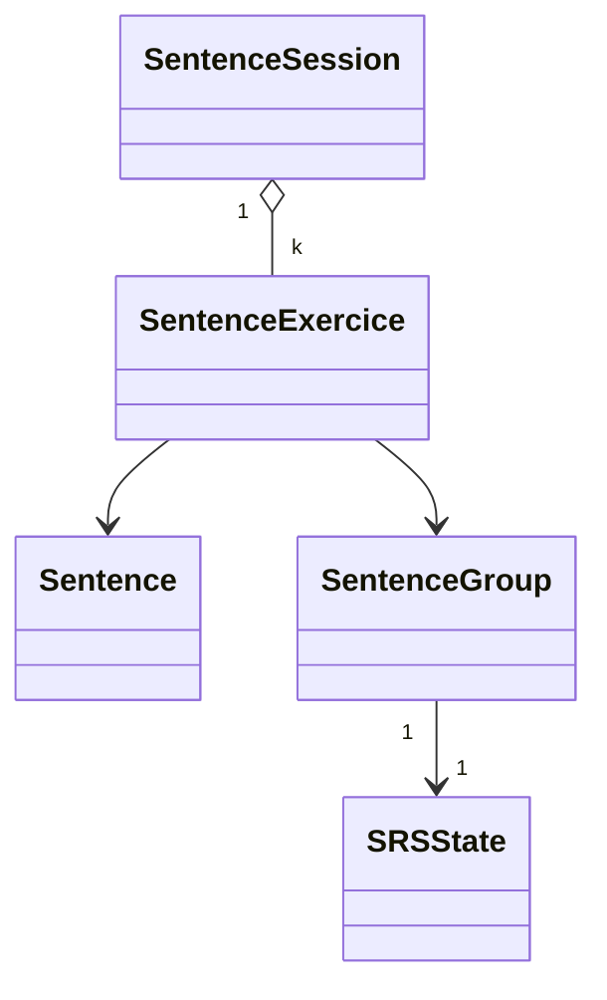

# 📘 Flutter App Langue

Application Flutter d’apprentissage des langues basée sur un algorithme de répétition espacée (SRS).
Ce projet sert à la fois de terrain d’apprentissage pour **Dart/Flutter** et de base pour une application complète de mémoristation de vocabulaire et de révision intelligente.

---

---

## 🚀 Objectifs

- Créer une application Flutter multiplateformes (Android, iOS, Web, Desktop).
- Implémenter un système de répétition espacée (Spaced Repetition System) inspiré d’Anki/SM-2.
- Construire une architecture modulaire et extensible avec une base de données SQLite.
- Appliquer les bonnes pratiques de conception logicielle (clean architecture, séparation des couches, code testable).

---

## 🧩 Architecture générale

L’application est divisée en plusieurs couches :

- [models/](lib/models/) $\rightarrow$ définitions des objets métier (`Note`, `Card`, `Exercice`, `SRSState`, `SRSConfig`, etc.)
- [playground/](lib/playground) $\rightarrow$  fichiers de test et d’expérimentation
- [screens/](lib/screens/) $\rightarrow$  interfaces utilisateur (`HomeScreen`, `StatisticScreen`, `SettingScreen`)
- [services/](lib/services) $\rightarrow$  logique d’accès aux données et conversions
> Les détails complets se trouvent dans [**doc/index.md**](docs/index.md)

---

## ⚙️ État actuel (MVP in progress) - chronologie

1. Définition des modèles principaux :  
   `Note`, `CardTemplate`, `Card`, `Exercice`, `WordExercice`, `SRSState`, `SRSConfig`
2. Création des fonctions utilitaires dans `convert_utils.dart` (conversion de types, gestion des dates et durées).
3. Conception complète de la base **SQLite** : 
   -  toutes les tables
   -  Les relations
   -  Méthodes toMap/fromMap implémentées pour tous les modèles
   - CRUD complet pour chaque table
   - Requêtes optimisées avec jointures pour reconstruire les objets complexes
4. Mise en place d’une **documentation claire** et maintenable en Markdown.

---

## 📈 Étapes suivantes

- Logique complète de session (enchaînement et filtrage des exercices)  
- Génération des statistiques et résumé de session  
- Développement de l’interface utilisateur finale  
- Écriture de tests unitaires pour chacun des modules  
