# 📘 Full Documentation Snapshot
> ⚙️ Auto-generated for ChatGPT context loading.

> Each section below corresponds to a file inside /docs.

> Source project: Psitta

---


---

## 📄 architecture/application_layer/application.md

````markdown
[Documentation index](../../index.md)

# Application layer

## Purpose

The Application layer coordinates actions coming from the UI, business logic
from the Domain, and storage operations exposed by Persistence. It contains no
Flutter widgets and no SQL.

---

## Diagram

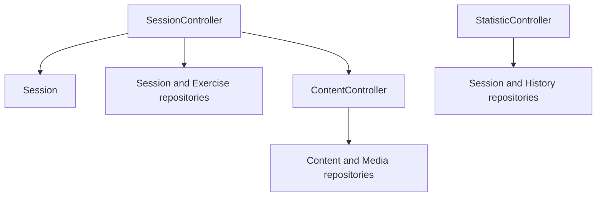

---

## Controllers

### `SessionController`

`SessionController` owns at most one active `Session`. It implements the
application workflow for:

- loading due and new exercises of the requested session type;
- starting or resuming a session;
- loading the content selected by the current exercise;
- previewing an interval and submitting a grade;
- pausing or ending the session;
- persisting progression after each accepted answer.

Exercise limits and SRS parameters currently come from the default `SRSConfig`
owned by the controller.

### `ContentController`

`ContentController` loads renderable `Content` by identifier and resolves
`Media` by SHA-256. It is used both by session workflows and by the UI media
resolver.

### `StatisticController`

`StatisticController` builds statistics from persisted session results and
answer history. It exposes session-level and exercise-level aggregates, with
optional half-open date ranges.

---

## Application models

The Application layer owns models intended for presentation:

- `Content`, `Field`, `FieldDefinition`, and `FieldValue` describe ordered
  renderable content;
- `Media` identifies a local media resource;
- `SessionStatistics` and `ExerciseStatistics` expose calculated aggregates.

These models are not learning entities. The Domain only manipulates the content
identifier selected by an exercise.

---

## Session workflow

For a new session, the controller loads a limited set of due and new exercises,
constructs and starts the Domain session, then persists its initial resumable
state. After each answer, the Domain is updated first and `SessionRepository`
stores the resulting exercise, history, and session result atomically. It also
refreshes the resume snapshot, or removes it when the session has finished.

Pausing releases the in-memory session after updating its snapshot. Resuming
reconstructs a new Domain `Session` from persisted progression and the snapshot.

---

## Lifecycle and boundaries

Controllers are constructed once by `AppDependencies` and are intended to be
shared by the future screens. A Domain `Session`, by contrast, exists only while
a learning session is active.

- The UI calls controllers rather than repositories.
- Controllers decide when to load and persist data, but learning transitions
  remain in the Domain.
- Persistence models and SQLite rows never enter the Application layer.
- Controllers currently depend on concrete repositories; no repository
  interface abstraction exists yet.

````

---

## 📄 architecture/domain_layer/domain.md

````markdown
[Documentation index](../../index.md)

# Domain layer

## Purpose

The Domain contains the core learning model. It defines how sessions sequence
exercises, how answers change progression, and which state is independent of
the UI and database representation.

Details are distributed between [Sessions](sessions.md),
[Exercises](exercises.md), and [SRS](srs.md).

---

## Diagram

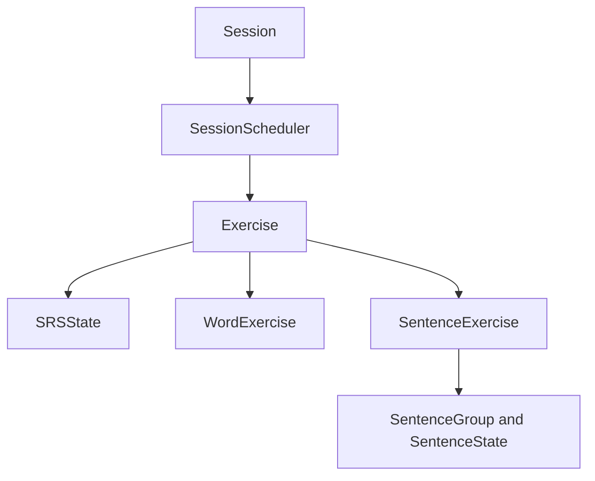

---

## Model overview

### Runtime orchestration

`Session` owns one `SessionScheduler`, a shared `SRSConfig`, and the aggregate
`SessionResult`. It delegates answer processing to the current exercise and
does not load or persist data itself.

### Exercises

`Exercise` is the common runtime abstraction for `WordExercise` and
`SentenceExercise`. It combines an intra-session status with the persistent SRS
state of one learning task.

Each submitted answer also produces an `ExerciseHistoryEntry`. New entries are
buffered until Persistence stores them with the updated progression.

### Progression

`SRSState` manages the interval and memory-model parameters associated with an
exercise. `SentenceState` is separate: it tracks the exposure and performance
of one sentence inside a sentence group.

### Content

The Domain does not know whether content contains text, HTML, images, audio, or
video. Exercises expose an integer `contentId`, which the Application layer
resolves into renderable content.

For a sentence exercise, the content identifier belongs to the sentence
instance currently selected from the group.

---

## Runtime and persistent state

Domain objects are not database models, but part of their state must survive
between sessions:

- exercise identity, subtype data, SRS state, and sentence state are stored;
- answer history and session results are stored;
- unfinished sessions store a minimal `ExerciseResume` for each exercise;
- `Session` and `SessionScheduler` instances are reconstructed in memory.

All conversions belong to Persistence. Domain code never imports DAOs, SQL, or
persistence models.

---

## Domain boundaries

The Domain intentionally ignores:

- Flutter widgets, navigation, and presentation state;
- SQL, transactions, and storage layout;
- the structure and rendering of learning content;
- repository queries and the selection limits used to build a session;
- application-wide settings and synchronisation.

````

---

## 📄 architecture/domain_layer/exercises.md

````markdown
[Documentation index](../../index.md)

# Exercises

## Purpose

This document describes the role of an `Exercise`, its state during a session,
and the differences between word and sentence exercises.

Temporal orchestration is described in [Sessions](sessions.md), while interval
updates are described in [SRS](srs.md).

---

## Conceptual diagram

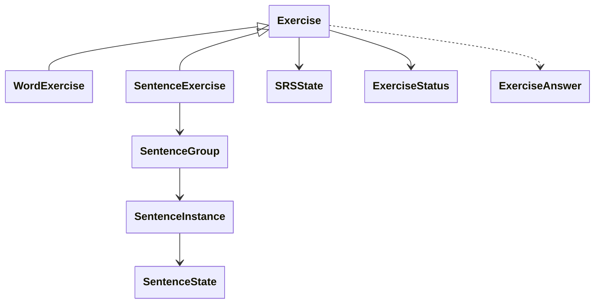

---

## General role

An exercise represents one learning task inside a session. It contains:

- a stable persisted identifier;
- an `ExerciseStatus` used by the session scheduler;
- an `SRSState` shared across sessions;
- answer-history entries waiting to be persisted.

The object itself never accesses the database or UI. Repositories reconstruct
it from persistent state before a session and save its updated progression
after an answer.

---

## Answers and status

A submitted answer contains a grade and timestamp. The exercise applies it to
its progression, records history, and updates its session status. A preview
answer runs the interval calculation without changing state.

The current statuses are:

| Status | Meaning |
|---|---|
| `newExercise` | The exercise has no previous answer history |
| `toReview` | A previously answered exercise is entering a review session |
| `learning` | A new exercise is repeating within the session |
| `relearning` | A reviewed exercise is repeating after a failure |
| `consolidating` | A sentence exercise is completing additional training |
| `completed` | No more presentation is required in this session |

The base exercise flow becomes complete when it has left the SRS learning phase
and its next review is beyond the configured day boundary. A sentence exercise
may replace this completion with a consolidation phase. The session stops
scheduling an exercise only after its final completion.

---

## `WordExercise`

A word exercise references one `contentId` and uses one SRS state. It accepts
all grades defined by the current model.

The Domain does not require the referenced content to be a literal word. The
name identifies the product use of this exercise type, while rendering remains
an Application and UI responsibility.

---

## `SentenceExercise`

A sentence exercise references one `SentenceGroup` and has one group-level SRS
state. The group contains one or more `SentenceInstance` objects, each with its
own `contentId` and `SentenceState`.

Before each answer, the exercise selects the sentence with the lowest state
score. This prioritises unseen, failed, or less successful sentences while the
group remains one scheduled exercise.

Sentence exercises accept `again`, `medium`, and `good`; `hard` and `easy` are
not available. Once the group-level SRS phase finishes, the exercise may enter
`consolidating` until the configured number of successful training answers has
been reached. Consolidation updates sentence state but not the group SRS.

---

## Persistence boundary

An answer may change several related values: SRS state, sentence state, history,
and session state. The exercise only produces those changes in memory.
`SessionRepository` and `ExerciseRepository` are responsible for storing them
within the surrounding transaction.

The minimal transient state needed to resume an unfinished session is exposed
through `ExerciseResume`: exercise identifier, status, and the remaining
sentence training count when applicable.

````

---

## 📄 architecture/domain_layer/sessions.md

````markdown
[Documentation index](../../index.md)

# Sessions

## Purpose

This document describes the lifecycle of a learning `Session`, how it selects
exercises, and how unfinished sessions can be resumed.

Exercise-specific behaviour is described in [Exercises](exercises.md).

---

## Lifecycle

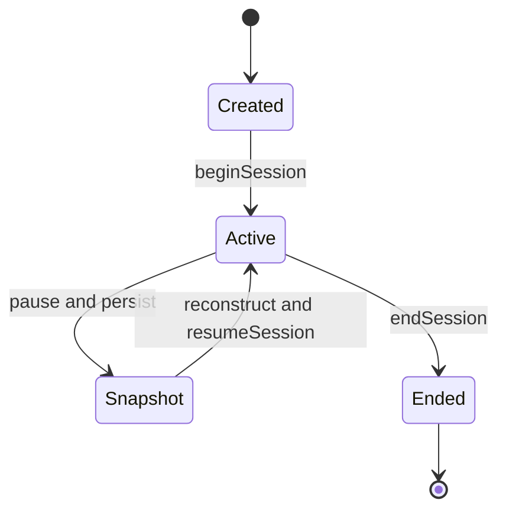

`Snapshot` represents persisted resume data; it is not a state stored inside
the Domain `Session` object.

---

## Construction

A session receives:

- a preloaded list of exercises;
- a `SessionType` (`wordSession` or `sentenceSession`);
- one `SRSConfig` shared by those exercises;
- optionally, an existing `SessionResult` when resuming.

Construction verifies that every exercise matches the requested session type.
The session does not create exercises and does not decide which due or new
exercises enter the list.

---

## Execution

`beginSession` records the start time and selects the first exercise. For each
submitted answer, the session:

1. counts the answer under the exercise's current status;
2. delegates the state change to the exercise;
3. updates the number of uniquely completed exercises;
4. asks the scheduler for the next exercise.

Interval previews are delegated to the current exercise and leave both the
exercise and session result unchanged.

`endSession` records the end time and may be called before every exercise is
complete. Once ended, the session cannot accept another answer. An empty
exercise list produces a session that is immediately finished after starting.

---

## Exercise scheduling

`SessionScheduler` separates exercises into two groups:

- `learning` and `relearning` exercises, ordered by their next review time;
- immediately available `newExercise`, `toReview`, and `consolidating`
  exercises, considered in shuffled order.

A learning exercise takes priority once its short interval is due. Otherwise,
an immediately available exercise is selected. If only learning work remains,
the earliest exercise is selected even when its interval has not fully elapsed.

The scheduler reads exercise state but never applies answers itself.

---

## Pause and resume

The Domain exposes one `ExerciseResume` per exercise. When the Application
pauses a session, Persistence stores these snapshots with the intermediate
`SessionResult` and releases the in-memory object.

To resume, Persistence reloads each exercise's current progression, restores
its saved status and optional sentence training count, and constructs a new
`Session`. `resumeSession` then selects the next exercise without changing the
original start time.

---

## `SessionResult`

`SessionResult` stores the session type, start and end times, the number of
unique completed exercises, and answer counts grouped by exercise status. It is
used both for statistics and as the persistent identity of an unfinished
session.

The result is an aggregate only. It does not contain exercise evaluation or SRS
logic.

---

## Boundaries

- A session orchestrates exercises but does not load, create, or persist them.
- Exercise and SRS rules remain inside the exercise objects.
- The session knows content only through the identifier exposed by its current
  exercise.
- Repository access and transaction boundaries belong to the Application and
  Persistence layers.

````

---

## 📄 architecture/domain_layer/srs.md

````markdown
[Documentation index](../../index.md)

# Spaced repetition system

## Purpose

This document explains the role of the SRS inside the Domain and the distinction
between exercise scheduling, sentence progression, and session orchestration.

The exact formulas are documented in
[SRS model mathematics](../../maths_and_srs/maths_srs.md).

---

## Diagram

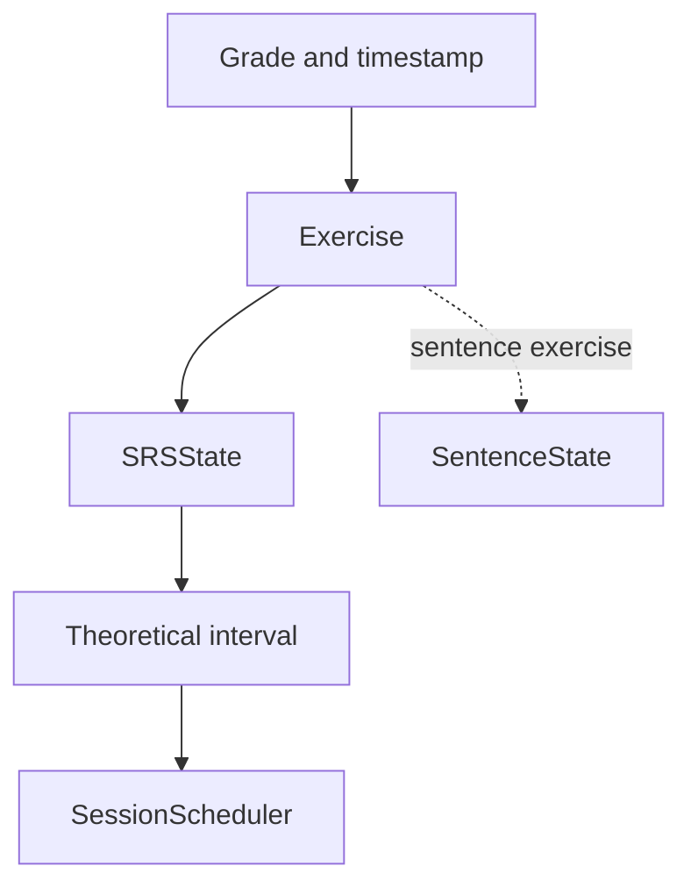

---

## Role of `SRSState`

Each exercise owns one `SRSState`. It stores the current interval, the last
review time, the learning-step index, and the parameters used by the recall
model. The next review time is derived from the last review and interval.

`SRSState` has two update modes:

- **learning mode**, which uses short configured steps;
- **review mode**, which computes a longer interval from the recall model.

A failed review returns the state to learning. A successful learning sequence
graduates it to review mode.

The SRS computes an interval but does not decide which exercises enter a
session. Repository queries select due and new exercises, while
`SessionScheduler` uses the resulting state to order exercises inside the
session.

---

## Configuration

`SRSConfig` groups the parameters shared by every exercise in one session:

- recall target and model coefficients;
- grade-dependent weights;
- learning steps and interval multipliers;
- maximum and graduation intervals;
- day boundary;
- limits on new and due exercises loaded for a session.

`SessionController` currently uses a default in-memory configuration. There is
no persisted or user-editable SRS configuration yet.

---

## Answers and grades

`SubmittedExerciseAnswer` changes progression. `PreviewExerciseAnswer` applies
the same interval calculation to a copy and has no side effect.

| Grade | Quality | Successful |
|---|---:|---|
| `again` | 0 | no |
| `hard` | 2 | no |
| `medium` | 3 | yes |
| `good` | 4 | yes |
| `easy` | 5 | yes |

Word exercises accept every grade. Sentence exercises deliberately expose only
`again`, `medium`, and `good`.

---

## Sentence progression

`SentenceState` is independent from `SRSState`. It records how often one
sentence has been shown, its accumulated answer score, and whether it is
currently learning. A sentence exercise uses this information to select the
least-known sentence in its group.

The group-level SRS determines when the sentence exercise is reviewed; the
per-sentence state determines which example is presented.

---

## Persistence rule

SRS state changes only after a submitted answer. The Application then asks
Persistence to store the updated exercise state together with history and the
current session state. Preview operations are never persisted.

The distinction between enforced checks and assumed parameter constraints is
documented in [SRS validity rules](../../maths_and_srs/invariant.md).

````

---

## 📄 architecture/overview.md

````markdown
[Documentation index](../index.md)

# Architecture overview

## Purpose

This document presents the main architectural blocks of Psitta and the
dependency rules between them. Internal behaviour is described in the dedicated
documents for each layer.

---

## Diagram

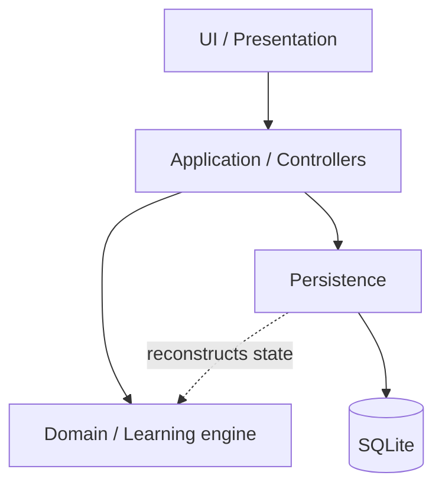

---

## Reading the diagram

### [UI](ui_layer/ui.md)

The UI renders application content and will eventually expose the user
interactions. The current implementation contains the content-rendering
pipeline, but no screens or navigation.

### [Application](application_layer/application.md)

The Application layer exposes the use cases required by the UI. Its controllers
coordinate sessions, content loading, statistics, and persistence operations.

### [Domain](domain_layer/domain.md)

The Domain contains the learning rules: sessions, exercises, scheduling, SRS
state, sentence progression, grades, and answer history. It depends on neither
Flutter nor SQLite.

Learning content is represented by identifiers in the Domain. Its field and
media structure belongs to the Application layer.

### [Persistence](persistence_layer/persistence.md)

Persistence stores content, exercises, progression, history, and session state.
Repositories expose application-oriented operations while DAOs, mappers, and
persistence models remain internal to the layer.

### Utilities

`lib/utils` contains pure conversion helpers shared by the Domain and
Persistence layers, notably duration and timestamp conversions.

---

## Dependency rules

- UI code uses Application controllers and models; it does not execute SQL.
- Application controllers coordinate Domain objects and repositories.
- The Domain imports neither Flutter nor persistence code.
- SQL, database rows, and persistence-only models remain in Persistence.
- Persistence may depend on Domain types to reconstruct learning state.

The current controllers depend directly on concrete repository classes, and
content persistence maps to models defined in the Application layer. These are
current MVP boundaries; repository interfaces have not been introduced.

---

## Application composition

`AppDependencies` is the composition root. It opens and migrates the database,
constructs the repositories, controllers, and content renderer, and owns the
database lifetime.

The current `main.dart` only validates this initialisation and then disposes the
dependencies. Once the Flutter interface is connected, the same dependency
container must remain alive for the application lifetime.

````

---

## 📄 architecture/persistence_layer/database.md

````markdown
[Documentation index](../../index.md)

# SQLite database

## Purpose

The SQLite schema stores learning content, exercise progression, answer
history, session statistics, and the snapshot required to resume an unfinished
session.

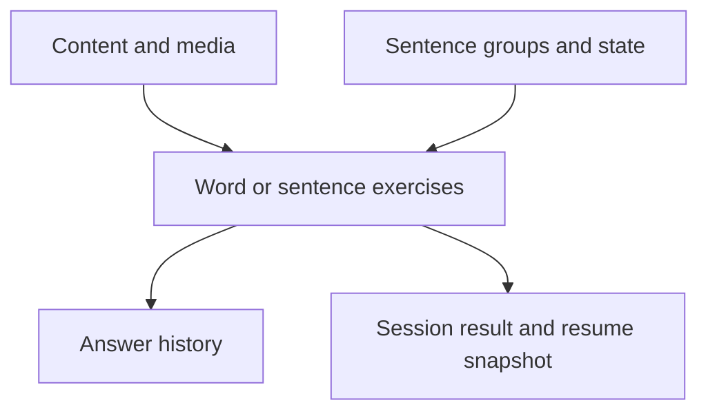

This is an aggregate view rather than a table-level entity diagram. The
version 1 schema is normalized across the following tables.

## Schema areas

| Area | Tables | Role |
|---|---|---|
| Exercise | `exercise`, `srs_state`, `word_exercise`, `sentence_exercise` | Stable identity, subtype data, and one SRS state per exercise |
| Sentence | `sentence_group`, `sentence_instance`, `sentence_state` | Group structure, content references, and per-sentence progress |
| Content | `content`, `field_definition`, `field_value`, `media` | Ordered typed fields and local media metadata |
| History | `exercise_history` | Immutable submitted-answer events, optionally tied to a sentence instance |
| Session | `session_result`, `session_result_status_count`, `active_session_exercise` | Aggregate statistics and unfinished-session snapshots |

The repository model expects each `exercise` to have one `srs_state` row and
exactly one subtype row. Primary keys prevent duplicate rows of either kind,
but SQLite does not enforce their required existence or subtype exclusivity. A
`word_exercise` points directly to content. A `sentence_exercise` points to one
unique sentence group, whose instances each point to content and own one
`sentence_state`.

## Persistent and reconstructed state

The database stores enough information to reconstruct domain aggregates, but it
does not serialize an in-memory object graph.

- Exercise identity, subtype configuration, and SRS values are persistent.
- `next_review` is stored so SQL can select due exercises, while the domain
  reconstructs its value from `lastReview + interval` rather than reading that
  column as independent state.
- Normal exercise loading derives `newExercise` versus `toReview` from the
  existence of answer history.
- An unfinished session stores its exact per-exercise status and remaining
  sentence `trainingCount` in `active_session_exercise`.
- `Session` and `SessionScheduler` instances are reconstructed in memory and
  are never stored directly.
- Session results remain after completion; active-session rows are removed.

## Referential integrity

Foreign keys are enabled for every native connection by
`PsittaSqliteOpenFactory`, because SQLite's foreign-key setting belongs to a
connection rather than to the database file.

Owned rows generally use `ON DELETE CASCADE`, including SRS state, subtype rows,
exercise history, sentence instances and state, session status counts, and
active-session snapshots. Content and media references are shared references
and do not cascade from the referencing exercise or field.

The database also enforces that one sentence group is associated with at most
one `sentence_exercise` through a unique constraint.

## Opening and migration

`SqliteDatabase.open()` is idempotent for an already open wrapper:

1. resolve the application-support directory;
2. create `<application-support>/psitta.db` through the custom native factory;
3. initialise `sqlite_async`;
4. read `PRAGMA user_version`;
5. apply each newer registered migration in version order;
6. update `user_version` in the same transaction as its migration.

If initialisation or migration fails, the newly created database object is
closed and the error is rethrown. `close()` releases it and resets the wrapper,
allowing a later call to reopen the database.

The only registered migration is currently `V1InitialSchema` with version 1.
Future schema changes must be added as new ordered migrations rather than by
editing databases that may already exist.

````

---

## 📄 architecture/persistence_layer/persistence.md

````markdown
[Documentation index](../../index.md)

# Persistence layer

## Purpose

The Persistence layer stores application data, reconstructs Domain and
Application models, and isolates the rest of the project from SQLite-specific
details. It records state produced by the Domain; it does not implement
learning rules.

---

## Architecture

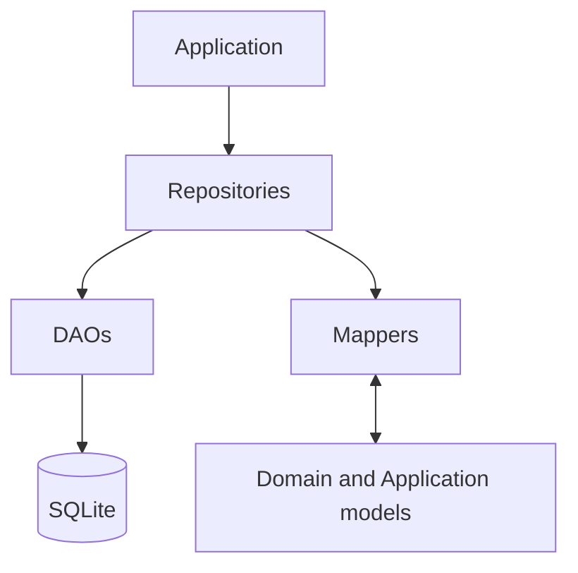

---

## Main components

### Repositories

Repositories expose operations aligned with application use cases. They
coordinate DAOs and mappers, rebuild complete objects, and define transaction
boundaries that span several tables.

See [Persistence repositories](repositories.md).

### DAOs

DAOs contain SQL and operate on persistence models. Simple operations open
their own `sqlite_async` transaction; aggregate writes may receive a transaction
created by a repository.

### Persistence models

Persistence models represent normalized stored data. They contain database
identifiers, scalar values, timestamps, and enum codes without business
behaviour. They never leave the Persistence layer.

### Mappers

Mappers translate persistence models into Domain objects or Application content
models and back. They handle structural conversion, not learning decisions.

### Database

The database component owns connection lifecycle, native connection
configuration, schema migrations, and access to the shared
`sqlite_async.SqliteDatabase` instance.

See [SQLite database](database.md).

---

## General flow

For a read, a repository asks one or more DAOs for normalized data, uses mappers
to reconstruct the required object, and returns only that object to the
Application layer.

For a write, the Domain has already produced the new state. The repository maps
it to persistence models and coordinates the necessary DAO operations.

The most important aggregate write occurs after an answer. One transaction
stores the exercise progression, sentence progression when applicable, answer
history, session result, and resumable exercise snapshots. This prevents the
stored exercise and active session from describing different answers.

---

## Time representation

Durations and review lookup values are stored as integer microseconds.
Date-time values are serialized as ISO-8601 UTC strings and converted back to
local `DateTime` values when reconstructed. Repository date ranges use an
inclusive start and exclusive end.

---

## Dependency rules

- Application code accesses stored data through repositories.
- SQL remains in DAOs and migrations.
- Persistence models and raw rows never cross the repository boundary.
- The Domain never imports Persistence.
- Repositories may depend on Domain types to reconstruct or store their state.
- The database is opened and migrated before any repository is constructed.

The current backend uses `sqlite_async` native connections and does not support
the Flutter web target.

---

## Directory structure

```text
infrastructure/persistence/
├── database/
├── dao/
├── mappers/
├── models/
└── repositories/
```

````

---

## 📄 architecture/persistence_layer/repositories.md

````markdown
[Documentation index](../../index.md)

# Persistence repositories

## Purpose

Repositories are the application-facing API of the persistence layer. They
combine DAO operations and mappers so callers work with domain or application
objects rather than normalized SQLite rows.

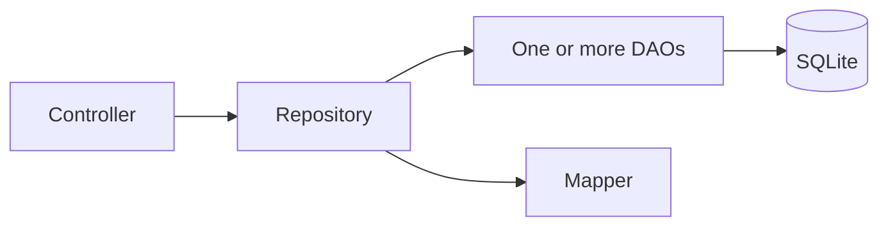

## Current repositories

| Repository | Main responsibility |
|---|---|
| `ExerciseRepository` | Create, load, select, save, delete, and reset word or sentence exercise aggregates |
| `SessionRepository` | Store results and resume snapshots, rebuild unfinished sessions, and coordinate answer transactions |
| `ExerciseHistoryRepository` | Read submitted-answer history with exercise and half-open date filters |
| `ContentRepository` | Create, load, update, and delete application content and its ordered field values |
| `MediaRepository` | Resolve media metadata by SHA-256 |
| `SentenceGroupRepository` | Create groups and instances, move instances, and delete sentence structures |

## Exercise selection and persistence

`ExerciseRepository.getDueExercises` selects rows whose `next_review` is not
null and is at or before the supplied time. Results are ordered by earliest
review and may be filtered by the persisted `word` or `sentence` type.

`getNewExercises` selects exercises with no answer history, ordered by exercise
identifier. When loaded normally, history existence determines the initial
session status: `newExercise` or `toReview`.

Saving an exercise updates its SRS state, sentence states when applicable, and
all buffered history entries. `resetProgress` restores a new SRS state, removes
history, and resets per-sentence progress.

## Session aggregate

`SessionRepository` owns the persistence boundary for session lifecycle:

- `save` inserts a new `SessionResult` and all `ExerciseResume` snapshots;
- `update` replaces an unfinished result and its snapshots when pausing;
- `getActiveSession` reconstructs a session from persistent exercise state and
  resume-specific status;
- `saveAnswerProgress` atomically stores the answered exercise, history,
  session result, and new snapshot set;
- `completeSession` stores the final result and removes active snapshots;
- `getList` returns session results for statistics.

The repository receives an existing `ExerciseRepository` so answer persistence
can reuse `saveInTransaction` without nesting independent transactions.

## Content and sentence structure

`ContentRepository` maps normalized `content`, `field_value`, and
`field_definition` rows into application `Content` models. Media-valued fields
include media metadata; HTML `media://` lookup is handled separately through
`MediaRepository`.

`SentenceGroupRepository` changes sentence-group structure but is not currently
constructed by `AppDependencies`. The current composition root supports reading
content during sessions, not an application workflow for creating learning
material.

## Boundary rules

- Controllers use repositories, not DAOs.
- Repositories define multi-table and multi-aggregate transaction boundaries.
- DAOs and persistence models remain internal implementation details.
- Repositories persist state produced by the domain; they do not decide grades,
  intervals, or exercise transitions.

The controller layer currently depends on concrete repository classes. This is
an explicit MVP trade-off, not evidence that repository interfaces already
exist.

````

---

## 📄 architecture/ui_layer/ui.md

````markdown
[Documentation index](../../index.md)

# UI presentation layer

## Purpose

The implemented UI code is a content-rendering pipeline. It turns application
`Content` models into one Flutter widget for the requested exercise side.

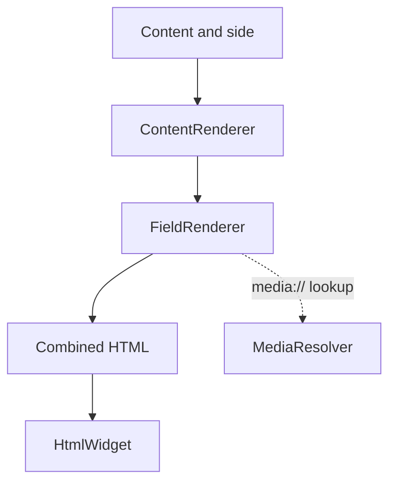

## Rendering flow

`ContentRenderer.render(content, side)` performs four operations:

1. keep fields whose side is `front`, `back`, or `both` as appropriate;
2. order them by `displayOrder`; for equal orders, null identifiers come first
   and non-null identifiers are ordered numerically;
3. ask `FieldRenderer` to produce an HTML fragment for each field;
4. concatenate the fragments and return a `flutter_widget_from_html`
   `HtmlWidget`.

## Field types

`FieldRenderer` dispatches according to `FieldValueType`:

| Type | Expected value | Rendering behaviour |
|---|---|---|
| `text` | `TextFieldValue` | Escaped text with line breaks converted to `<br>` |
| `html` | `TextFieldValue` | HTML fragment with internal media references resolved |
| `image` | `MediaFieldValue` | `` using a local file URI |
| `audio` | `MediaFieldValue` | `<audio>` using a local file URI |
| `video` | `MediaFieldValue` | `<video>` using a local file URI |

A type/value mismatch is treated as invalid application data and produces a
`StateError`.

## Media resolution

HTML may refer to stored media with `media://<sha256>`. `MediaResolver` parses
the fragment, finds `src` and `poster` attributes, asks `ContentController` for
the matching media record, and replaces the internal reference with a local
file URI.

Only simple `src` and `poster` attributes are handled. URI-list attributes such
as `srcset` are intentionally unsupported, and a missing media hash is an
error.

## Current scope

The repository does not currently implement screens, navigation, exercise
input controls, or state-management bindings. Those elements remain part of the
future MVP interface.

The presentation layer may depend on application models and controllers. It
must not access DAOs, repositories, SQLite rows, or domain mutation methods
directly.

````

---

## 📄 index.md

````markdown
# Psitta documentation

[Project README](../README.md)

These documents describe the implementation that currently exists in Psitta.
They focus on the architectural boundaries, runtime flows, persistence model,
and SRS rules needed by a developer entering the project.


## Architecture

- [Overview](architecture/overview.md) — layers, dependency directions, and
  application bootstrap.
- [UI](architecture/ui_layer/ui.md) — the implemented content-rendering
  pipeline and its current limits.
- [Application](architecture/application_layer/application.md) — controllers,
  application models, and session use cases.
- [Domain](architecture/domain_layer/domain.md) — the business model and its
  boundaries.
  - [Sessions](architecture/domain_layer/sessions.md) — lifecycle, scheduling,
    pause/resume, and results.
  - [Exercises](architecture/domain_layer/exercises.md) — word and sentence
    exercise behaviour.
  - [SRS](architecture/domain_layer/srs.md) — how scheduling state is used by
    exercises.
- [Persistence](architecture/persistence_layer/persistence.md) — repositories,
  DAOs, mappers, and transaction boundaries.
  - [Database](architecture/persistence_layer/database.md) — database lifecycle
    and version 1 schema.
  - [Repositories](architecture/persistence_layer/repositories.md) — the APIs
    exposed to the application layer.

## Mathematics and SRS

- [Hypotheses and scope](maths_and_srs/hypotheses_and_mvp_scopes.md) — explicit
  product and modelling choices.
- [Mathematical model](maths_and_srs/maths_srs.md) — formulas and implemented
  update order.
- [Validity rules](maths_and_srs/invariant.md) — enforced checks, repairs, and
  configuration assumptions.

## Maintenance

Each source document has one primary topic and one compact Mermaid diagram.
Keep statements tied to the current code; planned components should be labelled
as planned rather than documented as existing.

`FULL_DOC.md` is generated by `dart run tools/merge_docs.dart`. It should not be
edited manually.

Some documentation was written with AI assistance and reviewed by the project
author.

````

---

## 📄 maths_and_srs/hypotheses_and_mvp_scopes.md

````markdown
[Documentation index](../index.md)

# SRS hypotheses and MVP scope

## Purpose

This document records the non-mathematical assumptions behind Psitta's current
spaced repetition system. These are modelling and product choices, not claims
that the model is cognitively optimal.


## The SRS models a task

One `SRSState` belongs to one exercise, not to an abstract word, sentence, or
language skill. Two tasks using related content may therefore progress
independently, for example recognition and production exercises.

This local model avoids an ill-defined global notion of mastery and keeps the
MVP scheduling state composable. It does not attempt to infer transfer of
knowledge between exercises.

## The response signal is subjective

The user supplies a grade after seeing an exercise. The grade is expected to
summarise correctness, hesitation, and perceived effort.

Measured response duration is not currently part of `ExerciseAnswer` or the SRS
formula. This is a deliberate MVP simplification; it also means the scheduler
cannot independently verify the user's assessment.

## Delay affects failed reviews

In review mode, lateness is used only when the submitted grade is unsuccessful.
A sufficiently late failure weakens or resets the long-term recall estimate
before the normal grade update. A successful late review is not penalised solely
because it was late.

This is a product hypothesis: observed success is considered stronger evidence
than elapsed time. It is not a consequence of the exponential recall formula.

## Exercises are locally independent

The current engine does not model:

- dependencies between vocabulary and grammar;
- prerequisites or knowledge graphs;
- transfer between exercises sharing content;
- a global estimate of the learner's fatigue or ability.

Every answer changes only the selected exercise, its optional sentence state,
its history, and the enclosing session aggregate.

## Sentence exercises represent exposure

A sentence exercise uses two distinct levels of progression:

- one group-level `SRSState` schedules the exercise;
- one `SentenceState` per sentence chooses the least-known example and tracks
  its local exposure.

After the group-level SRS phase completes, a configurable number of successful
consolidation answers may still be required. This design favours repeated
exposure to related sentences without creating an independent SRS schedule for
every sentence instance.

## Session policy

The application layer chooses the session pool by loading at most
`reviewCount` due exercises and `newCount` exercises of the requested type.
Due exercises are prioritised by persisted review time; new exercises are
ordered by identifier.

Inside the session, `SessionScheduler` handles short learning repetitions and
randomises immediately available candidates. The resulting presentation order
is therefore not simply the repository query order.

Sessions can be paused and reconstructed. Persistence stores the session result
and minimal per-exercise resume state; it does not serialize the in-memory
`Session` object.

## Explainability over automatic optimisation

For the MVP, Psitta uses fixed global parameters and deterministic update
formulas. It does not learn parameters from user history and does not implement
a Bayesian or machine-learned memory model.

The following are explicitly outside the current scope:

- automatic per-user parameter fitting;
- cross-exercise knowledge inference;
- probabilistic uncertainty estimates;
- fatigue-aware session adaptation;
- recommendation across different learning activities.

These capabilities may be introduced later, but documentation and code should
not describe them as current behaviour.

## Relationship to the other SRS documents

- [SRS architecture](../architecture/domain_layer/srs.md) explains which
  classes own each responsibility.
- [SRS mathematics](maths_srs.md) describes the implemented formulas and update
  order.
- [SRS validity rules](invariant.md) distinguishes enforced checks from
  configuration assumptions.

````

---

## 📄 maths_and_srs/invariant.md

````markdown
[Documentation index](../index.md)

# SRS validity rules

## Purpose

This document distinguishes three different kinds of property:

1. values enforced by the `SRSConfig` constructor;
2. state repaired after `SRSState.applyAnswer`;
3. assumptions required for meaningful behaviour but not currently enforced.

Calling every desired property an invariant would be inaccurate: the current
implementation validates only a subset.


## Enforced configuration properties

The `SRSConfig` constructor throws unless

$$
0<R^*<1
\qquad\text{and}\qquad
0<\texttt{wMaxFactor}<1.
$$

Consequently,

$$
0<w_{\max}=\texttt{wMaxFactor}\,R^*<R^*.
$$

The constructor also normalizes `lambdas`:

- the stored list always has length 6;
- supplied values are clamped to $[0,1]$;
- missing positions use defaults;
- the resulting list is unmodifiable.

`learningSteps` is copied into an unmodifiable list, but its length, ordering,
and duration values are not validated.

## Repairs performed after a submitted answer

After `applyAnswer`, `_checkInvariants` repairs the mutable state as follows.

| State | Repair |
|---|---|
| `interval` | Non-finite or non-positive values become one minute; values above `iMax` become `iMax` days |
| `kFactor` | Non-finite or non-positive values become `defaultKFactor` |
| `rbar` | Non-finite values become 0; finite values are clamped to $[0,1]$ |
| `w` | Non-finite values become `defaultW`; finite values are clamped to $[0,wMax]$ |
| `easeFactor` | Non-finite values become `defaultEF`; lower values become `efMin` |
| `learningStepIndex` | Values below -1 become -1; values beyond the step list become its last index |

These repairs are silent: they do not currently emit a log or exception.
They assume that fallback configuration values such as `iMax`,
`defaultKFactor`, `defaultW`, `defaultEF`, and `efMin` are themselves valid.

No equivalent repair runs:

- in the `SRSState` constructor;
- immediately after a state is reconstructed by `SRSStateMapper`;
- during `previewInterval`.

A malformed stored state can therefore exist until a submitted answer reaches
the repair step, and a preview is not a validation operation.

## Properties guaranteed by construction

- `nextReview` is null exactly when `lastReview` is null; otherwise it is
  computed as `lastReview + interval`.
- `isInLearning` is equivalent to `learningStepIndex >= 0`.
- The stored grade set has numeric qualities $\{0,2,3,4,5\}$; quality 1 is not
  a valid `Grade`.
- `SentenceState.gradeWeights` has six positions so it can be indexed by these
  numeric qualities.

Answer history is not stored inside `SRSState`. It is represented separately by
`ExerciseHistoryEntry`, so no SRS invariant can refer to an internal history
length.

## Required configuration assumptions

For mathematically and operationally meaningful behaviour, callers should also
maintain the following constraints even though `SRSConfig` does not yet enforce
them:

- `mu >= 0`;
- `longPause > 0` and `minTolFactor >= 0`;
- `iMax > 0` and `easyInterval > 0`;
- `efMin > 0`, `defaultEF >= efMin`, and `defaultKFactor > 0`;
- `0 <= defaultW <= wMax`;
- every learning step is positive and the steps are ordered as intended;
- `hardReviewFactor > 0`, `hardLearningFactor > 0`, and `easyBonus > 0`;
- `0 <= dayBoundary < 24 hours`;
- `newCount >= 0` and `reviewCount >= 0`.

Stronger model expectations, such as `minTolFactor <= 1`, a non-empty increasing
learning-step sequence, `easyInterval <= iMax`, `hardReviewFactor >= 1`,
`hardLearningFactor <= 1`, or `easyBonus >= 1`, are product choices rather than
mathematical necessities. They should be validated if configuration becomes
user-editable.

## Persistence and enum constraints

The persistence format expects durations as non-negative integer microseconds
and timestamps as parseable ISO-8601 values. Invalid nullable timestamps in SRS
or session state map to null; an invalid required history timestamp prevents
that history entry from being reconstructed.

`Grade`, `ExerciseStatus`, and `SessionType` expose stable numeric codes.
Persistence should use those codes rather than enum declaration order. The
current `SessionResultMapper` still relies on status codes matching list
indices, so changing `ExerciseStatus` codes or order requires updating that
mapping together.

## Recommended evolution

If SRS configuration becomes editable or remotely supplied, validate all
required assumptions at construction and reject invalid data before running a
preview or update. State loaded from persistence should likewise be validated
or repaired explicitly instead of waiting for the next submitted answer.

````

---

## 📄 maths_and_srs/maths_srs.md

````markdown
[Documentation index](../index.md)

# SRS model mathematics

## Scope

This document describes the formulas implemented by `SRSState`. It is a code
reference, not a validation that the model is an optimal representation of
human memory.

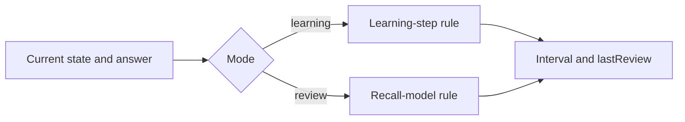

## Recall model

In review mode, the model assumes a recall probability

$$
P(t) = (1-w)e^{-kt}+w.
$$

For target recall probability $R^*$, the theoretical interval is

$$
I = -\frac{1}{k}\ln\left(\frac{R^*-w}{1-w}\right).
$$

This expression is defined under the intended conditions
$k>0$ and $0\leq w<R^*<1$. The implementation clamps the logarithm argument to
$[10^{-9},1-10^{-9}]$ as a numerical safeguard. Intervals and elapsed times are
converted to days during the calculation and rounded to integer microseconds
when converted back to `Duration`.

The main state variables are:

| Symbol | Code | Meaning |
|---:|---|---|
| $R^*$ | `rstar` | Target recall probability |
| $k$ | `kFactor` | Exponential forgetting coefficient in day$^{-1}$ |
| $w$ | `w` | Long-term recall floor |
| $\bar R$ | `rbar` | Weighted success estimate |
| $E$ | `easeFactor` | Review interval growth factor |
| $I$ | `interval` | Current theoretical interval |
| $j$ | `learningStepIndex` | Learning step; `-1` means review mode |

The derived maximum recall floor is

$$
w_{\max}=\texttt{wMaxFactor}\,R^*.
$$

## Review-mode update

Let $q$ be the numeric grade, with success indicator
$x=\mathbf{1}_{q\geq3}$. Let $\Delta$ be the elapsed time since the previous
review, or zero when no previous review exists. Lateness and tolerance are

$$
\ell=\max(0,\Delta-I),
\qquad
\tau=\min(\texttt{longPause},\texttt{minTolFactor}\cdot I).
$$

For an unsuccessful answer with $\ell\geq\tau$:

- if $\ell\geq\texttt{longPause}$, set $\bar R=0$ and $w=0$;
- otherwise, set
  $\bar R\leftarrow\bar R e^{-\mu\ell}$ and
  $w\leftarrow w_{\max}\bar R$.

For a successfull answer, there is no late penalty.


Define

$$
g(w)=-\ln\left(\frac{R^*-w}{1-w}\right).
$$

The interval branch is then:

- `again` ($q=0$): enter learning step 0 and use its duration, with a one-minute
  fallback;
- `hard` ($q=2$): enter learning step 1 and use its duration, with a ten-minute
  fallback;
- `medium` ($q=3$):
  $I\leftarrow\max(1, I\,\texttt{hardReviewFactor})$ days and
  $k\leftarrow g(w)/I$;
- `good` or `easy` ($q=4,5$):
  $k\leftarrow k/E$ and $I\leftarrow\max(1,g(w)/k)$ days;
- `easy` additionally multiplies the resulting interval by `easyBonus`.

All review intervals are capped at `iMax`. Failed reviews recompute $k$ from
the selected short interval using a denominator of at least one day.

Next, the ease factor is updated with the SM-2-derived rule

$$
\Delta E=0.1-(5-q)\left(0.08+(5-q)0.02\right),
\qquad
E\leftarrow\max(E+\Delta E,\texttt{efMin}).
$$

Finally, using the grade-specific coefficient $\lambda_q$:

$$
\bar R\leftarrow
\lambda_q\bar R+(1-\lambda_q)x,
\qquad
w\leftarrow w_{\max}\bar R.
$$

The value of $\bar R$ is clamped to $[0,1]$, and `lastReview` becomes the
answer timestamp.

The update order matters: the new interval uses the pre-answer value of $w$
after any late-failure correction. The grade's final $\bar R$ and $w$ update is
used by later reviews, not retroactively by the interval just computed.

## Learning-mode update

Let $s_0,\ldots,s_{n-1}$ be `learningSteps` and let $j\geq0$ be the current
learning index.

| Grade | Implemented transition |
|---|---|
| `again` | Set $j=0$ and $I=s_0$; fall back to one minute if no step exists |
| `hard` | Keep $j$; use $(s_j\cdot\texttt{hardLearningFactor})$ when $0<j<n$, otherwise a scaled mean of $s_0,s_1$ or a four-minute fallback |
| `medium` | Keep $j$; use $s_j$ when $0<j<n$, otherwise the mean of $s_0,s_1$ or a 5.5-minute fallback |
| `good` | Advance to the next short step while its index is strictly below $n-1$; otherwise graduate to review with the last step as interval |
| `easy` | Graduate immediately with `easyInterval` days and increase $E$ by 0.1, bounded below by `efMin` |

On graduation, $j=-1$ and $k=g(w)/I$. Every branch updates `lastReview`.
Learning-mode answers do not update $\bar R$ or $w$ in the current
implementation.

The last configured learning step therefore acts as the graduation interval;
it is not selected as another short learning repetition by the `good` branch.

## Scheduling consequences

`nextReview` is a getter:

$$
\texttt{nextReview}=\texttt{lastReview}+I,
$$

when `lastReview` exists. `SessionScheduler` uses it to prioritise learning and
relearning exercises.

Separately, `Exercise.applyAnswer` marks an exercise complete for the current
session only when `nextReview` is after the configured day boundary and the SRS
has left learning mode. This completion policy is not part of the recall
formula itself.

`previewInterval` applies the same branch calculations to a clone. It returns
only the interval and does not run persistence or change the original state.

````
