# 📘 Full Documentation Snapshot
> ⚙️ Auto-generated for ChatGPT context loading.

> Each section below corresponds to a file inside /docs.

> Source project: Psitta

---

---

## 📄 architecture/application_layer/application.md

markdown
[Documentation Index](/docs/index.md)

# `docs/architecture/application.md`

## Purpose

Describe the **Application / Controllers** layer, which coordinates:

* actions coming from the UI,
* business logic from the **Domain** (sessions, exercises),
* **Persistence** (loading and saving via repositories).

This diagram does not describe the UI or SQL details — only the **structural dependencies**.

---

## Diagram

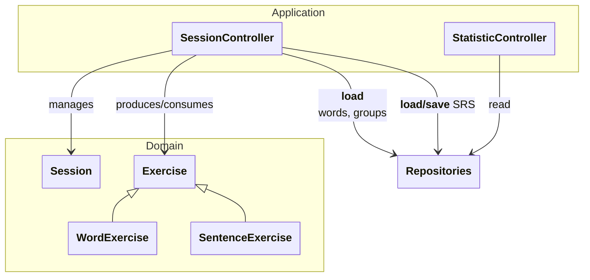

---

## Reading the Diagram

### Controllers (Application)

* `SessionController`: orchestrates the flow of a session (exercise and session creation; sending `Content` objects to the UI and collecting user input; session teardown).
* `StatisticController`: computes and exposes statistics from persisted data, without depending on sessions or the exercise runtime.

### Domain

* `Session` orchestrates the exercises of a session.
* `Exercise` is an abstract **runtime** object used during a session. `WordExercise` and `SentenceExercise` are two specialisations.

### Persistence

Controllers access data through **repositories**:

SQL, DB mapping, and table definitions are confined to the Persistence diagram.

---

## Architecture Rules

* The UI calls controllers; it never calls the Domain or Persistence directly.
* `StatisticController` does not depend on the runtime (sessions/exercises) — only on repositories.
* `SessionController` orchestrates sessions and delegates persistence to repositories (no SQL here).
* Answer submission persists exercise progression and session state in one transaction.
* The Domain remains independent of the Flutter UI layer.

---

## Note on Controller Lifecycle

**Controllers** are **long-lived** objects, created at application startup and shared across screens.

* They hold dependencies (repositories, configuration).
* They **do not represent** an ongoing session.
* They create and destroy **Session** instances on demand, parameterised by `SessionType`.

**Sessions** are **ephemeral** objects, scoped to the duration of a single learning session.

This decoupling allows multiple sessions to be run sequentially without recreating controllers, and ensures a clear lifecycle management.

* The Application layer knows neither `Widget`, nor Flutter, nor `BuildContext`.


---

## 📄 architecture/domain_layer/domain.md

markdown
[Documentation Index](/docs/index.md)

# `docs/architecture/domain.md`

## Purpose

Describe the **core business model** and the **general flow** of the learning engine.

This document establishes:

* the project vocabulary,
* the major responsibilities (`Session`, `Exercise`, content, progression),
Implementation details are covered in:

* `sessions.md` (lifecycle and orchestration),
* `exercises.md` (exercise runtime and statuses),
* `srs.md` (SRS progression + "exposure" progression via `SentenceState`).

---

## Domain Diagram (useful view, not exhaustive)

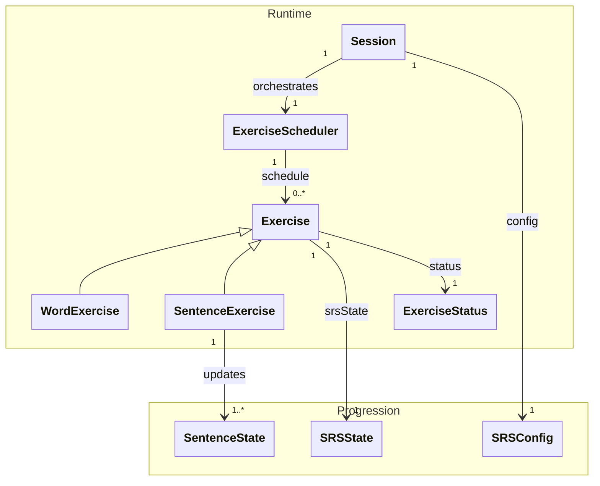

---

## Quick Model Overview

### 1) Content

* In the domain, only the `contentId` is saved. The domain does not need to what the content is. 
* `Exercise` have a getter to get the `contentId`. This id is used by the application layer to create the content for the UI.
  * For `SentenceExercise`, the getter target the `contentId` of the current sentenceInstance in the group. (see: [exercise.md](/docs/architecture/domain_layer/exercises.md))

### 2) Progression

* `SRSState` is **attached to `Exercise`** (not to `Word` or `SentenceExercise`). It manages inter-session progression logic.
* `SentenceState` is **separate from the SRS** and exists **for each `Sentence`** within a `SentenceExercise`.
* `SRSConfig` is provided by the `Session` and used for updates/previews through exercises.


### 3) Runtime

* `Exercise` is a **stateful runtime object**: `status`, `srsState`, intra-session logic.
* `WordExercise` and `SentenceExercise` only specialise the target and certain rules (allowed grades, `SentenceState` updates, etc.).
* `Session` is an **orchestrator**: it sequences exercises using `ExerciseSchedule` and holds the `SRSConfig`.

> Note: `SessionType` (see [sessions.md](sessions.md)) is an initialisation detail (validation/consistency) and is not a persistent state of `Session`.

---

## What the Domain Intentionally Ignores

* Flutter UI (widgets, navigation, layout)
* Persistence (SQL, schema, mapping)
* "UX" application parameters (e.g. display preferences)
* Organisation of content into "chapters" (this is an access/filtering structure on the Application/Stats side, not a runtime engine concern)

---

## Detail Distribution (to keep domain.md concise)

* `Session` details (start/end, current, ordering, call constraints) → `sessions.md`
* `Exercise` details (statuses, transition rules, allowed grades) → `exercises.md`
* Progression details (`SRSState`, `SentenceState`, `Grade`, preview/apply) → `srs.md`


---

## 📄 architecture/domain_layer/exercises.md

markdown
[Documentation Index](/docs/index.md)

# `docs/architecture/exercises.md`

## Purpose

Describe the **role of exercises** in the learning engine.

This document specifies:

* what an `Exercise` is,
* how it evolves during a session,
* how it interacts with progression mechanisms,
* the invariants to respect.

Temporal aspects and orchestration are described in [`sessions.md`](sessions.md).

---

## Role of an Exercise

An `Exercise` is a **stateful runtime object**.

It represents:

* a **user interaction** with learning content,
* within the context of a **given session**.

An exercise:

* is **created before** the session starts,
* is **temporary** (not persisted),
* encapsulates logic that is **local** to that interaction.

---

## Conceptual Diagram

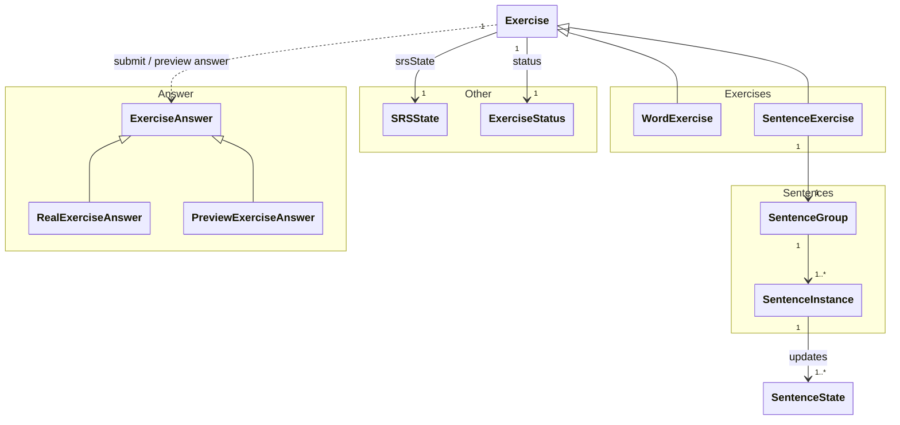

---

## General Structure of an Exercise

An `Exercise` encapsulates:

* a **local intra-session state** (`ExerciseStatus`),
* a **progression state** (`SRSState`),
* logic for reacting to user responses.

It knows nothing about:

* the global session,
* the UI,
* persistence.

---

## ExerciseStatus

`ExerciseStatus` describes the **current state** of an exercise during the session.

It is used by:

* the exercise (to manage its transitions),
* the Scheduler (to orchestrate the presentation order).

Typical status examples: not yet attempted, new exercise, already answered, completed.

---

## User Interaction: ExerciseAnswer

User interactions are modelled by the `ExerciseAnswer` type.

An exercise can receive:

* the **submitted response** (`SubmittedExerciseAnswer`):
  * resulting from an actual user interaction,
  * applied to the exercise and SRS state.

* a **hypothetical response** (`PreviewExerciseAnswer`):
  * used to simulate interval evolution,
  * with no side effects whatsoever.

The exercise is responsible for:
* validating that the response is permitted,
* delegating the progression update,
* updating its intra-session state.

---

## Exercise Specialisations

### WordExercise

A `WordExercise`:

* targets a `ContentId`,
* uses its `SRSState`.

It does not manipulate any `SentenceState`.

### SentenceExercise

A `SentenceExercise`:

* has its own `SRSState` (at the group level),
* targets a **group of sentences** (`SentenceGroup`),
* The `SentenceGroup` is composed of a list of `SentenceInstance`
* Each `SentenceInstance` Have:
  * his own `ContentId`
  * a `SentenceState` updated by the `SentenceExercise`


Using a group of sentences allows:

* a single **SRS** state to cover several grammatically related sentences,
* the user to be exposed to many sentences without compromising **SRS** quality.

---

## Content 

### Content

Each Words and Sentences have their own `ContentId`.

- A `ContentId` is used by the application layer to create the content needed for the UI.
- The domain, doen't need to know the content itself, because no logic have to be done on it.

---

## Core Invariants

* An exercise is always temporary.
* An exercise never persists any state.
* All progression updates go through an exercise.
* The session never directly modifies an exercise.
* An exercise knows neither the UI nor persistence.

---

## What the Exercise Intentionally Ignores

An exercise ignores:

* the global session sequencing,
* user parameters,
* the origin of data (DB, API),


---

## 📄 architecture/domain_layer/sessions.md

markdown
[Documentation Index](/docs/index.md)

# `docs/architecture/sessions.md`

## Purpose

Describe the **role of sessions** in the learning engine and their **lifecycle**.

This document specifies:

* what a `Session` is,
* what it does and does not do,
* how it interacts with exercises,
* the invariants to respect when using it.

Internal exercise details are described in [`exercises.md`](exercises.md).

---

## Role of a Session

A `Session` is a **runtime orchestrator**.

It is responsible for:

* the temporal sequencing of exercises,
* managing the start and end of a session,
* collecting a global result.

It is **not responsible** for:

* SRS logic,
* response evaluation logic,
* exercise creation,
* display.

---

## Conceptual Diagram

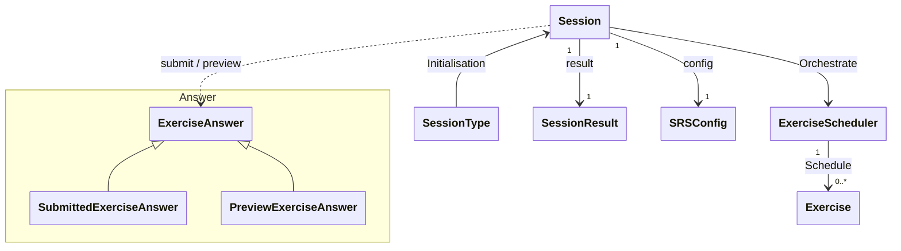

---

## Session Lifecycle

A session follows a **strict lifecycle**:

1. **Creation**

   * A session is created with:

     * a list of `Exercise` objects,
     * a `SessionType`,
     * a `SRSConfig`.
   * No exercise is yet active.

2. **Start**

   * The session is explicitly started (`begin`).
   * The first exercise becomes current.

3. **Execution**

   * The session:

     * ask the `ExerciseShceduler` for the next exercise,
     * is called with user responses (`ExerciseAnswer`) by the application layer,
     * delegates processing to exercises,

4. **End**

* The session can terminated by the user at any moment
* `Session.isSessionFinished()` tell you when there are no exercise left.
* When a session is terminated no exercise can answered anymore.
* A final `SessionResult` is produced when the session is terminated.

---

## Exercise Sequencing

The `ExerciseScheduler`:

* holds a **pre-existing list of exercises** 
* maintains a **current exercise**,
* determines the presentation order based on:

  * exercise state (`ExerciseStatus`, `SRSState`),
  * simple orchestration rules.

The Scheduler:

* **observes** exercise state,
* **never directly modifies** their internal logic.

---

## Interaction with Exercises

When a user response is submitted:

1. The session receives an `ExerciseAnswer`.
2. It delegates the response to the current exercise.
3. The exercise:

   * updates its state,
   * updates the progression mechanisms.
4. The session maintains exercise ordering, updates `SessionResult`, then selects the next exercise.

The session does not know:

* the meaning of a response (`Grade`, durations),
* evaluation or progression rules.

---

## Preview vs Submitted Submission

The session distinguishes two types of user interactions:

* **Real submission** (`SubmittedExerciseAnswer`)
  * modifies the exercise and SRS state,
  * updates `SessionResult`,
  * triggers persistence on the application side.

* **Preview** (`PreviewExerciseAnswer`)
  * simulates the theoretical interval,
  * has no side effects,
  * modifies neither the exercise nor the session.

This distinction guarantees that:
* calculation logic is unique,
* the Domain state is never modified by an exploratory action.

---

## SessionType

A `SessionType` represents the **pedagogical intent** of the session.

It is used:

* during initialisation only,
* to validate the consistency of the provided exercises,
* to qualify the session from a user and statistical perspective.

It is **not a long-lived state** of the session
and does not influence its internal behaviour after initialisation.

---

## SessionResult

A `SessionResult` is a **summary object**.
It is created during initialisation and updated after each response.

It aggregates:

* counters (exercises processed, successes, failures),
* timing information,
* global progression data.

It contains:

* no business logic,
* no evaluation rules.

---

## Core Invariants

* A session orchestrates exercises — it does not create them.
* A session contains no SRS logic and no response evaluation logic.
* A session does not know the detailed pedagogical content.
* All progression updates go through an exercise.
* A session can only be started once.
* A terminated session can no longer accept responses.
* The application layer observes session state only through explicit getters (to ensure consistency and facilitate persistence).

---

## What the Session Intentionally Ignores

The session ignores:

* UI and screens,
* persistence,
* user parameters,
* organisation of content into chapters.


---

## 📄 architecture/domain_layer/srs.md

markdown
[Documentation Index](/docs/index.md)

# `docs/architecture/srs.md`

## Purpose

Describe the **functioning of the Spaced Repetition System (SRS)** and its usage rules within the learning engine.

This document specifies:

* the role of the SRS,
* the responsibilities of the classes involved,
* the distinction between intra-session and inter-session behaviour,
* persistence rules.

---

## Role of the SRS

The SRS is responsible for:

* representing the memorisation state,
* evolving that state after each response,
* computing a **theoretical review interval**.

The SRS:

* has no concept of a session,
* never decides when a review takes place — it only computes when a review would be optimal.

---

## SRS Diagram

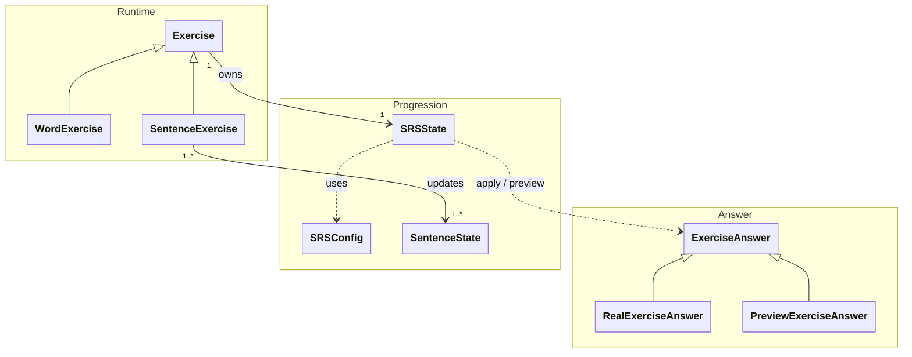

---

## SRSState

`SRSState` represents the memorisation state of an exercise.

* Attached directly to `Exercise`.
* Persisted.
* Modified only as the result of a user response.

Responsibilities:

* interpret a user response (`ExerciseAnswer`),
* evolve the memorisation state,
* compute a theoretical review interval,
* provide an interval simulation without side effects (preview).

`SRSState` never directly consumes a `Grade`.
It interprets an `ExerciseAnswer`, which encapsulates:
* the grade (`Grade`),
* The timestamp (the moment of the response),
* and optionally timing information (step durations).

---

## SRSConfig

`SRSConfig` groups the parameters of the SRS model.

* Provided to the `Session`.
* Used when updating `SRSState`.
* Contains no runtime logic.

---

## SentenceState

`SentenceState` represents the exposure/usage state of a sentence. It is updated by `SentenceExercise` objects (typically one state per sentence in the group), independently of the SRS: it does not compute a review interval but serves contextual progression tracking.

Its role is to hold the information that allows `SentenceExercise` to choose which sentence to display — typically: the least shown / least successfully answered sentence in the group.

---

## ExerciseAnswer

The SRS does not process raw grades directly, but **modelled user responses**.

`ExerciseAnswer` is a sealed type representing an interaction with an exercise:

* `RealExerciseAnswer` corresponds to an actual user response and triggers a persisted update to `SRSState`.

* `PreviewExerciseAnswer` represents a hypothetical response, allows simulation of interval evolution, and has **no side effects**.

This distinction guarantees that:
* preview never alters the persisted state,
* every real SRS update is explicitly intentional.

---

## Grade

`Grade` represents the quality of a user response (e.g. failure, partial success, success). It is provided by the application layer, but its interpretation (effect on progression) is entirely managed by the exercise and the SRS.
Not all grades are valid for every exercise type.

---

## Intra-Session vs Inter-Session

### Theoretical Interval

After a response, the SRS computes an interval **independent of context**:

* minutes,
* hours,
* days.

### Intra-Session Usage

The `Session` may use the interval to:

* reorder exercises,
* re-present an exercise within the session,
* ignore intervals that exceed the session duration.

The session:

* never modifies the interval,
* only applies an orchestration policy.

### Inter-Session Usage

Outside of a session:

* the interval is used to schedule the next review,
* no session logic is involved.

---

## Practical Usage

### Interval Preview

The session can expose an **interval preview**:

* without modifying `SRSState`,
* using a `PreviewExerciseAnswer`,
* with logic strictly identical to that of a real response,
* for informational purposes: the user knows when they will see the same exercise again if they achieve a given grade.

### Persistence: Fundamental Rule

`SRSState` objects are persisted **after each valid user response**.

* The Domain updates the SRS.
* The application layer triggers persistence.
* Sessions and exercises are never persisted.

### Mobile Considerations

* An interrupted session is abandoned.
* Unfinished exercises are lost.
* Already persisted `SRSState` objects remain valid.
* Timing statistics are best-effort.

---

## Invariants

* The SRS computes only theoretical intervals.
* The SRS has no concept of a session.
* Every SRS update goes through an exercise.
* Persistence is immediate after each response.


---

## 📄 architecture/overview.md

markdown
[Documentation Index](/docs/index.md)

# `docs/architecture/overview.md`

## Purpose

Describe the overall application architecture and the dependency rules between the main building blocks.
This diagram provides a **macroscopic view** of the project; the internal details of each block are covered in the following diagrams.

---

## Diagram

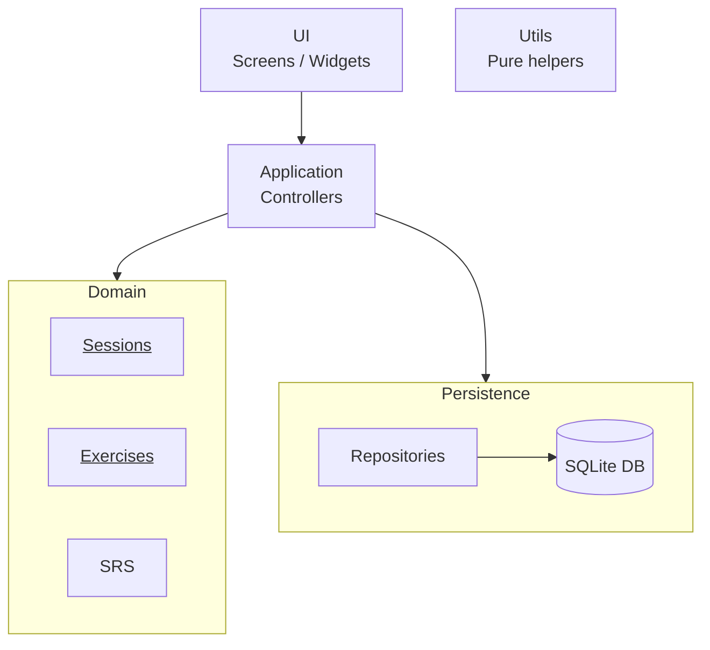

---

## Reading the Diagram

### [UI](ui.md)

The **UI** block groups all Flutter screens and widgets.
It is solely responsible for rendering and handling user interactions.

### [Application](application.md) / Controllers

The **Application** block is the entry point for application logic.
Controllers:

* receive user actions from the UI,
* orchestrate business operations,
* coordinate the use of the Domain and Persistence layers.

### [Domain](domain.md)

The **Domain** groups all business logic of the application.
It is intentionally represented as a **single block**, but structured into conceptual sub-components:

* **Exercises**
  Represents the concrete exercises presented to the user.
  Exercises are stateful runtime objects, created before the session starts and destroyed at its end.

* **Sessions**
  Manages the organisation of exercises into learning sessions. It's the starting point of the domain.

* **SRS**
  Implements spaced repetition logic and progression state.

The Domain is **independent of all technology** (UI, DB, Flutter, SQLite).

### [Persistence](persistence.md)

The **Persistence** block is responsible for storing and reconstructing Domain data.

* **Repositories** expose a business-oriented data access interface.
* The **SQLite database** handles physical storage.

SQL, mapping (`toMap / fromMap`), and persistence details are confined to this block.

### Utils

The **Utils** block groups pure utility functions (dates, conversions, helpers).
It is transversal and does not belong to the main dependency hierarchy.

---

## Dependency Rules

* The **UI** depends only on the **Application** layer.
* The **Application** depends on the **Domain** and **Persistence** layers.
* The **Domain** does not depend on any technical layer.
* The **Persistence** contains no business logic.
* **SQL and DB mapping** are confined to Persistence.

---

## Architecture Notes

* The Domain is presented as a single block at the global level; its internal structure is detailed in the following diagrams.
* The Application acts as an orchestrator between the UI, Domain, and Persistence layers.
* Utility functions are intentionally excluded from the explicit dependency diagram to preserve readability.

### Notes on the Chapter Concept

* Words and sentences are organised by chapter. This chapter concept only exists in `StatsScreen` and `HomeScreen`.
* Chapters structure content for the user, but play no role in the learning logic and are therefore ignored by sessions and the domain.


---

## 📄 architecture/persistence_layer/database.md

markdown
[Documentation Index](/docs/index.md)

# SQLite Database

## Purpose

Describe the structure and main relationships of the SQLite database used by the Persistence layer.

The database stores persistent application data such as:

* exercises and their progression,
* learning content,
* sentence groups,
* exercise history,
* session results.

Runtime objects such as `Session` and `Exercise` are not stored directly.

---

## Schema Overview

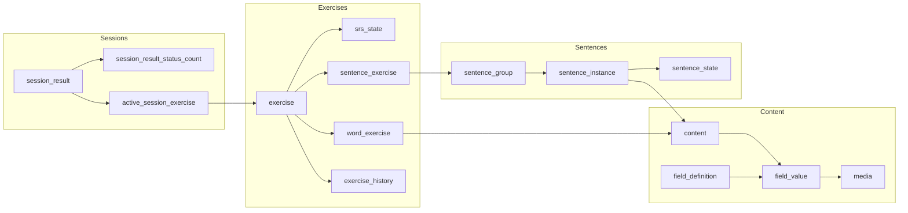

The schema is organised around four main areas:

* **Exercises** — persistent exercise identity and SRS state.
* **Content** — generic content and its fields.
* **Sentences** — groups, sentence instances and sentence-level progression.
* **Sessions** — persistent results produced by completed sessions.

---

## Exercises

An exercise is represented by a base `exercise` row and a type-specific row:

* `word_exercise`
* `sentence_exercise`

The common identity is stored in `exercise`, while type-specific data is stored in the corresponding table.

Each exercise has exactly one `srs_state`.

Exercise responses are recorded separately in `exercise_history`, allowing multiple history entries for the same exercise.

---

## Content

Content is stored independently from exercises.

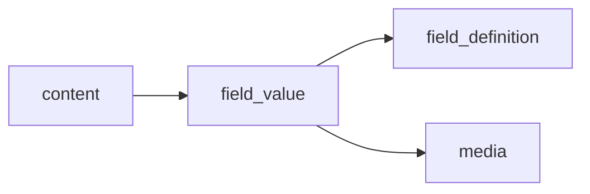

A `content` item is composed of one or more field values.

`field_definition` describes what a field represents, while `field_value` stores the value associated with a particular content item.

Media are stored as references to files rather than as binary data inside the database.

---

## Sentences

Sentence exercises operate on groups of sentence instances.

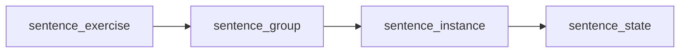

A `sentence_group` contains several `sentence_instance` objects.

Each instance has its own `sentence_state`, which tracks sentence-level exposure independently from the exercise's `srs_state`.

---

## Session Results

Sessions are runtime objects and are not persisted.

Sessions are reconstructed from their result and active-exercise rows:

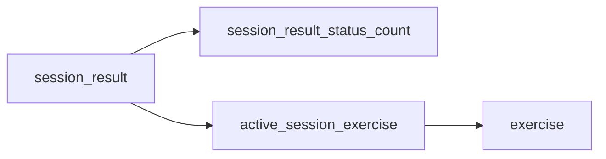

`session_result` stores aggregate progress, `session_result_status_count` stores answer
counts, and `active_session_exercise` stores the per-session state required for resume.

---

## Referential Integrity

Foreign keys are enabled in SQLite.

`ON DELETE CASCADE` is used for data that is owned by another entity, such as:

* an exercise and its SRS state,
* an exercise and its history,
* a sentence group and its instances,
* a sentence instance and its state,
* a session result and its status counts.
* a session result and its active exercises.

References to shared `content` do not cascade. Deleting content therefore does not automatically delete the exercises that reference it.

---

## Runtime vs Persistent Data

The database does not reproduce the Domain object graph exactly.

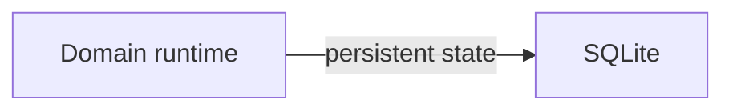

The database stores the information required to reconstruct and continue the application, rather than temporary runtime objects.

In particular:

* `Session` is reconstructed rather than stored as a serialized object.
* `Exercise` runtime state is not persisted directly.
* `SRSState` is persisted.
* Exercise history is persisted.
* Session results are persisted.


---

## 📄 architecture/persistence_layer/persistence.md

markdown
[Documentation Index](/docs/index.md)

# `docs/architecture/persistence.md`

## Purpose

Describe the general architecture of the **Persistence** layer and its role in the application.

The Persistence layer is responsible for:

* storing application data,
* loading persisted data,
* translating between Persistence models and Domain objects,
* isolating the Domain from SQLite and other storage-specific details.

The Persistence layer does **not** contain business logic.

---

## Architecture

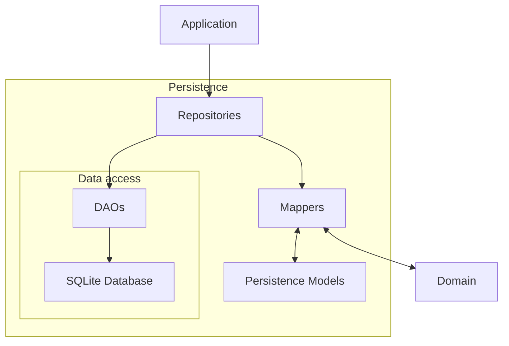

---

## General Flow

Persistence acts as a boundary between the **Domain** and the physical database.

When data is loaded:

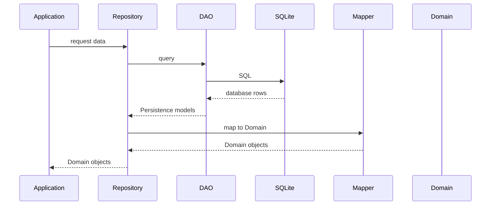

When Domain state must be persisted, the flow is reversed:

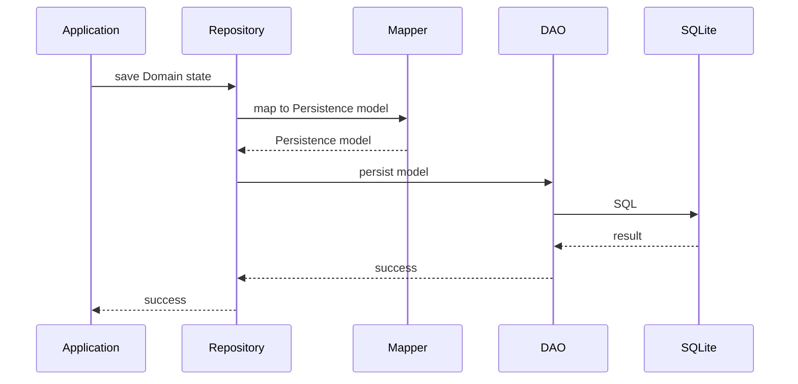

The important boundary is that **SQL and Persistence models never leave the Persistence layer**.

---

## Main Components

### Repositories

Repositories expose a **Domain-oriented interface** to the Application layer.

They:

* coordinate data access,
* combine several DAOs when necessary,
* convert Persistence models into Domain objects,
* hide the database implementation.

A repository therefore represents an application concept rather than necessarily a single database table.

### DAOs

DAOs are responsible for **database access**.

They:

* execute SQL queries,
* insert, update and delete database data,
* reconstruct Persistence models from database rows.

DAOs do not contain Domain logic.

### Persistence Models

Persistence models represent the data as it is stored and manipulated inside the Persistence layer.

They are intentionally separate from Domain objects.

This allows the database schema to evolve without forcing the Domain model to follow the same structure.

### Mappers

Mappers translate between:

* Persistence models ↔ Domain objects.

They contain structural conversion logic, but no business rules.

### Database

The database component manages SQLite itself:

* database connection,
* schema creation,
* migrations,
* transactions,
* database-level configuration.

Foreign-key enforcement is enabled before migrations run. Schema changes are applied
through the ordered migration registry.

SQLite-specific details remain confined to Persistence.

---

## Dependency Rules

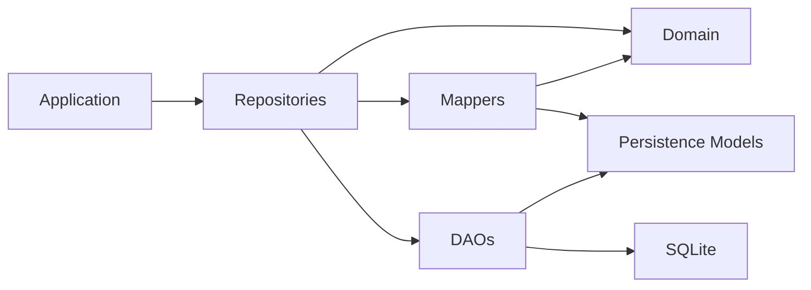

The following rules must hold:

* The Application accesses persisted data through repositories.
* The Domain never accesses Persistence.
* DAOs never expose SQL rows or `Map<String, dynamic>` outside Persistence.
* Persistence models never leave Persistence.
* Mappers are the boundary between Domain objects and Persistence models.
* SQL is confined to DAOs and database infrastructure.
* Persistence does not implement business rules.

---

## Persistence vs Domain

The distinction is intentional:

**Domain**

* defines what the application means,
* owns business rules,
* computes progression,
* manages runtime state.

**Persistence**

* defines how data is stored,
* reconstructs Domain state,
* executes queries,
* handles database-specific concerns.

Persistence records the state produced by the Domain; it does not decide what that state should be.

---

## Current Structure

The Persistence layer is currently organised around four main technical components:

```text
persistence/
├── database/
├── models/
├── mappers/
├── dao/
└── repositories/
```

Each component has a distinct responsibility:

| Component | Responsibility |
|---|---|
| `database/` | SQLite database and migrations |
| `models/` | Persistence representation of stored data |
| `mappers/` | Domain ↔ Persistence conversion |
| `dao/` | SQL and low-level database access |
| `repositories/` | Domain-oriented data access API |

The detailed design of each component is documented separately.


---

## 📄 architecture/persistence_layer/repositories.md

markdown
[Documentation Index](/docs/index.md)

# Persistence Repositories

## Purpose

Repositories provide the **application-facing API** of the Persistence layer.

They:

* expose operations oriented toward application use cases,
* hide DAOs and SQL queries,
* convert Persistence models into Domain objects,
* persist Domain state produced by the application and Domain layers.

The Application layer should interact with repositories rather than with DAOs directly.

---

## Architecture

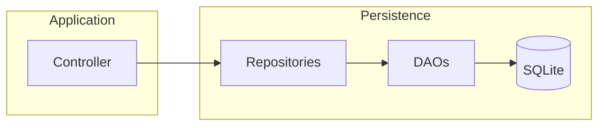

Repositories are therefore the **boundary between the Application layer and the database implementation**.

---

## Repository API

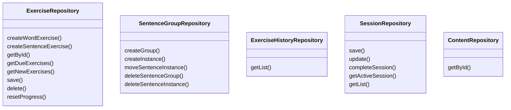

### `ExerciseRepository`

Manages the persisted state associated with learning exercises.

It is responsible for:

* creating Word and Sentence exercises,
* loading exercises by ID,
* loading due or new exercises,
* saving progression after a response,
* deleting exercises,
* resetting an exercise's progression.

When saving a `SentenceExercise`, the repository also persists the associated sentence progression state and exercise history.

---

### `SentenceGroupRepository`

Manages sentence groups and their sentence instances.

It provides operations to:

* create a group,
* add a sentence instance,
* move an instance between groups,
* delete a group,
* delete an instance.

It does not create or manage `SentenceExercise` objects.

---

### `ExerciseHistoryRepository`

Provides read access to the history of exercise responses.

History can be filtered by:

* exercise,
* start date,
* end date.

History entries are returned as Domain `ExerciseHistoryEntry` objects.

---

### `SessionRepository`

Persists active and completed sessions and provides historical results. Active sessions
store the exercise status needed to resume the runtime session.

It provides:

* saving and updating an active `Session`,
* restoring an active session,
* completing a session,
* retrieving results within an optional date range.

---

## Content

`ContentRepository` and `MediaRepository` expose the persisted data used to assemble
Application-level content. Exercises retain only the `contentId` required to load it.

---

## Repository Boundary

The intended dependency flow is:

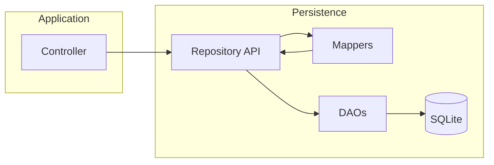

The important rule is:

> **Controllers use repositories; repositories use DAOs and mappers.**

DAOs and Persistence models remain implementation details of the Persistence layer.


---

## 📄 architecture/ui_layer/ui.md

markdown
[Documentation Index](/docs/index.md)

# UI Layer

## Current State

The application shell and screens are not implemented yet. The existing UI code is
limited to generic content presentation:

* `ContentRenderer` selects and renders content fields;
* `FieldRenderer` renders supported field values;
* `MediaResolver` resolves persisted media references.

The first UI flow will use `SessionController` to start, resume, answer, pause, and
complete word or sentence sessions. Statistics will be obtained from
`StatisticController`.

## Dependency Rules

* UI code calls Application controllers rather than repositories or DAOs.
* Business rules remain in the Domain layer.
* SQL and persistence models never enter the UI layer.
* The state-management mechanism will be selected when the application shell is built.


---

## 📄 index.md

markdown
# 📚 Documentation

This directory contains the complete technical documentation of the project.

The documentation is divided into two main parts:

- **Architecture**, which describes how the application is structured.
- **Mathematics & SRS**, which documents the learning algorithm and its theoretical foundations.

---

# Architecture

## [Overview](architecture/overview.md)

Provides a high-level view of the application's architecture and the dependency rules between the different layers.

## [UI](architecture/ui_layer/ui.md)

Describes the application's screens, their responsibilities, and the controllers they interact with.

## [Application](architecture/application_layer/application.md)

Explains the role of the controllers and how they coordinate the UI, Domain, and Persistence layers.

## [Persistence](architecture/persistence_layer/persistence.md)

Describes the Persistence layer and its role as the boundary between the application and data storage.

### [Database](architecture/persistence_layer/database.md)

Describes the SQLite database schema and the relationships between persisted entities.

### [Repositories](architecture/persistence_layer/repositories.md)

Describes the API exposed by the Persistence layer to the Application layer.

## [Domain](architecture/domain_layer/domain.md)

Introduces the core business model of the application, including sessions, exercises, content, and progression.

### [Sessions](architecture/domain_layer/sessions.md)

Details the lifecycle of a learning session and how it orchestrates exercises.

### [Exercises](architecture/domain_layer/exercises.md)

Describes runtime exercises, their responsibilities, state transitions, and interactions with the SRS.

### [SRS](architecture/domain_layer/srs.md)

Explains how the spaced repetition system integrates into the Domain and how progression is managed.

---

# Mathematics & SRS

## [SRS Hypotheses](maths_and_srs/hypotheses_et_info_srs.md)

Lists the cognitive assumptions, product choices, and scope of the SRS model.

## [SRS Mathematics](maths_and_srs/maths_srs.md)

Presents the mathematical model, formulas, variables, and update equations used by the SRS.

## [SRS Invariants](maths_and_srs/invariant.md)

Defines the formal invariants that every valid `SRSConfig` and `SRSState` must satisfy.

---

Each document focuses on a single aspect of the project to minimise duplication and keep the documentation easy to maintain.

Some parts of this documentation were written with the assistance of AI. All generated content has been reviewed and verified by the project author to ensure consistency and accuracy.


---

## 📄 maths_and_srs/hypotheses_et_info_srs.md

markdown
[Documentation Index](/docs/index.md)

# Hypotheses and Scope of the SRS Model

This document describes the **non-mathematical hypotheses** of the spaced repetition model (SRS) used in the application.

It complements:

* the mathematical SRS documentation [`maths_srs.md`](maths_srs.md),
* the architecture diagrams (Domain, Sessions, Application).

Its purpose is to make **explicit the cognitive, pedagogical, and product choices** that guide the model, in order to:

* avoid ambiguity during future evolutions,
* clearly distinguish what is intentionally simplified from what is genuinely missing,
* define the scope of the MVP.

---

## 1. Core Hypothesis: the SRS evaluates a task, not abstract knowledge

Each **exercise** (in the sense of: type of task) has its own SRS state.

The same content (word, rule, sentence) may therefore be associated with **several distinct exercises**, for example:

* language A → language B,
* language B → language A,
* recognition vs. active recall.

The SRS never evaluates a "global mastery" of a word or rule, but only the ability to succeed at **one specific task**.

This choice allows:

* avoiding any ambiguity about what it means to "know" an item,
* aligning the model with Anki (one note → multiple cards),
* keeping the SRS simple and local.

---

## 2. Hypothesis on the response signal: subjective self-assessment

The model assumes that the user is capable of honestly self-assessing after each exercise.

The possible responses (Easy / Good / Medium / Hard / Again) reflect:

* the correctness of the answer,
* the degree of hesitation felt,
* the perceived time to answer,
* confidence in the response.

**Actual measured time** is not used. The signal is intentionally subjective.

This choice is deliberate because:

* users perceive their own difficulty better than a raw time measurement would,
* it avoids heavy and fragile instrumentation,
* it is the model successfully used by Anki.

---

## 3. Hypothesis on delay: success takes precedence over elapsed time

A successful response to an exercise is **never penalised**, even after a significant delay.

The model considers that:

* if the user succeeds despite the delay, the mastery state was sufficient,
* elapsed time alone is not more reliable information than the success itself.

Delay is only taken into account **when the exercise is failed**, in order to:

* reset or weaken the SRS state,
* prevent repeated lucky successes from masking a real fragility.

This choice favours:

* SRS stability,
* user confidence,
* a simple and explainable system behaviour.

---

## 4. Hypothesis of local independence between exercises

Each exercise is treated as **independent from the others**.

The SRS does not model:

* skill transfer between exercises,
* dependencies between vocabulary and grammar,
* hierarchical relationships between items of knowledge.

This choice is intentional.

It rests on the idea that:

* good vocabulary coverage is critical,
* sentences serve mainly as exposure and contextualisation,
* a poorly mastered sentence should simply reappear sooner.

The approximation is considered acceptable as long as:

* words are correctly revised,
* errors on sentences lead to rapid repetition.

---

## 5. Hypothesis on the role of sentences

Sentences are not fundamental units of knowledge.

They serve primarily to:

* illustrate grammatical rules,
* provide real-world context,
* reinforce memorisation through repeated exposure.

The SRS for sentences may be less precise than that for words without compromising overall learning.

Aids (e.g. displaying word translations within a sentence) are acceptable and do not invalidate the exercise, since the primary objective remains exposure and comprehension.

---

## 6. Product hypothesis: priority on simplicity and explainability

The model favours:

* simple rules,
* predictable behaviour,
* complete explainability for both the user and the developer.

It does not aim for maximum theoretical optimality.

This implies in particular:

* no Bayesian probabilistic model,
* fixed global parameters,
* no automatic parameter learning.

These limitations are accepted for the MVP.

---

## 7. Session management (MVP)

Sessions are **ephemeral** objects.

Their role is to:

* orchestrate a sequence of exercises,
* collect responses,
* delegate SRS updates.

**Exercise prioritisation** (e.g. if 150 exercises are due but the daily maximum is 100) is performed **before the session**, in the Application layer.

Inside a session:

* no additional sorting is necessary,
* exercises are presented in the order defined at session creation.

---

## 8. Cognitive load management (MVP)

The model has no global representation of the user's state (fatigue, declining performance).

For the MVP, management relies on simple rules:

* the user may interrupt a session at any time,
* a stop or pause may be suggested in case of repeated errors.

Occasional errors or a poor session should not permanently penalise the SRS state.

---

## 9. Explicit MVP scope

The MVP **does not attempt** to solve the following problems:

* fine-grained probabilistic memory modelling,
* skill transfer between items of knowledge,
* automatic SRS parameter learning,
* global model adaptation to the user.

These evolutions are considered **post-MVP** and must not influence current choices as long as the hypotheses above are respected.

---

## 10. Role of this document

This document serves as a reference for:

* justifying the SRS model choices,
* guiding future evolutions without distorting the system,
* preventing the introduction of features inconsistent with the founding hypotheses.

Any major SRS modification must be evaluated against the hypotheses described here.

---

## TODO:

* Suggestion to stop or pause in case of repeated errors.
* **Exercise prioritisation** in the application layer based on recall probability (rather than interval).


---

## 📄 maths_and_srs/invariant.md

markdown
[Documentation Index](/docs/index.md)

# SRS Model Invariants

This document lists **all formal invariants** of the SRS model used in the application.

An invariant is a property that **must always hold** to guarantee:
- the mathematical validity of the model,
- the cognitive consistency of its behaviour,
- the absence of undefined states (NaN, negative intervals, etc.).

Invariants are divided into two categories:
1. invariants related to `SRSConfig` (global, static configuration),
2. invariants related to `SRSState` (dynamic, persisted state).

---

## 1. `SRSConfig` Invariants

These invariants concern **only the model configuration**.

They must be verified:
- when a `SRSConfig` is created,
- when loading from persistence,
- when modified via the `SettingsScreen`.

They **must not** be verified on every runtime SRS update.

---

### 1.1. Probabilistic parameters

- For every `λ` in `lambdas`:  
`0 < λ ≤ 1`
- `lambdas.length == 6`

Rationale:
- `λ` is a weighted forgetting factor.
- Outside this range, the weighted success average (`rbar`) becomes unstable or unbounded.
- `lambdas` must provide a value for each `Grade` used by the SRS.
  In the current implementation, this corresponds to a length of 6
  (grades 0 to 5), even if some grades may be unused.

---

### 1.2. Temporal decay parameters

- `mu ≥ 0`

Rationale:
- `mu < 0` would cause memory to strengthen with delay, which is nonsensical.

---

### 1.3. Long pause handling

- `longPause > 0`

Rationale:
- a zero or negative pause has no temporal meaning.

- `0 ≤ minTolFactor ≤ 1`

Rationale:
- tolerance cannot exceed the expected interval,
- nor be negative.

---

### 1.4. Learning phases

- `learningSteps.isNotEmpty`

**Hard** invariant.

- `learningSteps.length > 1`

**Soft** invariant (recommended, but not strictly required).

Rationale:
- an empty or degenerate learning phase has no pedagogical value.

---

### 1.5. Multiplicative factors

- `hardReviewFactor ≥ 1`
- `0 < hardLearningFactor ≤ 1`
- `easyBonus ≥ 1`

Rationale:
- "Hard" must never be more favourable than "Good",
- "Easy" must always accelerate progression.

---

### 1.6. Day boundary

- `dayBoundary < 24h`

Rationale:
- a boundary greater than or equal to 24h makes daily partitioning incoherent.

---

### 1.7. Derived definition (not an invariant)

- `wMax = wMaxFactor × rStar`
- `0 ≤ wMaxFactor < 1`

This relationship is **definitional** and guaranteed by a getter.
It must not be verified dynamically.
The second relation ensures that `w < rStar` and that the logarithmic
expressions in the model are always defined.

---

### 1.8. Default parameters

- `0 < rstar < 1`

`rstar` is a probabilistic parameter representing the target recall probability.

---

- `0 < easyInterval < iMax`

All intervals are in days.

Note:
It is recommended that `easyInterval` be greater than or equal to
the last step in `learningSteps`, to avoid a regression when
graduating with "Easy".

---

- `0 < efMin`

Minimum possible value of `easeFactor`.

---

- `0 < iMax`

Maximum review interval. An interval that is too short has no value but is not forbidden.

---

- `efMin < defaultEF`

Default value of `easeFactor`.

---

- `0 < defaultW ≤ wMax`

Default value of `w`.


---

## 2. `SRSState` Invariants

These invariants concern the **dynamic memorisation state**.

They must be:
- verified regularly,
- corrected where possible,
- signalled (exception / log) when an inconsistency is detected.

Unlike `SRSConfig`, `SRSState` may attempt to **correct certain invariants**
to prevent irreversible corruption.

---

### 2.1. Temporal invariants

- `interval > 0`
- `interval ≤ config.iMax`

Rationale:
- a zero or negative interval is invalid,
- an excessively large interval breaks scheduling.

---

- `lastReview ≤ nextReview`

Rationale:
- time cannot go backwards.

---

### 2.2. Mathematical invariants

- `kFactor > 0`

Rationale:
- `kFactor` is a forgetting rate (unit: `1 / day`),
- required for exponential computation.

---

- `0 ≤ rbar ≤ 1`

Rationale:
- `rbar` is a weighted average of successes.

---

- `0 ≤ w ≤ wMax`

Rationale:
- otherwise the recall probability becomes invalid
  (`log` or exponential undefined).

---

- `efMin ≤ easeFactor`

Rationale: this is a minimum bound.

---

### 2.3. Logical state invariants

- `learningStepIndex == -1`  
**or**
- `0 ≤ learningStepIndex < learningSteps.length`

Rationale:
- no other state is semantically valid.

---

### 2.4. History

- All elements of `history` must be valid `Grade` values.

- `history.isNotEmpty` after at least one effective review.
- `history.length` must match the number of grades effectively applied.

Rationale:
- history is used for:
  - statistics,
  - updating `rbar`.

---

### 2.5. Cross-variable invariants

- `nextReview = lastReview + interval`

Rationale:

`interval` represents the theoretically optimal interval between
`lastReview` and `nextReview`.

By construction:
`nextReview` is computed as `lastReview + interval`
at the moment the SRS is updated, regardless of whether the current
date has exceeded that value.

---

### 2.6. Soft invariants (debug / monitoring)

These invariants **must not** cause failures in production,
but may trigger:
- logs,
- debug assertions.

Examples:
- minor inconsistency between `interval` and `nextReview - lastReview`,
- `nextReview` slightly in the past.

---

## 3. Fundamental Rule

- Invariants **do not correct logic**.
- They **detect** and **signal** violations of assumptions.
- Any automatic correction must be:
  - minimal,
  - documented,
  - followed by a notification (log / error).

---

## 4. What Are Not Invariants

Formulas that must **not** be treated as invariants:

- `w = wMax * rbar`

This is a `w` update equation.
`w` is a stored latent state — it does not strictly depend on `wMax` and `rbar` at all times.

For the same reason, there is no invariant between: `interval`, `easeFactor`, `kFactor`, and `w`.

---

## 5. Recommended Usage

- `SRSConfig`:
  - invariants verified **once** at creation.
- `SRSState`:
  - invariants verified:
    - after construction,
    - after applying a `Grade`,
    - after loading from persistence.

---

This document is the reference for any future SRS evolution.
Any modification to the model must preserve these invariants or explicitly justify their evolution.


---

## 📄 maths_and_srs/maths_srs.md

markdown
[Documentation Index](/docs/index.md)

# 🧮 SRS Model Mathematics

This document describes the formulas and variables used by the SRS engine of the application.

---

## 🔹 Base Model

The retention probability after a delay $t$ is:

$$
P(t) = (1 - w)e^{-k t} + w
$$

We seek the interval $I$ such that $P(I) = R^*$:

$$
I = -\frac{1}{k}\ln\left(\frac{R^* - w}{1 - w}\right)
$$

---

## 🔹 Main Variables

| Symbol | Name (field / param) | Description |
|---:|---|---|
| $R^*$ | `rstar` | target recall probability |
| $k$ | `kFactor` | forgetting coefficient (short-term) |
| $\text{easeFactor}$ | `easeFactor` | ease factor (adjusts $k$ during review) |
| $w$ | `w` | long-term memory weight (determined by $\bar{R}$) |
| $w_{\max}$ | `wMax` (derived) | $w_{\max} = \text{wMaxFactor}\cdot R^*$ |
| $\bar{R}$ | `rbar` | weighted average of recent successes |
| $\lambda_q$ | `lambdas[q]` | weighting factor associated with grade $q$ |
| $\mu$ | `mu` | exponential decay rate during long pauses |
| `longPause` | `longPause` | delay (days) after which state is fully reset |
| `minTolFactor` | `minTolFactor` | minimum tolerance factor for delay |
| $I$ | `interval` | current interval (Duration) |
| `nextReview` | `nextReview` | DateTime of the next scheduled review |
| `lastReview` | `lastReview` | DateTime of the last review |
| `history` | `history` | grade history (list) |
| `learningStepIndex` | `learningStepIndex` | learning step index (-1 = review mode) |
| `learningSteps` | `learningSteps` | learning step durations (List\<Duration\>) |
| `easyInterval` | `easyInterval` | interval in days for "Easy" graduation |
| `hardReviewFactor` | `hardReviewFactor` | multiplier for "Hard" in review mode |
| `hardLearningFactor` | `hardLearningFactor` | multiplier for "Hard" in learning mode |
| `easyBonus` | `easyBonus` | multiplier for "Easy" in review mode |
| `iMax` | `iMax` | maximum interval (days) |
| `defaultEF` | `defaultEF` | default ease factor value |
| `defaultW` | `defaultW` | default `w` value |
| `wMaxFactor` | `wMaxFactor` | factor used to compute $w_{\max}$ |
| `dayBoundary` | `dayBoundary` | duration representing the day boundary (Duration) |

(Verified: all fields present in `SRSState` and `SRSConfig` are listed above.)

---

## 🔹 Parameter Updates

### 1) Weighted success average
After an observation `obs` (1 = success, 0 = failure) and a weight $\lambda_q$ depending on grade $q$:

$$
\bar{R}_{t+1} = \lambda_q\bar{R}_t + (1 - \lambda_q)\,\text{obs}
$$

### 2) Long-term memory
$$
w = w_{\max}\cdot \bar{R},\qquad w_{\max} = \text{wMaxFactor}\cdot R^*
$$

### 3) Forgetting rate adjustment via easeFactor
On a successful review:

$$
k_{\text{new}} = \dfrac{k_{\text{old}}}{\text{easeFactor}}
$$

### 4) Next interval computation
With updated $k_{\text{new}}$ and $w$:

$$
I_{\text{next}} = -\frac{1}{k_{\text{new}}}\ln\left(\frac{R^* - w}{1 - w}\right)
$$

Constraint applied: $I_{\text{next}} \le iMax$ (in days).

---

## 🔹 Long Pause (Delay) Handling and the Role of $\mu$

Let $\Delta t$ be the time elapsed since the last review and $I$ the expected interval. Define:

$$
l = \max(0,\Delta t - I)
$$

Tolerance:

$$
\text{tol} = \min(\text{longPause}, \text{minTolFactor}\cdot I)
$$

- If $l \ge \text{longPause}$ and grade $q < 2$ (review is failed), then reset:
$$
\bar{R}\leftarrow 0,\quad w\leftarrow 0
$$
- Otherwise, if $l > \text{tol}$, apply exponential decay:
$$
\bar{R}_{t+1} = \bar{R}_t \space e^{-\mu l}
$$
  then:
$$
w \leftarrow w_{\max}\cdot \bar{R}_{t+1}
$$

$\mu$ controls the rate of memory loss after a long absence.

Multiplying `wMax` by `Rbar` ensures that `w <= wMax` while avoiding an abrupt discontinuity.

---

## 🔹 Implementation Notes

- Extreme values are clamped to avoid division by zero or invalid logarithms (arguments are clamped in code).
- Transitions between *learning* and *review* mode are handled via `learningStepIndex == -1`.
- Buttons (grades $q\in\{0..5\}$) determine $\lambda$ via `getLambda(q)` and influence both $\bar{R}$ and the evolution of `easeFactor`:
  - Again button: $q=0$
  - Hard button:  $q=2$  → New button, does not exist in Anki
  - Medium button: $q=3$ → Equivalent to Anki's Hard button
  - Good button:  $q=4$
  - Easy button:  $q=5$
- The formulas presented are those implicitly used by `computePreview*` and `apply*` in `SRSState`.

---

## 🔹 Summary Cycle

1. The user gives a grade $q$.
2. Optional decay ($\mu$) applied if delay is significant.
3. Adjustment of $k$ (via `easeFactor`) and update of `easeFactor` if in review mode.
4. Computation of $I_{\text{next}}$ and update of `interval`, `nextReview`, `lastReview`, `history`.
5. Computation/update of $\bar{R}$ and $w$.

---

_File: `docs/maths_and_srs/maths_srs.md` — key formulas and variables of the SRS._
