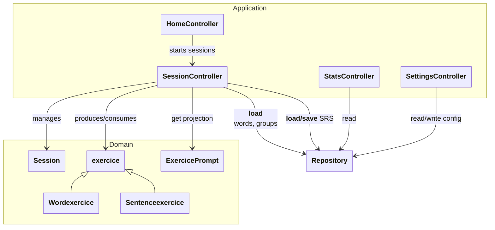

# `docs/architecture/application.md`

## Objectif

Décrire la couche **Application / Controllers**, qui coordonne :

* les actions venant de l’UI,
* la logique métier du **Domain** (sessions, exercices),
* la **Persistence** (chargement et sauvegarde via repositories).

Ce diagramme ne décrit pas l’UI ni les détails SQL : uniquement les **dépendances structurantes**.

---

## Diagramme

---

## Lecture du diagramme

### Controllers (Application)

* `HomeController` : logique d’entrée (démarrer une session, navigation logique côté app).
* `SessionController` : orchestre le déroulement d’une session (création des exercices et de la session; envoie des `ExercicePrompt` à l'UI et récupération des inputs de l'utilisateur; suppression de la session)
* `StatsController` : calcule et expose les statistiques à partir des données persistées, sans dépendre des sessions ou du runtime d’exercices.
* `SettingsController` : expose et modifie la configuration (ex: paramètres SRS).

### Domain

* `Session` orchestre les Exercices d'une session
* `exercice` est un objet abstrait **runtime** utilisé pendant une session. `WordExercice` et `SentenceExercice` sont 2 spécialisation.
* `ExercicePrompt` est une projection d'un exercice créer par la session pour l'UI. `SessionController` les envoient à l'UI qui les transforme en widget.

### Persistence

Les controllers accèdent aux données via des **repositories** :

* contenu (`WordRepository`, `SentenceGroupRepository`, `ChapterRepository`)
* progression/config (`SrsRepository`)

Le SQL, le mapping DB, et les tables sont confinés au diagramme “Persistence”.

---

## Règles d’architecture

* L’UI appelle les controllers ; elle n’appelle jamais directement le Domain ou la Persistence.
* Le `StatsController` ne dépend pas du runtime (sessions/exercices), uniquement des repositories.
* Le `SessionController` orchestre les sessions et délègue la persistance aux repositories (aucun SQL ici).
* Le Domain reste indépendant de la couche UI Flutter.

---

## Note sur le cycle de vie des Controllers

Les **Controllers** sont des objets **long-vivants**, créés lors de l’initialisation de l’application et partagés entre les écrans.

* Ils conservent les dépendances (repositories, configuration).
* Ils **ne représentent pas** une session en cours.
* Ils créent et détruisent des instances de **Sessions** à la demande paramétrées par `SessionType`.

Les **Sessions** sont des objets **éphémères**, limités à la durée d’une session d’apprentissage.

Ce découplage permet d’enchaîner plusieurs sessions sans recréer les Controllers et garantit une gestion claire du cycle de vie.

* La couche Application ne connaît ni `Widget`, ni Flutter, ni BuildContext.
