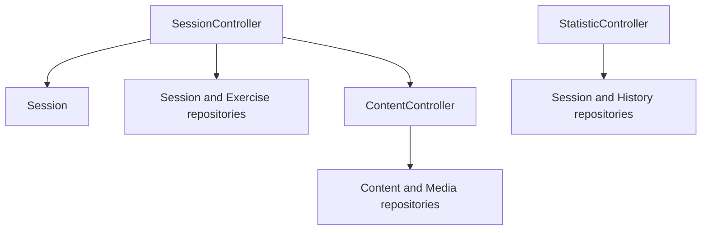

[Documentation index](../../index.md)

# Application layer

## Purpose

The Application layer coordinates actions coming from the UI, business logic
from the Domain, and storage operations exposed by Persistence. It contains no
Flutter widgets and no SQL.

---

## Diagram

---

## Controllers

### `SessionController`

`SessionController` owns at most one active `Session`. It implements the
application workflow for:

- building the session overview displayed before a session starts or resumes;
- loading due and new exercises of the requested session type;
- starting or resuming a session;
- loading the content selected by the current exercise;
- previewing an interval and submitting a grade;
- pausing or ending the session;
- persisting progression after each accepted answer.

Exercise limits and SRS parameters currently come from the default `SRSConfig`
owned by the controller.

### `ContentController`

`ContentController` loads renderable `Content` by identifier and resolves
`Media` by SHA-256. It is used both by session workflows and by the UI media
resolver.

### `StatisticController`

`StatisticController` builds statistics from persisted session results and
answer history. It exposes session-level and exercise-level aggregates, with
optional half-open date ranges.

---

## Application models

The Application layer owns models intended for presentation:

- `Content`, `Field`, `FieldDefinition`, and `FieldValue` describe ordered
  renderable content;
- `Media` identifies a local media resource;
- `SessionOverview` exposes the number of new and review exercises available
  for one session type, and whether that session has already started;
- `SessionStatistics` and `ExerciseStatistics` expose calculated aggregates.

These models are not learning entities. The Domain only manipulates the content
identifier selected by an exercise.

---

## Session overview

`SessionController.getSessionOverviews()` returns one `SessionOverview` for
every `SessionType`. The meaning of its counters depends on
`hasActiveSession`:

| Session state | `newExerciseCount` | `reviewExerciseCount` |
|---|---|---|
| Not started | Exercises with no history, capped by `SRSConfig.newCount` | Exercises due at the query time, capped by `SRSConfig.reviewCount` |
| Active | Snapshot exercises in `newExercise` status | Snapshot exercises in `toReview`, `learning`, `relearning`, or `consolidating` status |

Completed snapshot exercises are excluded. When several unfinished persisted
results exist for one type, the controller uses the most recent one, matching
the session-resume behaviour.

The current mapping from `SessionType` to one persisted `ExerciseType` is an
MVP application concern, not a Domain invariant. A future session type may
accept several exercise types or use different selection conditions. The
current time is also read immediately before the due-exercise query, after any
preceding asynchronous work, so the selection is based on the freshest
available timestamp.

---

## Session workflow

For a new session, the controller loads a limited set of due and new exercises,
constructs and starts the Domain session, then persists its initial resumable
state. After each answer, the Domain is updated first and `SessionRepository`
stores the resulting exercise, history, and session result atomically. It also
refreshes the resume snapshot, or removes it when the session has finished.

Pausing releases the in-memory session after updating its snapshot. Resuming
reconstructs a new Domain `Session` from persisted progression and the snapshot.

---

## Lifecycle and boundaries

Controllers are constructed once by `AppDependencies` and are intended to be
shared by application screens. A Domain `Session`, by contrast, exists only
while a learning session is active.

- The UI calls controllers rather than repositories.
- Controllers decide when to load and persist data, but learning transitions
  remain in the Domain.
- Persistence models and SQLite rows never enter the Application layer.
- Controllers currently depend on concrete repositories; no repository
  interface abstraction exists yet.
