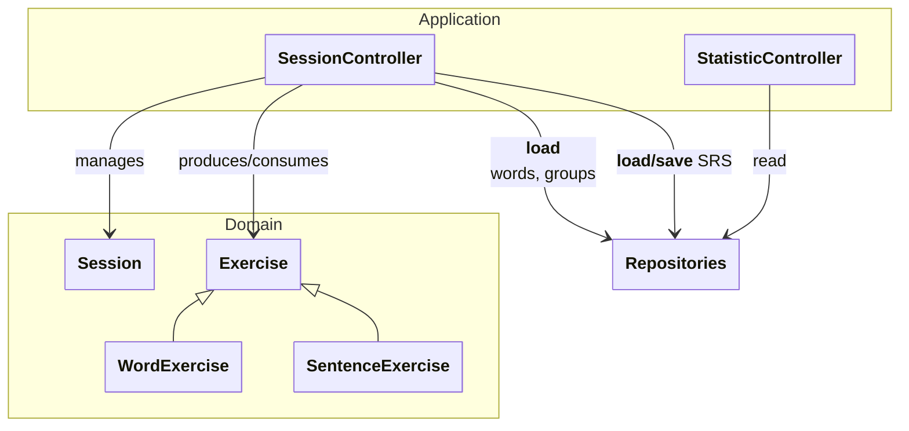

[Documentation Index](/docs/index.md)

# `docs/architecture/application.md`

## Purpose

Describe the **Application / Controllers** layer, which coordinates:

* actions coming from the UI,
* business logic from the **Domain** (sessions, exercises),
* **Persistence** (loading and saving via repositories).

This diagram does not describe the UI or SQL details — only the **structural dependencies**.

---

## Diagram

---

## Reading the Diagram

### Controllers (Application)

* `SessionController`: orchestrates the flow of a session (exercise and session creation; sending `Content` objects to the UI and collecting user input; session teardown).
* `StatisticController`: computes and exposes statistics from persisted data, without depending on sessions or the exercise runtime.

### Domain

* `Session` orchestrates the exercises of a session.
* `Exercise` is an abstract **runtime** object used during a session. `WordExercise` and `SentenceExercise` are two specialisations.

### Persistence

Controllers access data through **repositories**:

SQL, DB mapping, and table definitions are confined to the Persistence diagram.

---

## Architecture Rules

* The UI calls controllers; it never calls the Domain or Persistence directly.
* `StatisticController` does not depend on the runtime (sessions/exercises) — only on repositories.
* `SessionController` orchestrates sessions and delegates persistence to repositories (no SQL here).
* Answer submission persists exercise progression and session state in one transaction.
* The Domain remains independent of the Flutter UI layer.

---

## Note on Controller Lifecycle

**Controllers** are **long-lived** objects, created at application startup and shared across screens.

* They hold dependencies (repositories, configuration).
* They **do not represent** an ongoing session.
* They create and destroy **Session** instances on demand, parameterised by `SessionType`.

**Sessions** are **ephemeral** objects, scoped to the duration of a single learning session.

This decoupling allows multiple sessions to be run sequentially without recreating controllers, and ensures a clear lifecycle management.

* The Application layer knows neither `Widget`, nor Flutter, nor `BuildContext`.
