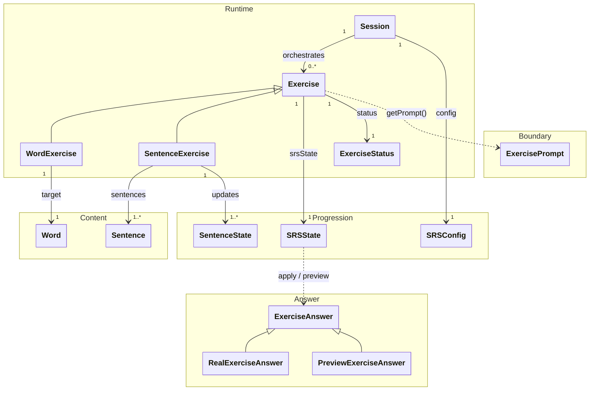

# `docs/architecture/domain.md`

## Purpose

Describe the **core business model** and the **general flow** of the learning engine.

This document establishes:

* the project vocabulary,
* the major responsibilities (`Session`, `Exercise`, content, progression),
* the display boundary via `ExercisePrompt`.

Implementation details are covered in:

* `sessions.md` (lifecycle and orchestration),
* `exercises.md` (exercise runtime and statuses),
* `srs.md` (SRS progression + "exposure" progression via `SentenceState`).

---

## Domain Diagram (useful view, not exhaustive)

---

## Quick Model Overview

### 1) Content

* `Word` and `Sentence` are **static/immutable data** (loaded from the DB).
* They do not carry progression state — only content (words, sentences).

### 2) Progression

* `SRSState` is **attached to `Exercise`** (not to `Word` or `SentenceExercise`). It manages inter-session progression logic.
* `SentenceState` is **separate from the SRS** and exists **for each `Sentence`** within a `SentenceExercise`.
* `SRSConfig` is provided to the `Session` and used for updates/previews through exercises.

### 3) ExerciseAnswer (user responses)

The Domain explicitly models user responses via `ExerciseAnswer`, a sealed type that distinguishes:
* real responses (`RealExerciseAnswer`), resulting from an actual user interaction and applied to the SRS engine,
* hypothetical responses (`PreviewExerciseAnswer`), used to simulate a future interval with no side effects.

`ExerciseAnswer` is consumed by `Session`, `Exercise`, and `SRSState` during an interaction, but is not a persistent Domain state.

### 4) Runtime

* `Exercise` is a **stateful runtime object**: `status`, `srsState`, intra-session logic.
* `WordExercise` and `SentenceExercise` only specialise the target and certain rules (allowed grades, `SentenceState` updates, etc.).
* `Session` is an **orchestrator**: it sequences exercises and holds the `SRSConfig`.

> Note: `SessionType` (see [sessions.md](sessions.md)) is an initialisation detail (validation/consistency) and is not a persistent state of `Session`.

### 5) Boundary (`ExercisePrompt`)

* `ExercisePrompt` is an **immutable projection** built **on demand** via `Exercise.getPrompt()`.
* It is not persisted.
* It contains **no presentation logic** (no widget, no layout).

---

## What the Domain Intentionally Ignores

* Flutter UI (widgets, navigation, layout)
* Persistence (SQL, schema, mapping)
* "UX" application parameters (e.g. display preferences)
* Organisation of content into "chapters" (this is an access/filtering structure on the Application/Stats side, not a runtime engine concern)

---

## Detail Distribution (to keep domain.md concise)

* `Session` details (start/end, current, ordering, call constraints) → `sessions.md`
* `Exercise` details (statuses, transition rules, allowed grades) → `exercises.md`
* Progression details (`SRSState`, `SentenceState`, `Grade`, preview/apply) → `srs.md`