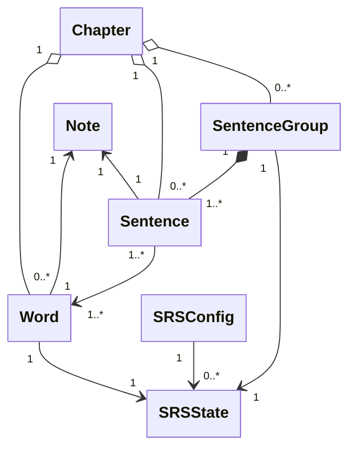

# `docs/architecture/domain.md`

## Objectif

Décrire les entités métier fondamentales de l’application, leurs relations, ainsi que la structure du système de répétition espacée (SRS).
Ce diagramme définit **le contenu appris** et **la progression**, indépendamment de toute logique d’interface, de session ou de persistance.

---

## Diagramme

---

## Lecture du diagramme

### Chapter

Un **Chapter** représente une étape de progression pédagogique.

* Il regroupe :

  * des `Word`
  * des `Sentence`
  * des `SentenceGroup`
* Il permet de contrôler le **déblocage du contenu**, indépendamment des règles grammaticales.

Les Chapters peuvent être persistés ou reconstruits dynamiquement à partir des références.

### Note

Une **Note** est une source de contenu brut (multi-langue, dictionnaire, import).

* Chaque `Word` référence **exactement une** `Note`
* Chaque `Sentence` référence **exactement une** `Note`
* La `Note` ne contient aucune logique SRS

### Word

Un **Word** représente une unité lexicale apprise.

* Il appartient à un `Chapter`
* Il référence une `Note`
* Il possède **exactement un** `SRSState`

### Sentence

Une **Sentence** est un exemple concret de phrase.

* Elle appartient à :

  * un `SentenceGroup` (règle grammaticale)
  * un `Chapter` (progression pédagogique)
* Elle référence une `Note`
* Elle utilise un ou plusieurs `Word`

Les phrases **ne sont pas évaluées individuellement** par le SRS.

### SentenceGroup

Un **SentenceGroup** représente une **connaissance grammaticale** (pattern).

* Il peut être utilisé dans plusieurs Chapters
* Il regroupe plusieurs `Sentence`
* Il possède **exactement un** `SRSState`

Le SRS est attaché au groupe, pas aux phrases.

### SRSState

Un **SRSState** représente l’état de maîtrise d’une connaissance.

* Il est associé à :

  * un `Word`
  * ou un `SentenceGroup`
* Il contient les informations nécessaires pour planifier la prochaine révision

### SRSConfig

Un **SRSConfig** définit les paramètres globaux du SRS.

* Il est partagé par plusieurs `SRSState`
* Il ne dépend d’aucune entité de contenu

---

## Règles métier importantes

* Le SRS s’applique uniquement aux **connaissances** (`Word`, `SentenceGroup`)
* Les `Sentence` sont des exemples, jamais des éléments évalués
* Le déblocage pédagogique est géré par `Chapter`, pas par le SRS
* Le contenu brut (`Note`) est séparé de la logique d’apprentissage

---

## Notes d’architecture

* Le Domain est écrit en Dart et fait partie du projet Flutter, mais reste **indépendant de la couche UI Flutter**.
* Ce diagramme ne décrit ni les exercices, ni les sessions, ni la persistance.
* Il constitue la **référence métier** pour tous les autres diagrammes.
