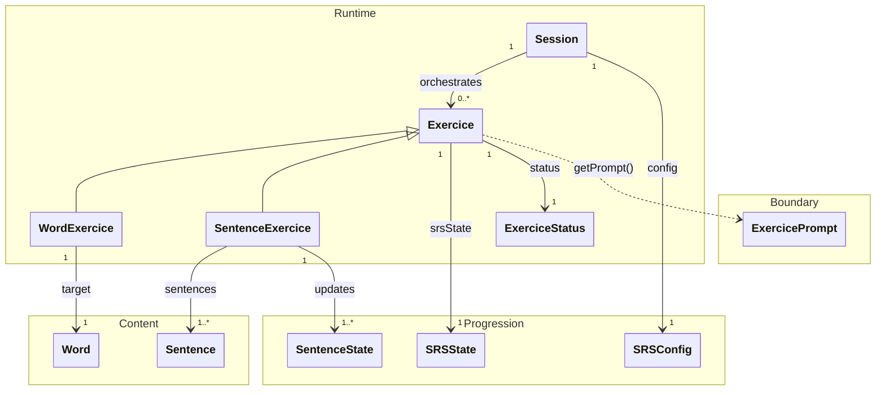

# `docs/architecture/domain.md`

## Objectif

Décrire le **modèle métier central** et le **déroulement général** du moteur d’apprentissage.

Ce document fixe :

* le vocabulaire du projet,
* les responsabilités majeures (`Session`, `Exercice`, contenu, progression),
* la frontière d’affichage via `ExercicePrompt`.

Les détails d’implémentation sont dans :

* `sessions.md` (cycle de vie et orchestration),
* `exercises.md` (runtime d’un exercice et statuts),
* `srs.md` (progression SRS + progression “exposition” via `SentenceState`).

---

## Diagramme du Domain (vue utile, pas exhaustive)

---

## Lecture rapide du modèle

### 1) Content

* `Word` et `Sentence` sont des **données statiques/immuables** (issues de la DB).
* Elles ne portent pas l’état de progression, mais uniquement le contenu (mots, phrases).
### 2) Progression

* `SRSState` est **attaché à `Exercice`** (pas à `Word` ni à `SentenceExercice`). Il gère la logique de progression inter-session.
* `SentenceState` est **distinct du SRS** et existe **pour chaque `Sentence`** dans un `SentenceExercice`.
* `SRSConfig` est fourni à la `Session` et sert aux mises à jour/preview via les exercices.
### 3) Runtime

* `Exercice` est un objet **runtime stateful** : `status`, `srsState`, logique intra-session.
* `WordExercice` et `SentenceExercice` spécialisent uniquement la cible et certaines règles (grades autorisés, mise à jour `SentenceState`, etc.).
* `Session` est un **orchestrateur** : elle enchaîne des exercices et porte le `SRSConfig`.

> Note : `SessionType` (cf [session.md](session.md)) est un détail d’initialisation (validation/cohérence) et n’est pas un état persistant de `Session`.

### 4) Boundary (`ExercicePrompt`)

* `ExercicePrompt` est une **projection immuable** construite **à la demande** via `Exercice.getPrompt()`.
* Il n’est pas persisté.
* Il ne contient **aucune logique de présentation** (pas de widget, pas de layout).

---

## Ce que le Domain ignore volontairement

* UI Flutter (widgets, navigation, layout)
* Persistence (SQL, schéma, mapping)
* Paramètres applicatifs “UX” (ex : préférences d’affichage)
* Organisation du contenu en “chapitres” (c’est une structure d’accès/filtrage côté Application/Stats, pas un besoin du moteur runtime)

---

## Répartition des détails (pour éviter un Domain.md trop gros)

* Détails de `Session` (début/fin, current, ordering, contraintes d’appel) → `sessions.md`
* Détails de `Exercice` (statuts, règles de transitions, allowed grades) → `exercises.md`
* Détails progression (`SRSState`, `SentenceState`, `Grade`, preview/apply) → `srs.md`
