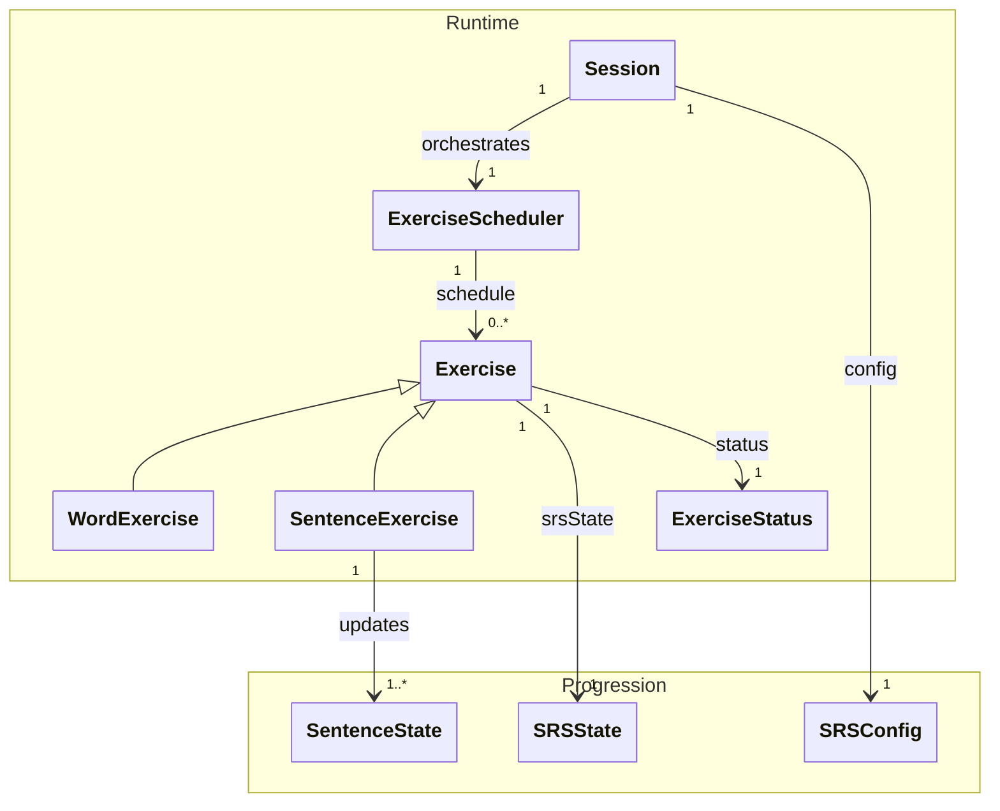

[Documentation Index](/docs/index.md)

# `docs/architecture/domain.md`

## Purpose

Describe the **core business model** and the **general flow** of the learning engine.

This document establishes:

* the project vocabulary,
* the major responsibilities (`Session`, `Exercise`, content, progression),
Implementation details are covered in:

* `sessions.md` (lifecycle and orchestration),
* `exercises.md` (exercise runtime and statuses),
* `srs.md` (SRS progression + "exposure" progression via `SentenceState`).

---

## Domain Diagram (useful view, not exhaustive)

---

## Quick Model Overview

### 1) Content

* In the domain, only the `contentId` is saved. The domain does not need to what the content is. 
* `Exercise` have a getter to get the `contentId`. This id is used by the application layer to create the content for the UI.
  * For `SentenceExercise`, the getter target the `contentId` of the current sentenceInstance in the group. (see: [exercise.md](/docs/architecture/domain_layer/exercises.md))

### 2) Progression

* `SRSState` is **attached to `Exercise`** (not to `Word` or `SentenceExercise`). It manages inter-session progression logic.
* `SentenceState` is **separate from the SRS** and exists **for each `Sentence`** within a `SentenceExercise`.
* `SRSConfig` is provided by the `Session` and used for updates/previews through exercises.

### 3) Runtime

* `Exercise` is a **stateful runtime object**: `status`, `srsState`, intra-session logic.
* `WordExercise` and `SentenceExercise` only specialise the target and certain rules (allowed grades, `SentenceState` updates, etc.).
* `Session` is an **orchestrator**: it sequences exercises using `ExerciseSchedule` and holds the `SRSConfig`.

> Note: `SessionType` (see [sessions.md](sessions.md)) is an initialisation detail (validation/consistency) and is not a persistent state of `Session`.

---

## What the Domain Intentionally Ignores

* Flutter UI (widgets, navigation, layout)
* Persistence (SQL, schema, mapping)
* "UX" application parameters (e.g. display preferences)
* Organisation of content into "chapters" (this is an access/filtering structure on the Application/Stats side, not a runtime engine concern)

---

## Detail Distribution (to keep domain.md concise)

* `Session` details (start/end, current, ordering, call constraints) → `sessions.md`
* `Exercise` details (statuses, transition rules, allowed grades) → `exercises.md`
* Progression details (`SRSState`, `SentenceState`, `Grade`, preview/apply) → `srs.md`