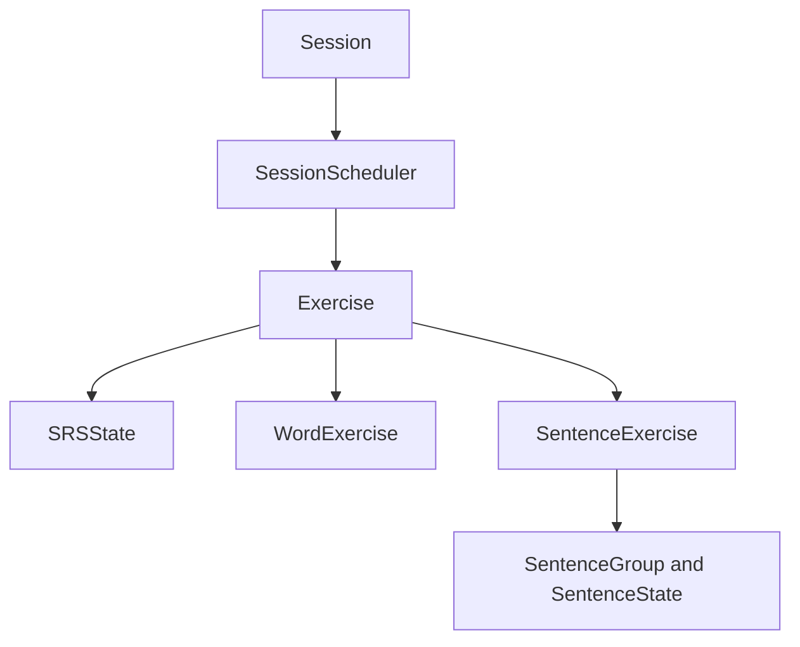

[Documentation index](../../index.md)

# Domain layer

## Purpose

The Domain contains the core learning model. It defines how sessions sequence
exercises, how answers change progression, and which state is independent of
the UI and database representation.

Details are distributed between [Sessions](sessions.md),
[Exercises](exercises.md), and [SRS](srs.md).

---

## Diagram

---

## Model overview

### Runtime orchestration

`Session` owns one `SessionScheduler`, a shared `SRSConfig`, and the aggregate
`SessionResult`. It delegates answer processing to the current exercise and
does not load or persist data itself.

### Exercises

`Exercise` is the common runtime abstraction for `WordExercise` and
`SentenceExercise`. It combines an intra-session status with the persistent SRS
state of one learning task.

Each submitted answer also produces an `ExerciseHistoryEntry`. New entries are
buffered until Persistence stores them with the updated progression.

### Progression

`SRSState` manages the interval and memory-model parameters associated with an
exercise. `SentenceState` is separate: it tracks the exposure and performance
of one sentence inside a sentence group.

### Content

The Domain does not know whether content contains text, HTML, images, audio, or
video. Exercises expose an integer `contentId`, which the Application layer
resolves into renderable content.

For a sentence exercise, the content identifier belongs to the sentence
instance currently selected from the group.

---

## Runtime and persistent state

Domain objects are not database models, but part of their state must survive
between sessions:

- exercise identity, subtype data, SRS state, and sentence state are stored;
- answer history and session results are stored;
- unfinished sessions store a minimal `ExerciseResume` for each exercise;
- `Session` and `SessionScheduler` instances are reconstructed in memory.

All conversions belong to Persistence. Domain code never imports DAOs, SQL, or
persistence models.

---

## Domain boundaries

The Domain intentionally ignores:

- Flutter widgets, navigation, and presentation state;
- SQL, transactions, and storage layout;
- the structure and rendering of learning content;
- repository queries and the selection limits used to build a session;
- application-wide settings and synchronisation.
