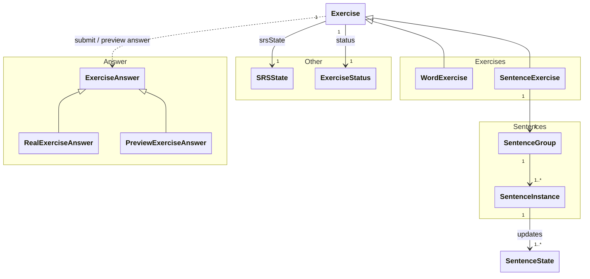

[Documentation Index](/docs/index.md)

# `docs/architecture/exercises.md`

## Purpose

Describe the **role of exercises** in the learning engine.

This document specifies:

* what an `Exercise` is,
* how it evolves during a session,
* how it interacts with progression mechanisms,
* the invariants to respect.

Temporal aspects and orchestration are described in [`sessions.md`](sessions.md).

---

## Role of an Exercise

An `Exercise` is a **stateful runtime object**.

It represents:

* a **user interaction** with learning content,
* within the context of a **given session**.

An exercise:

* is **created before** the session starts,
* is **temporary** (not persisted),
* encapsulates logic that is **local** to that interaction.

---

## Conceptual Diagram

---

## General Structure of an Exercise

An `Exercise` encapsulates:

* a **local intra-session state** (`ExerciseStatus`),
* a **progression state** (`SRSState`),
* logic for reacting to user responses.

It knows nothing about:

* the global session,
* the UI,
* persistence.

---

## ExerciseStatus

`ExerciseStatus` describes the **current state** of an exercise during the session.

It is used by:

* the exercise (to manage its transitions),
* the Scheduler (to orchestrate the presentation order).

Typical status examples: not yet attempted, new exercise, already answered, completed.

---

## User Interaction: ExerciseAnswer

User interactions are modelled by the `ExerciseAnswer` type.

An exercise can receive:

* the **submitted response** (`SubmittedExerciseAnswer`):
  * resulting from an actual user interaction,
  * applied to the exercise and SRS state.

* a **hypothetical response** (`PreviewExerciseAnswer`):
  * used to simulate interval evolution,
  * with no side effects whatsoever.

The exercise is responsible for:
* validating that the response is permitted,
* delegating the progression update,
* updating its intra-session state.

---

## Exercise Specialisations

### WordExercise

A `WordExercise`:

* targets a `ContentId`,
* uses its `SRSState`.

It does not manipulate any `SentenceState`.

### SentenceExercise

A `SentenceExercise`:

* has its own `SRSState` (at the group level),
* targets a **group of sentences** (`SentenceGroup`),
* The `SentenceGroup` is composed of a list of `SentenceInstance`
* Each `SentenceInstance` Have:
  * his own `ContentId`
  * a `SentenceState` updated by the `SentenceExercise`

Using a group of sentences allows:

* a single **SRS** state to cover several grammatically related sentences,
* the user to be exposed to many sentences without compromising **SRS** quality.

---

## Content 

### Content

Each Words and Sentences have their own `ContentId`.

- A `ContentId` is used by the application layer to create the content needed for the UI.
- The domain, doen't need to know the content itself, because no logic have to be done on it.

---

## Core Invariants

* An exercise is always temporary.
* An exercise never persists any state.
* All progression updates go through an exercise.
* The session never directly modifies an exercise.
* An exercise knows neither the UI nor persistence.

---

## What the Exercise Intentionally Ignores

An exercise ignores:

* the global session sequencing,
* user parameters,
* the origin of data (DB, API),
