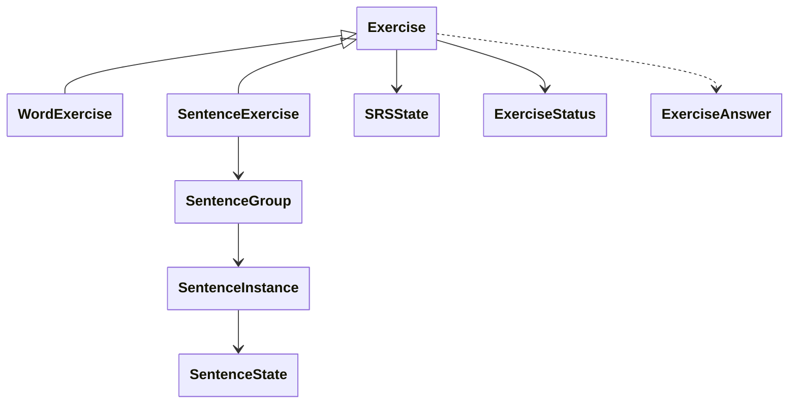

[Documentation index](../../index.md)

# Exercises

## Purpose

This document describes the role of an `Exercise`, its state during a session,
and the differences between word and sentence exercises.

Temporal orchestration is described in [Sessions](sessions.md), while interval
updates are described in [SRS](srs.md).

---

## Conceptual diagram

---

## General role

An exercise represents one learning task inside a session. It contains:

- a stable persisted identifier;
- an `ExerciseStatus` used by the session scheduler;
- an `SRSState` shared across sessions;
- answer-history entries waiting to be persisted.

The object itself never accesses the database or UI. Repositories reconstruct
it from persistent state before a session and save its updated progression
after an answer.

---

## Answers and status

A submitted answer contains a grade and timestamp. The exercise applies it to
its progression, records history, and updates its session status. A preview
answer runs the interval calculation without changing state.

The current statuses are:

| Status | Meaning |
|---|---|
| `newExercise` | The exercise has no previous answer history |
| `toReview` | A previously answered exercise is entering a review session |
| `learning` | A new exercise is repeating within the session |
| `relearning` | A reviewed exercise is repeating after a failure |
| `consolidating` | A sentence exercise is completing additional training |
| `completed` | No more presentation is required in this session |

The base exercise flow becomes complete when it has left the SRS learning phase
and its next review is beyond the configured day boundary. A sentence exercise
may replace this completion with a consolidation phase. The session stops
scheduling an exercise only after its final completion.

---

## `WordExercise`

A word exercise references one `contentId` and uses one SRS state. It accepts
all grades defined by the current model.

The Domain does not require the referenced content to be a literal word. The
name identifies the product use of this exercise type, while rendering remains
an Application and UI responsibility.

---

## `SentenceExercise`

A sentence exercise references one `SentenceGroup` and has one group-level SRS
state. The group contains one or more `SentenceInstance` objects, each with its
own `contentId` and `SentenceState`.

Before each answer, the exercise selects the sentence with the lowest state
score. This prioritises unseen, failed, or less successful sentences while the
group remains one scheduled exercise.

Sentence exercises accept `again`, `medium`, and `good`; `hard` and `easy` are
not available. Once the group-level SRS phase finishes, the exercise may enter
`consolidating` until the configured number of successful training answers has
been reached. Consolidation updates sentence state but not the group SRS.

---

## Persistence boundary

An answer may change several related values: SRS state, sentence state, history,
and session state. The exercise only produces those changes in memory.
`SessionRepository` and `ExerciseRepository` are responsible for storing them
within the surrounding transaction.

The minimal transient state needed to resume an unfinished session is exposed
through `ExerciseResume`: exercise identifier, status, and the remaining
sentence training count when applicable.
