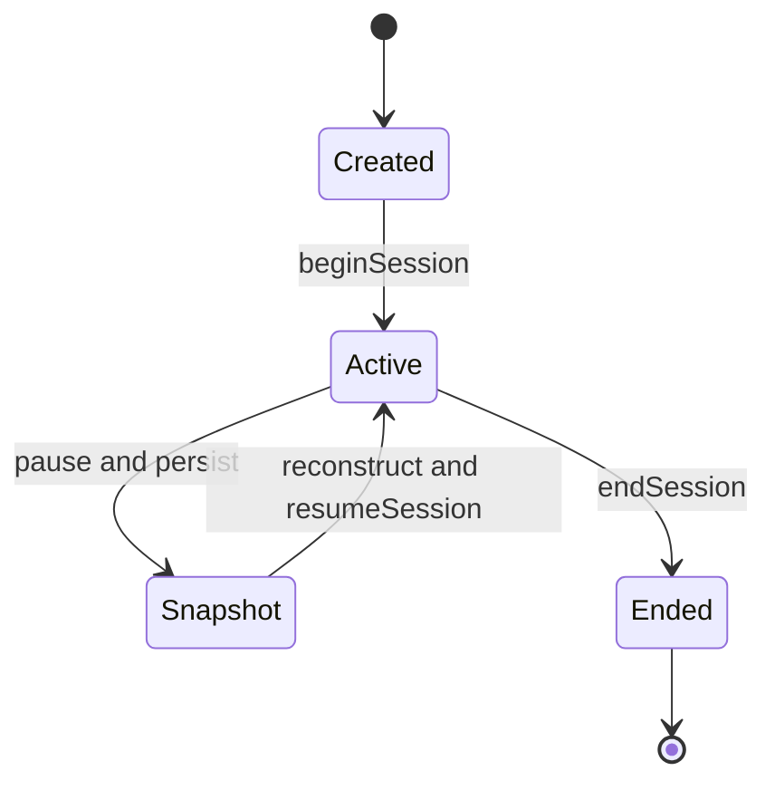

[Documentation index](../../index.md)

# Sessions

## Purpose

This document describes the lifecycle of a learning `Session`, how it selects
exercises, and how unfinished sessions can be resumed.

Exercise-specific behaviour is described in [Exercises](exercises.md).

---

## Lifecycle

`Snapshot` represents persisted resume data; it is not a state stored inside
the Domain `Session` object.

---

## Construction

A session receives:

- a preloaded list of exercises;
- a `SessionType` (`wordSession` or `sentenceSession`);
- one `SRSConfig` shared by those exercises;
- optionally, an existing `SessionResult` when resuming.

Construction verifies that every exercise matches the requested session type.
The session does not create exercises and does not decide which due or new
exercises enter the list.

---

## Execution

`beginSession` records the start time and selects the first exercise. For each
submitted answer, the session:

1. counts the answer under the exercise's current status;
2. delegates the state change to the exercise;
3. updates the number of uniquely completed exercises;
4. asks the scheduler for the next exercise.

Interval previews are delegated to the current exercise and leave both the
exercise and session result unchanged.

`endSession` records the end time and may be called before every exercise is
complete. Once ended, the session cannot accept another answer. An empty
exercise list produces a session that is immediately finished after starting.

---

## Exercise scheduling

`SessionScheduler` separates exercises into two groups:

- `learning` and `relearning` exercises, ordered by their next review time;
- immediately available `newExercise`, `toReview`, and `consolidating`
  exercises, considered in shuffled order.

A learning exercise takes priority once its short interval is due. Otherwise,
an immediately available exercise is selected. If only learning work remains,
the earliest exercise is selected even when its interval has not fully elapsed.

The scheduler reads exercise state but never applies answers itself.

---

## Pause and resume

The Domain exposes one `ExerciseResume` per exercise. When the Application
pauses a session, Persistence stores these snapshots with the intermediate
`SessionResult` and releases the in-memory object.

To resume, Persistence reloads each exercise's current progression, restores
its saved status and optional sentence training count, and constructs a new
`Session`. `resumeSession` then selects the next exercise without changing the
original start time.

---

## `SessionResult`

`SessionResult` stores the session type, start and end times, the number of
unique completed exercises, and answer counts grouped by exercise status. It is
used both for statistics and as the persistent identity of an unfinished
session.

The result is an aggregate only. It does not contain exercise evaluation or SRS
logic.

---

## Boundaries

- A session orchestrates exercises but does not load, create, or persist them.
- Exercise and SRS rules remain inside the exercise objects.
- The session knows content only through the identifier exposed by its current
  exercise.
- Repository access and transaction boundaries belong to the Application and
  Persistence layers.
