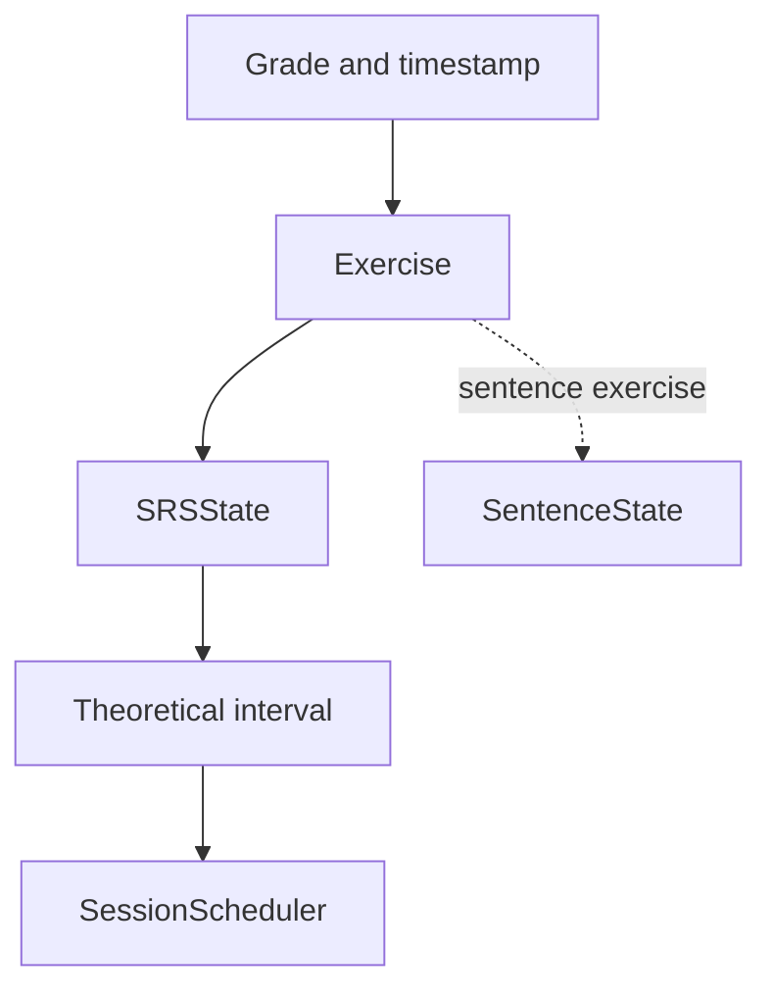

[Documentation index](../../index.md)

# Spaced repetition system

## Purpose

This document explains the role of the SRS inside the Domain and the distinction
between exercise scheduling, sentence progression, and session orchestration.

The exact formulas are documented in
[SRS model mathematics](../../maths_and_srs/maths_srs.md).

---

## Diagram

---

## Role of `SRSState`

Each exercise owns one `SRSState`. It stores the current interval, the last
review time, the learning-step index, and the parameters used by the recall
model. The next review time is derived from the last review and interval.

`SRSState` has two update modes:

- **learning mode**, which uses short configured steps;
- **review mode**, which computes a longer interval from the recall model.

A failed review returns the state to learning. A successful learning sequence
graduates it to review mode.

The SRS computes an interval but does not decide which exercises enter a
session. Repository queries select due and new exercises, while
`SessionScheduler` uses the resulting state to order exercises inside the
session.

---

## Configuration

`SRSConfig` groups the parameters shared by every exercise in one session:

- recall target and model coefficients;
- grade-dependent weights;
- learning steps and interval multipliers;
- maximum and graduation intervals;
- day boundary;
- limits on new and due exercises loaded for a session.

`SessionController` currently uses a default in-memory configuration. There is
no persisted or user-editable SRS configuration yet.

---

## Answers and grades

`SubmittedExerciseAnswer` changes progression. `PreviewExerciseAnswer` applies
the same interval calculation to a copy and has no side effect.

| Grade | Quality | Successful |
|---|---:|---|
| `again` | 0 | no |
| `hard` | 2 | no |
| `medium` | 3 | yes |
| `good` | 4 | yes |
| `easy` | 5 | yes |

Word exercises accept every grade. Sentence exercises deliberately expose only
`again`, `medium`, and `good`.

---

## Sentence progression

`SentenceState` is independent from `SRSState`. It records how often one
sentence has been shown, its accumulated answer score, and whether it is
currently learning. A sentence exercise uses this information to select the
least-known sentence in its group.

The group-level SRS determines when the sentence exercise is reviewed; the
per-sentence state determines which example is presented.

---

## Persistence rule

SRS state changes only after a submitted answer. The Application then asks
Persistence to store the updated exercise state together with history and the
current session state. Preview operations are never persisted.

The distinction between enforced checks and assumed parameter constraints is
documented in [SRS validity rules](../../maths_and_srs/invariant.md).
