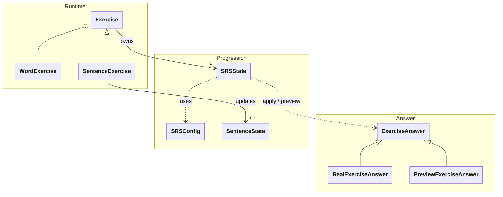

[Documentation Index](/docs/index.md)

# `docs/architecture/srs.md`

## Purpose

Describe the **functioning of the Spaced Repetition System (SRS)** and its usage rules within the learning engine.

This document specifies:

* the role of the SRS,
* the responsibilities of the classes involved,
* the distinction between intra-session and inter-session behaviour,
* persistence rules.

---

## Role of the SRS

The SRS is responsible for:

* representing the memorisation state,
* evolving that state after each response,
* computing a **theoretical review interval**.

The SRS:

* has no concept of a session,
* never decides when a review takes place — it only computes when a review would be optimal.

---

## SRS Diagram

---

## SRSState

`SRSState` represents the memorisation state of an exercise.

* Attached directly to `Exercise`.
* Persisted.
* Modified only as the result of a user response.

Responsibilities:

* interpret a user response (`ExerciseAnswer`),
* evolve the memorisation state,
* compute a theoretical review interval,
* provide an interval simulation without side effects (preview).

`SRSState` never directly consumes a `Grade`.
It interprets an `ExerciseAnswer`, which encapsulates:
* the grade (`Grade`),
* The timestamp (the moment of the response),
* and optionally timing information (step durations).

---

## SRSConfig

`SRSConfig` groups the parameters of the SRS model.

* Provided to the `Session`.
* Used when updating `SRSState`.
* Contains no runtime logic.

---

## SentenceState

`SentenceState` represents the exposure/usage state of a sentence. It is updated by `SentenceExercise` objects (typically one state per sentence in the group), independently of the SRS: it does not compute a review interval but serves contextual progression tracking.

Its role is to hold the information that allows `SentenceExercise` to choose which sentence to display — typically: the least shown / least successfully answered sentence in the group.

---

## ExerciseAnswer

The SRS does not process raw grades directly, but **modelled user responses**.

`ExerciseAnswer` is a sealed type representing an interaction with an exercise:

* `RealExerciseAnswer` corresponds to an actual user response and triggers a persisted update to `SRSState`.

* `PreviewExerciseAnswer` represents a hypothetical response, allows simulation of interval evolution, and has **no side effects**.

This distinction guarantees that:
* preview never alters the persisted state,
* every real SRS update is explicitly intentional.

---

## Grade

`Grade` represents the quality of a user response (e.g. failure, partial success, success). It is provided by the application layer, but its interpretation (effect on progression) is entirely managed by the exercise and the SRS.
Not all grades are valid for every exercise type.

---

## Intra-Session vs Inter-Session

### Theoretical Interval

After a response, the SRS computes an interval **independent of context**:

* minutes,
* hours,
* days.

### Intra-Session Usage

The `Session` may use the interval to:

* reorder exercises,
* re-present an exercise within the session,
* ignore intervals that exceed the session duration.

The session:

* never modifies the interval,
* only applies an orchestration policy.

### Inter-Session Usage

Outside of a session:

* the interval is used to schedule the next review,
* no session logic is involved.

---

## Practical Usage

### Interval Preview

The session can expose an **interval preview**:

* without modifying `SRSState`,
* using a `PreviewExerciseAnswer`,
* with logic strictly identical to that of a real response,
* for informational purposes: the user knows when they will see the same exercise again if they achieve a given grade.

### Persistence: Fundamental Rule

`SRSState` objects are persisted **after each valid user response**.

* The Domain updates the SRS.
* The application layer triggers persistence.
* Sessions and exercises are never persisted.

### Mobile Considerations

* An interrupted session is abandoned.
* Unfinished exercises are lost.
* Already persisted `SRSState` objects remain valid.
* Timing statistics are best-effort.

---

## Invariants

* The SRS computes only theoretical intervals.
* The SRS has no concept of a session.
* Every SRS update goes through an exercise.
* Persistence is immediate after each response.