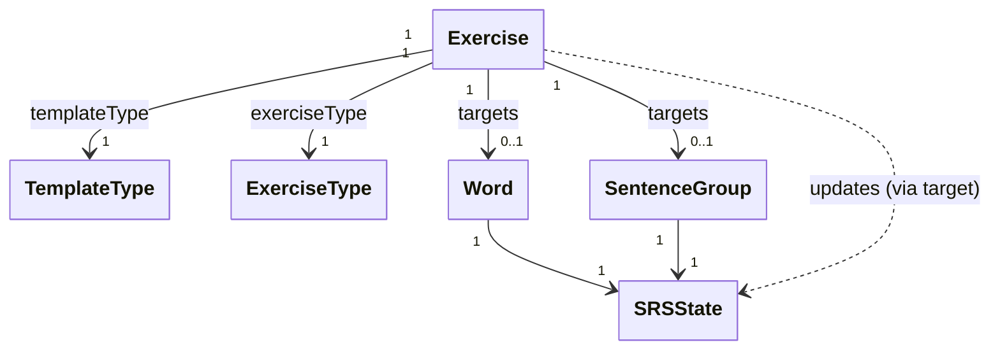

# `docs/architecture/exercises.md`

## Objectif

Décrire le modèle **runtime** des exercices (objets temporaires créés pendant une session) et comment ils se rattachent au contenu du Domain et au SRS.

## Diagramme

## Lecture du diagramme

* `Exercise` est un objet **temporaire** créé pendant une session. Il référence une cible (`Word` ou `SentenceGroup`) et porte le contexte d’interaction (`exerciseType`, `templateType`).
* Le `SRSState` est attaché aux **connaissances** (`Word`, `SentenceGroup`), pas aux exercices. Un exercice met à jour le `SRSState` de sa cible.
* `TemplateType` et `ExerciseType` sont des identifiants (ex: enums) permettant à l’UI/présentation de choisir le rendu et la logique d’évaluation.

## Règles de dépendance

* `Exercise` ne contient pas de logique de persistance.
* L’UI utilise `templateType` pour construire l’affichage (templates codés en Dart/Flutter pour le MVP).
* La mise à jour du SRS se fait via la cible de l’exercice (Word ou SentenceGroup).
