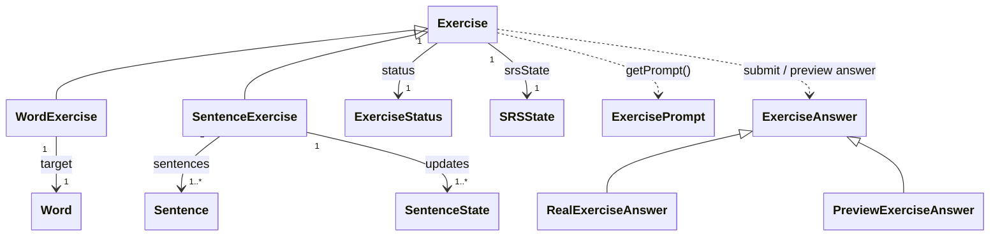

# `docs/architecture/exercises.md`

## Objectif

Décrire le **rôle des exercices** dans le moteur d’apprentissage.

Ce document précise :

* ce qu’est un `Exercise`,
* comment il évolue pendant une session,
* comment il interagit avec les mécanismes de progression,
* les invariants à respecter.

Les aspects temporels et l’orchestration sont décrits dans [`sessions.md`](sessions.md).

---

## Rôle d’un Exercice

Un `Exercise` est un **objet runtime stateful**.

Il représente :

* une **interaction utilisateur** avec un contenu pédagogique,
* dans le cadre d’une **session donnée**.

Un exercice :

* est **créé avant** le démarrage de la session,
* est **temporaire** (non persisté),
* encapsule la logique **locale** à cette interaction.

---

## Diagramme conceptuel

---

## Structure générale d’un Exercice

Un `Exercise` encapsule :

* un **état local** intra-session (`ExerciseStatus`),
* un **état de progression** (`SRSState`),
* une logique de réaction aux réponses utilisateur.

Il ne connaît :

* ni la session globale,
* ni l’UI,
* ni la persistence.

---

## ExerciceStatus

`ExerciseStatus` décrit l’**état courant** d’un exercice pendant la session.

Il est utilisé par :

* l’exercice (pour gérer ses transitions),
* la session (pour orchestrer l’ordre de passage).

Exemples typiques de statuts : exercice non encore traité, nouvel exercice, déjà répondu, terminé.

---

## Interaction utilisateur : ExerciseAnswer

Les interactions utilisateur sont modélisées par le type `ExerciseAnswer`.

Un exercice peut recevoir :

* une **réponse réelle** (`RealExerciseAnswer`) :
  * issue d’une interaction utilisateur effective,
  * appliquée à l’état de l’exercice et du SRS.

* une **réponse hypothétique** (`PreviewExerciseAnswer`) :
  * utilisée pour simuler l’évolution de l’interval,
  * sans aucun effet de bord.

L’exercice est responsable de :
* valider que la réponse est autorisée,
* déléguer la mise à jour de la progression,
* mettre à jour son état intra-session.

---

## Spécialisations d’Exercice

### WordExercise

Un `WordExercise` :

* cible un `Word`,
* utilise son `SRSState`.

Il ne manipule aucune `SentenceState`.

### SentenceExercise

Un `SentenceExercise` :

* cible un **groupe de phrases** (`Sentence`),
* possède un `SRSState` propre (au niveau du groupe),
* met à jour un `SentenceState` pour chaque phrase concernée.

L'utilisation d'un groupe de phrases permet de :

* avoir un même état **SRS** pour plusieurs phrases proches grammaticalement.
* permettre à l'utilisateur une exposition à de nombreuses phrases sans compromettre la qualité du **SRS**.

---

## Projection d’un Exercice

Un exercice peut produire une **projection immuable de son état**
via `Exercise.getPrompt()`.

Cette projection (`ExercisePrompt`) :

* est créée **à la demande**,
* n’est pas persistée,
* ne contient aucune logique de présentation,
* constitue la seule information exposée à l’UI.

---

## Invariants fondamentaux

* Un exercice est toujours temporaire.
* Un exercice ne persiste aucun état.
* Toute mise à jour de progression passe par un exercice.
* La session ne modifie jamais directement un exercice.
* Un exercice ne connaît ni l’UI ni la persistence.

## Ce que l’Exercice ignore volontairement

Un exercice ignore :

* l’enchaînement global de la session,
* les paramètres utilisateur,
* l’origine des données (DB, API),
* la notion de chapitre.
