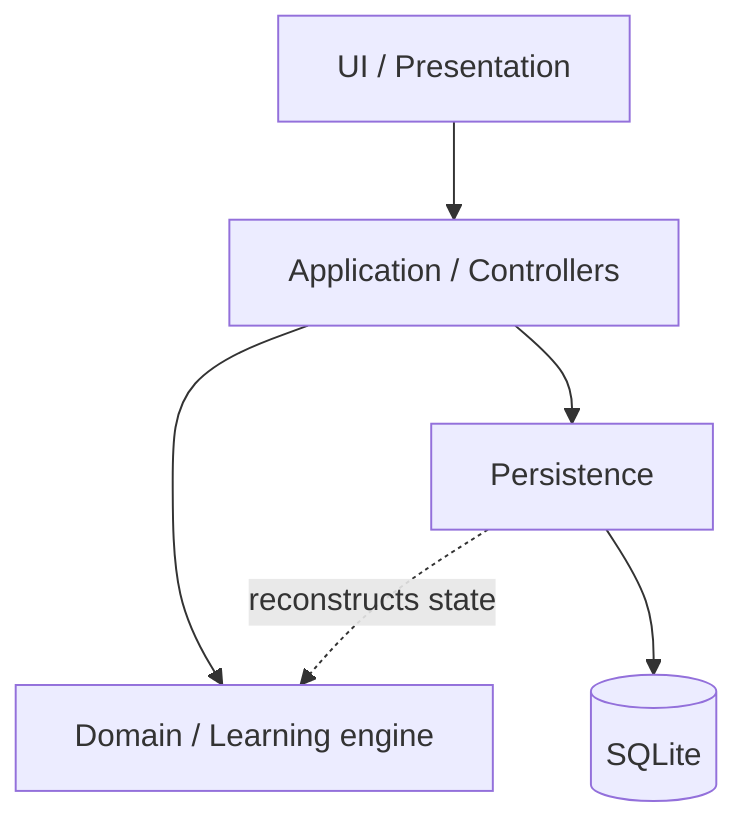

[Documentation index](../index.md)

# Architecture overview

## Purpose

This document presents the main architectural blocks of Psitta and the
dependency rules between them. Internal behaviour is described in the dedicated
documents for each layer.

---

## Diagram

---

## Reading the diagram

### [UI](ui_layer/ui.md)

The UI renders application content and will eventually expose the user
interactions. The current implementation contains the content-rendering
pipeline, but no screens or navigation.

### [Application](application_layer/application.md)

The Application layer exposes the use cases required by the UI. Its controllers
coordinate sessions, content loading, statistics, and persistence operations.

### [Domain](domain_layer/domain.md)

The Domain contains the learning rules: sessions, exercises, scheduling, SRS
state, sentence progression, grades, and answer history. It depends on neither
Flutter nor SQLite.

Learning content is represented by identifiers in the Domain. Its field and
media structure belongs to the Application layer.

### [Persistence](persistence_layer/persistence.md)

Persistence stores content, exercises, progression, history, and session state.
Repositories expose application-oriented operations while DAOs, mappers, and
persistence models remain internal to the layer.

### Utilities

`lib/utils` contains pure conversion helpers shared by the Domain and
Persistence layers, notably duration and timestamp conversions.

---

## Dependency rules

- UI code uses Application controllers and models; it does not execute SQL.
- Application controllers coordinate Domain objects and repositories.
- The Domain imports neither Flutter nor persistence code.
- SQL, database rows, and persistence-only models remain in Persistence.
- Persistence may depend on Domain types to reconstruct learning state.

The current controllers depend directly on concrete repository classes, and
content persistence maps to models defined in the Application layer. These are
current MVP boundaries; repository interfaces have not been introduced.

---

## Application composition

`AppDependencies` is the composition root. It opens and migrates the database,
constructs the repositories, controllers, and content renderer, and owns the
database lifetime.

The current `main.dart` only validates this initialisation and then disposes the
dependencies. Once the Flutter interface is connected, the same dependency
container must remain alive for the application lifetime.
