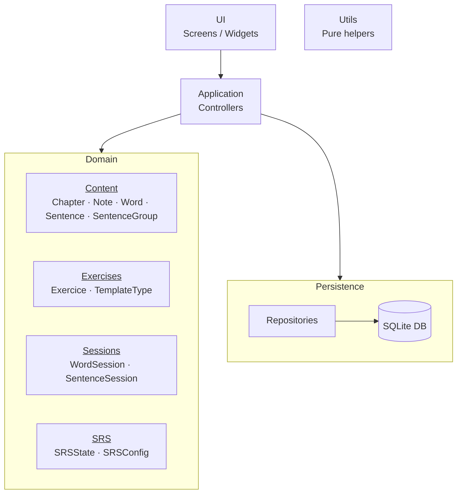

# `docs/architecture/overview.md`

## Objectif

Décrire l’architecture globale de l’application et les règles de dépendance entre les grands blocs.
Ce diagramme donne une **vue macroscopique** du projet ; les détails internes de chaque bloc sont précisés dans les diagrammes suivants.

---

## Diagramme

---

## Lecture du diagramme

### UI

Le bloc **UI** regroupe tous les écrans et widgets Flutter.
Il est responsable uniquement de l’affichage et de la gestion des interactions utilisateur.

### Application / Controllers

Le bloc **Application** constitue le point d’entrée de la logique applicative.
Les controllers :

* reçoivent les actions utilisateur depuis l’UI,
* orchestrent les opérations métier,
* coordonnent l’utilisation du Domain et de la Persistence.

### Domain

Le **Domain** regroupe toute la logique métier de l’application.
Il est volontairement représenté comme un **bloc unique**, mais structuré en sous-composants conceptuels :

* **Content**
  Représente le contenu pédagogique (mots, phrases, chapitres, notes).

* **Exercises**
  Représente les exercices concrets présentés à l’utilisateur ainsi que les TemplateType qui décrive l'affichage de chaque type d'exercice.

* **Sessions**
  Gère l’organisation des exercices en sessions d’apprentissage.

* **SRS**
  Implémente la logique de répétition espacée et l’état de progression.

Le Domain est **indépendant de toute technologie** (UI, DB, Flutter, SQLite).

### Persistence

Le bloc **Persistence** est responsable du stockage et de la reconstruction des données du Domain.

* Les **Repositories** exposent une interface métier d’accès aux données.
* La **base SQLite** gère le stockage physique.

Le SQL, le mapping (`toMap / fromMap`) et les détails de persistance sont confinés à ce bloc.

### Utils

Le bloc **Utils** regroupe des fonctions utilitaires pures (dates, conversions, helpers).
Il est transversal et ne fait pas partie de la hiérarchie de dépendances principale.

---

## Règles de dépendance

* L’**UI** dépend uniquement de l’**Application**.
* L’**Application** dépend du **Domain** et de la **Persistence**.
* Le **Domain** ne dépend d’aucune couche technique.
* La **Persistence** ne contient aucune logique métier.
* Le **SQL et le mapping DB** sont confinés à la Persistence.

---

## Notes d’architecture

* Le Domain est présenté comme un bloc unique au niveau global ; sa structure interne est détaillée dans les diagrammes suivants.
* L’Application joue un rôle d’orchestrateur entre l’UI, le Domain et la Persistence.
* Les fonctions utilitaires sont volontairement exclues des dépendances explicites pour préserver la lisibilité du diagramme.
