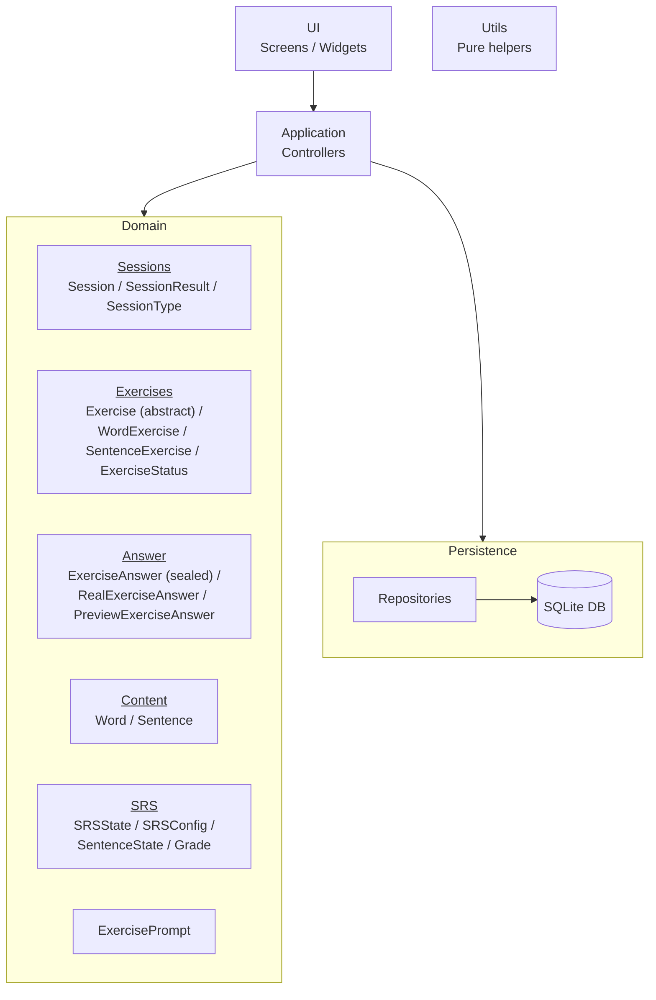

[Documentation Index](../index.md)

# `docs/architecture/overview.md`

## Purpose

Describe the overall application architecture and the dependency rules between the main building blocks.
This diagram provides a **macroscopic view** of the project; the internal details of each block are covered in the following diagrams.

---

## Diagram

---

## Reading the Diagram

### UI

The **UI** block groups all Flutter screens and widgets.
It is solely responsible for rendering and handling user interactions.

### Application / Controllers

The **Application** block is the entry point for application logic.
Controllers:

* receive user actions from the UI,
* orchestrate business operations,
* coordinate the use of the Domain and Persistence layers.

### Domain

The **Domain** groups all business logic of the application.
It is intentionally represented as a **single block**, but structured into conceptual sub-components:

* **Content**
  Represents the learning content (words, sentences).

* **Exercises**
  Represents the concrete exercises presented to the user.
  Exercises are stateful runtime objects, created before the session starts and destroyed at its end.

  The UI only knows exercises through `ExercisePrompt`, which is a projection of an `Exercise`.

* **Answers**
  Represents user responses (`ExerciseAnswer`) passed to exercises.

* **Sessions**
  Manages the organisation of exercises into learning sessions.
  Sessions only orchestrate exercises.

* **SRS**
  Implements spaced repetition logic and progression state.

The Domain is **independent of all technology** (UI, DB, Flutter, SQLite).

### Persistence

The **Persistence** block is responsible for storing and reconstructing Domain data.

* **Repositories** expose a business-oriented data access interface.
* The **SQLite database** handles physical storage.

SQL, mapping (`toMap / fromMap`), and persistence details are confined to this block.

### Utils

The **Utils** block groups pure utility functions (dates, conversions, helpers).
It is transversal and does not belong to the main dependency hierarchy.

---

## Dependency Rules

* The **UI** depends only on the **Application** layer.
* The **Application** depends on the **Domain** and **Persistence** layers.
* The **Domain** does not depend on any technical layer.
* The **Persistence** contains no business logic.
* **SQL and DB mapping** are confined to Persistence.

---

## Architecture Notes

* The Domain is presented as a single block at the global level; its internal structure is detailed in the following diagrams.
* The Application acts as an orchestrator between the UI, Domain, and Persistence layers.
* Utility functions are intentionally excluded from the explicit dependency diagram to preserve readability.

### Notes on the Chapter Concept

* Words and sentences are organised by chapter. This chapter concept only exists in `StatsScreen` and `HomeScreen`.
* Chapters structure content for the user, but play no role in the learning logic and are therefore ignored by sessions and the domain.