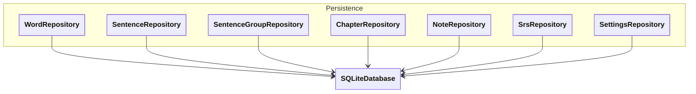

# `docs/architecture/persistence.md`

## Objectif

Décrire la couche **Persistence**, responsable du stockage et de la récupération des données de l’application.

Cette couche :

* encapsule **SQLite**,
* implémente les **repositories**,
* gère le **mapping DB ↔ Domain**,
* isole toutes les décisions techniques liées aux performances.

Aucune logique métier ne doit se trouver ici.

---

## Diagramme

---

## Responsabilités des repositories

### Principe général

Un **repository** représente un **concept métier utilisé par l’application**,
pas nécessairement une table SQL unique.

Chaque repository :

* expose des méthodes orientées métier,
* cache le SQL,
* retourne uniquement des objets du **Domain**.

---

### Repositories principaux

#### `WordRepository`

* charge les mots par chapitre
* charge les mots dus (via SRS)
* sauvegarde l’état SRS des mots

#### `SentenceRepository`

* charge les phrases par groupe ou par chapitre
* utilisée principalement pour la génération d’exercices

#### `SentenceGroupRepository`

* charge les groupes grammaticaux
* charge les groupes dus via le SRS

#### `ChapterRepository`

* charge la structure pédagogique
* ordre des chapitres, métadonnées

#### `NoteRepository`

* accès au contenu brut
* abstraction des sources de données

#### `SrsRepository`

* gère **SRSState** et **SRSConfig**
* calcule et persiste :

  * prochaine date de révision
  * niveau / intervalle

👉 Pour le MVP, `SRSState` et `SRSConfig` sont volontairement regroupés ici.

#### `SettingsRepository`

* paramètres globaux de l’application
* ex :

  * langues A / B
  * taille des sessions
  * préférences utilisateur
  * paramètres SRS

---

## Mapping DB ↔ Domain

Le mapping entre SQLite et le Domain est **confiné à la Persistence**.

Deux implémentations possibles :

* mapping privé dans le repository (recommandé MVP)
* classes `Row` dédiées si la complexité augmente

Dans tous les cas :

* aucun `Map<String, dynamic>` ne sort de la Persistence
* le Domain ne connaît pas le schéma SQL

---

## Optimisations et performances

Toutes les optimisations techniques sont **exclusivement gérées dans cette couche**, notamment :

* index SQL,
* jointures complexes,
* cache mémoire,
* transactions multi-tables.

Ces optimisations peuvent évoluer **sans impacter** :

* le Domain,
* les Controllers,
* l’UI.

---

## Points sensibles à l’implémentation (⚠️ important)

### 1. Frontières à ne jamais franchir

* ❌ SQL dans les Controllers
* ❌ SQL dans le Domain
* ❌ `Map<String, dynamic>` hors Persistence

---

### 2. Méthodes des repositories

Les méthodes doivent être :

* orientées **cas d’usage**
* pas orientées **table**

❌ `getAllWordsFromTable()`

✔ `getDueWords(chapterId)`

---

### 3. Évolution future

* Si les stats deviennent complexes :

  * ajouter un `StatsRepository`
* Si le SRS évolue :

  * modifier uniquement `SrsRepository`
* Si la DB change :

  * la Persistence absorbe le changement
* Si les repository deviennent trop gros
  
  * Ajouter des DAO pour le CRUD

---

## Règle d’or

> **Tout ce qui concerne “comment c’est stocké” ou “comment c’est rapide”
> appartient à la Persistence, et uniquement à elle.**

