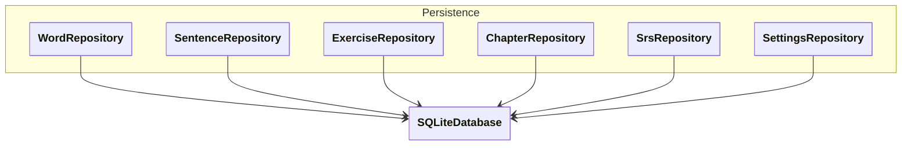

[Documentation Index](../index.md)

# `docs/architecture/persistence.md`

## Purpose

Describe the **Persistence** layer, responsible for storing and retrieving application data.

This layer:

* encapsulates **SQLite**,
* implements the **repositories**,
* handles **DB ↔ Domain mapping**,
* isolates all technical decisions related to performance.

No business logic should reside here.

⚠️ Persistence only records states computed by the Domain.

---

## Diagram

---

## Repository Responsibilities

### General Principle

A **repository** represents a **business concept used by the application**,
not necessarily a single SQL table.

Each repository:

* exposes business-oriented methods,
* hides SQL,
* returns only **Domain** objects.

---

### Main Repositories

#### `WordRepository`

* loads words by chapter,
* loads due words (via SRS),
* saves the SRS state of words.

#### `SentenceRepository`

* loads sentences by group or by chapter,
* used primarily for exercise generation.

#### `ExerciseRepository`

* creates exercises using `WordRepository`, `SentenceRepository`, and `SrsRepository`,
* exercises are not persisted, but created on demand by the application layer through the other repositories, which are themselves persisted.

#### `ChapterRepository`

* loads the pedagogical structure,
* chapter order and content, metadata.

#### `SrsRepository`

* manages **SRSState**, **SRSConfig**, and **SentenceState**,
* persists:

  * progression states computed by the Domain,
  * next review date,
  * level / interval.

👉 For the MVP, `SRSState`, `SRSConfig`, and `SentenceState` are intentionally grouped here (may be split later).

#### `SettingsRepository`

* global application parameters, e.g.:

  * languages A / B,
  * session size,
  * user preferences,
  * SRS parameters.

---

## DB ↔ Domain Mapping

Mapping between SQLite and the Domain is **confined to Persistence**.

Two possible implementations:

* private mapping inside the repository (recommended for MVP),
* dedicated `Row` classes if complexity grows.

In all cases:

* no `Map<String, dynamic>` leaves the Persistence layer,
* the Domain does not know the SQL schema.

---

## Optimisations and Performance

All technical optimisations are **exclusively managed within this layer**, including:

* SQL indexes,
* complex joins,
* in-memory cache,
* multi-table transactions.

These optimisations can evolve **without impacting**:

* the Domain,
* Controllers,
* the UI.

---

## Key Implementation Boundaries ⚠️

### 1. Boundaries never to cross

* ❌ SQL in Controllers
* ❌ SQL in the Domain
* ❌ `Map<String, dynamic>` outside Persistence

---

### 2. Repository methods

Methods must be:

* oriented towards **use cases**,
* not oriented towards **tables**.

❌ `getAllWordsFromTable()`

✔ `getDueWords(chapterId)`

---

### 3. Future evolution

* If statistics become complex → add a `StatsRepository`.
* If the SRS evolves → modify only `SrsRepository`.
* If the DB changes → Persistence absorbs the change.
* If repositories become too large → add DAOs for CRUD operations.

---

## Golden Rule

> **Everything related to "how it is stored" or "how it is fast"
> belongs to Persistence, and to Persistence alone.**