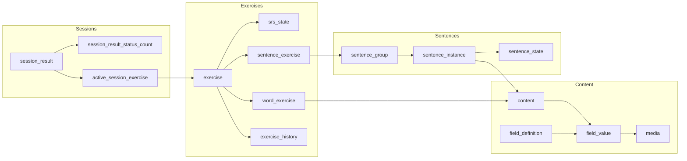
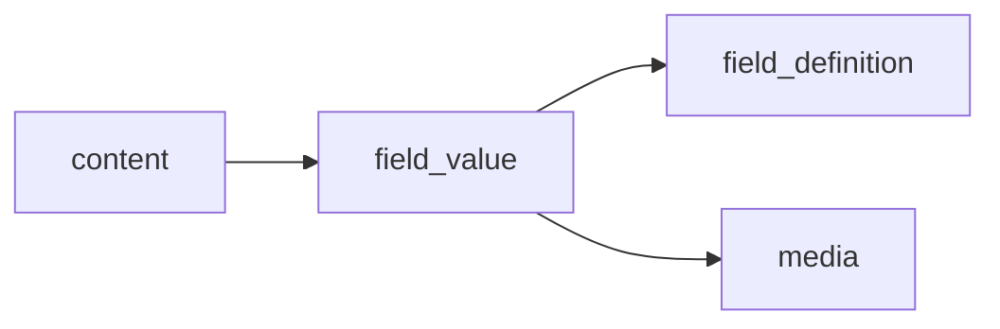
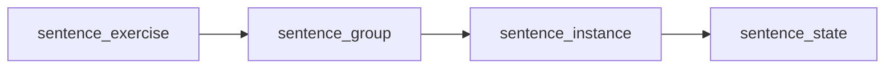
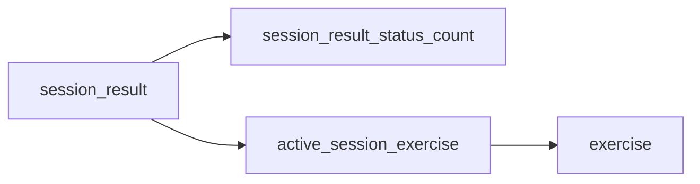
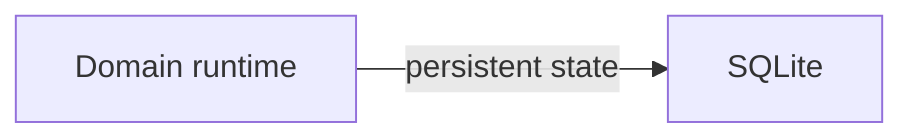

[Documentation Index](/docs/index.md)

# SQLite Database

## Purpose

Describe the structure and main relationships of the SQLite database used by the Persistence layer.

The database stores persistent application data such as:

* exercises and their progression,
* learning content,
* sentence groups,
* exercise history,
* session results.

Runtime objects such as `Session` and `Exercise` are not stored directly.

---

## Schema Overview

The schema is organised around four main areas:

* **Exercises** — persistent exercise identity and SRS state.
* **Content** — generic content and its fields.
* **Sentences** — groups, sentence instances and sentence-level progression.
* **Sessions** — persistent results produced by completed sessions.

---

## Exercises

An exercise is represented by a base `exercise` row and a type-specific row:

* `word_exercise`
* `sentence_exercise`

The common identity is stored in `exercise`, while type-specific data is stored in the corresponding table.

Each exercise has exactly one `srs_state`.

Exercise responses are recorded separately in `exercise_history`, allowing multiple history entries for the same exercise.

---

## Content

Content is stored independently from exercises.

A `content` item is composed of one or more field values.

`field_definition` describes what a field represents, while `field_value` stores the value associated with a particular content item.

Media are stored as references to files rather than as binary data inside the database.

---

## Sentences

Sentence exercises operate on groups of sentence instances.

A `sentence_group` contains several `sentence_instance` objects.

Each instance has its own `sentence_state`, which tracks sentence-level exposure independently from the exercise's `srs_state`.

---

## Session Results

Sessions are runtime objects and are not persisted.

Sessions are reconstructed from their result and active-exercise rows:

`session_result` stores aggregate progress, `session_result_status_count` stores answer
counts, and `active_session_exercise` stores the per-session state required for resume.

---

## Referential Integrity

Foreign keys are enabled in SQLite.

`ON DELETE CASCADE` is used for data that is owned by another entity, such as:

* an exercise and its SRS state,
* an exercise and its history,
* a sentence group and its instances,
* a sentence instance and its state,
* a session result and its status counts.
* a session result and its active exercises.

References to shared `content` do not cascade. Deleting content therefore does not automatically delete the exercises that reference it.

---

## Runtime vs Persistent Data

The database does not reproduce the Domain object graph exactly.

The database stores the information required to reconstruct and continue the application, rather than temporary runtime objects.

In particular:

* `Session` is reconstructed rather than stored as a serialized object.
* `Exercise` runtime state is not persisted directly.
* `SRSState` is persisted.
* Exercise history is persisted.
* Session results are persisted.
