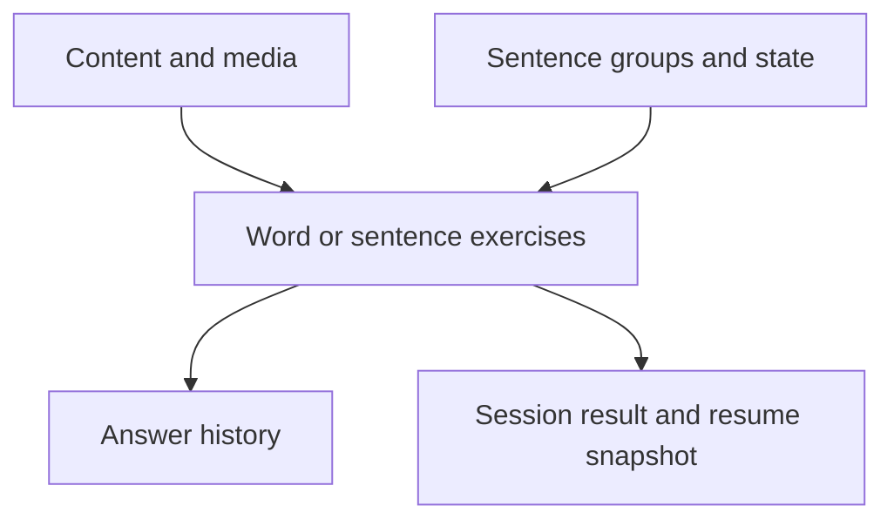

[Documentation index](../../index.md)

# SQLite database

## Purpose

The SQLite schema stores learning content, exercise progression, answer
history, session statistics, and the snapshot required to resume an unfinished
session.

This is an aggregate view rather than a table-level entity diagram. The
version 1 schema is normalized across the following tables.

## Schema areas

| Area | Tables | Role |
|---|---|---|
| Exercise | `exercise`, `srs_state`, `word_exercise`, `sentence_exercise` | Stable identity, subtype data, and one SRS state per exercise |
| Sentence | `sentence_group`, `sentence_instance`, `sentence_state` | Group structure, content references, and per-sentence progress |
| Content | `content`, `field_definition`, `field_value`, `media` | Ordered typed fields and local media metadata |
| History | `exercise_history` | Immutable submitted-answer events, optionally tied to a sentence instance |
| Session | `session_result`, `session_result_status_count`, `active_session_exercise` | Aggregate statistics and unfinished-session snapshots |

The repository model expects each `exercise` to have one `srs_state` row and
exactly one subtype row. Primary keys prevent duplicate rows of either kind,
but SQLite does not enforce their required existence or subtype exclusivity. A
`word_exercise` points directly to content. A `sentence_exercise` points to one
unique sentence group, whose instances each point to content and own one
`sentence_state`.

## Persistent and reconstructed state

The database stores enough information to reconstruct domain aggregates, but it
does not serialize an in-memory object graph.

- Exercise identity, subtype configuration, and SRS values are persistent.
- `next_review` is stored so SQL can select due exercises, while the domain
  reconstructs its value from `lastReview + interval` rather than reading that
  column as independent state.
- Normal exercise loading derives `newExercise` versus `toReview` from the
  existence of answer history.
- An unfinished session stores its exact per-exercise status and remaining
  sentence `trainingCount` in `active_session_exercise`.
- `Session` and `SessionScheduler` instances are reconstructed in memory and
  are never stored directly.
- Session results remain after completion; active-session rows are removed.

## Referential integrity

Foreign keys are enabled for every native connection by
`PsittaSqliteOpenFactory`, because SQLite's foreign-key setting belongs to a
connection rather than to the database file.

Owned rows generally use `ON DELETE CASCADE`, including SRS state, subtype rows,
exercise history, sentence instances and state, session status counts, and
active-session snapshots. Content and media references are shared references
and do not cascade from the referencing exercise or field.

The database also enforces that one sentence group is associated with at most
one `sentence_exercise` through a unique constraint.

## Opening and migration

`SqliteDatabase.open()` is idempotent for an already open wrapper:

1. resolve the application-support directory;
2. create `<application-support>/psitta.db` through the custom native factory;
3. initialise `sqlite_async`;
4. read `PRAGMA user_version`;
5. apply each newer registered migration in version order;
6. update `user_version` in the same transaction as its migration.

If initialisation or migration fails, the newly created database object is
closed and the error is rethrown. `close()` releases it and resets the wrapper,
allowing a later call to reopen the database.

The only registered migration is currently `V1InitialSchema` with version 1.
Future schema changes must be added as new ordered migrations rather than by
editing databases that may already exist.
