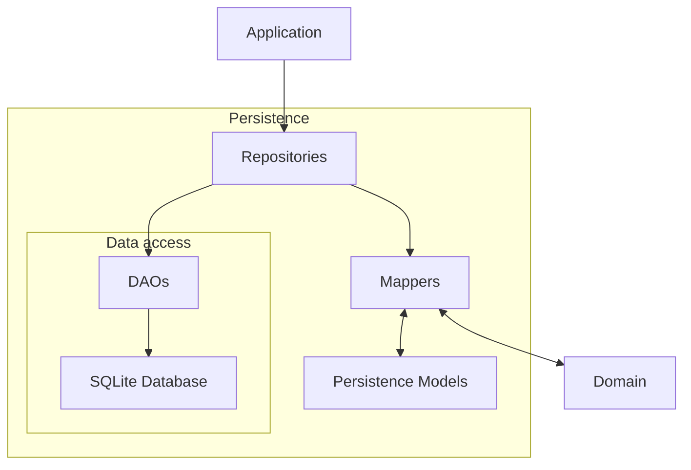
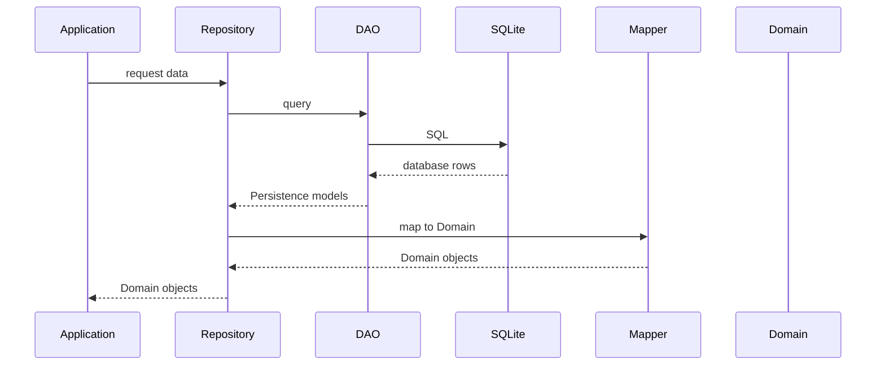
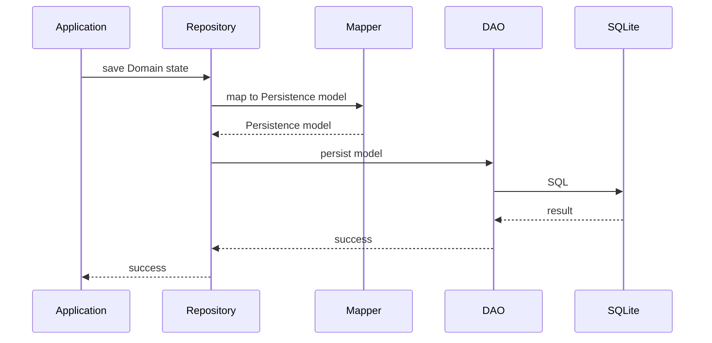
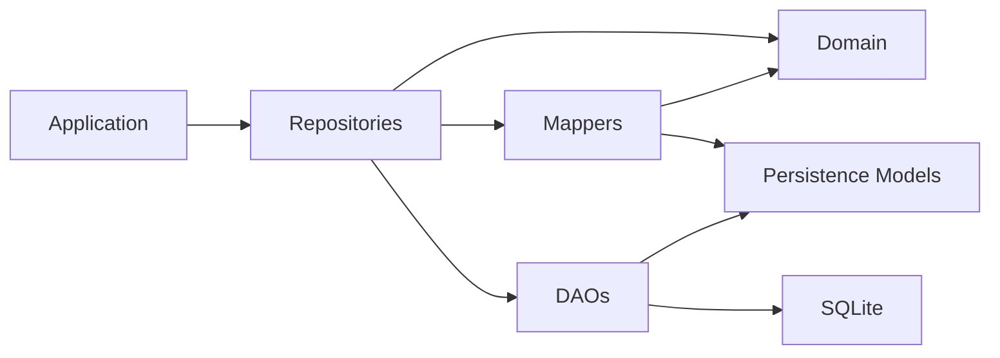

[Documentation Index](/docs/index.md)

# `docs/architecture/persistence.md`

## Purpose

Describe the general architecture of the **Persistence** layer and its role in the application.

The Persistence layer is responsible for:

* storing application data,
* loading persisted data,
* translating between Persistence models and Domain objects,
* isolating the Domain from SQLite and other storage-specific details.

The Persistence layer does **not** contain business logic.

---

## Architecture



---

## General Flow

Persistence acts as a boundary between the **Domain** and the physical database.

When data is loaded:



When Domain state must be persisted, the flow is reversed:



The important boundary is that **SQL and Persistence models never leave the Persistence layer**.

---

## Main Components

### Repositories

Repositories expose a **Domain-oriented interface** to the Application layer.

They:

* coordinate data access,
* combine several DAOs when necessary,
* convert Persistence models into Domain objects,
* hide the database implementation.

A repository therefore represents an application concept rather than necessarily a single database table.

### DAOs

DAOs are responsible for **database access**.

They:

* execute SQL queries,
* insert, update and delete database data,
* reconstruct Persistence models from database rows.

DAOs do not contain Domain logic.

### Persistence Models

Persistence models represent the data as it is stored and manipulated inside the Persistence layer.

They are intentionally separate from Domain objects.

This allows the database schema to evolve without forcing the Domain model to follow the same structure.

### Mappers

Mappers translate between:

* Persistence models ↔ Domain objects.

They contain structural conversion logic, but no business rules.

### Database

The database component manages SQLite itself:

* database connection,
* schema creation,
* migrations,
* transactions,
* database-level configuration.

Foreign-key enforcement is enabled before migrations run. Schema changes are applied
through the ordered migration registry.

SQLite-specific details remain confined to Persistence.

---

## Dependency Rules



The following rules must hold:

* The Application accesses persisted data through repositories.
* The Domain never accesses Persistence.
* DAOs never expose SQL rows or `Map<String, dynamic>` outside Persistence.
* Persistence models never leave Persistence.
* Mappers are the boundary between Domain objects and Persistence models.
* SQL is confined to DAOs and database infrastructure.
* Persistence does not implement business rules.

---

## Persistence vs Domain

The distinction is intentional:

**Domain**

* defines what the application means,
* owns business rules,
* computes progression,
* manages runtime state.

**Persistence**

* defines how data is stored,
* reconstructs Domain state,
* executes queries,
* handles database-specific concerns.

Persistence records the state produced by the Domain; it does not decide what that state should be.

---

## Current Structure

The Persistence layer is currently organised around four main technical components:

```text
persistence/
├── database/
├── models/
├── mappers/
├── dao/
└── repositories/
```

Each component has a distinct responsibility:

| Component | Responsibility |
|---|---|
| `database/` | SQLite database and migrations |
| `models/` | Persistence representation of stored data |
| `mappers/` | Domain ↔ Persistence conversion |
| `dao/` | SQL and low-level database access |
| `repositories/` | Domain-oriented data access API |

The detailed design of each component is documented separately.
