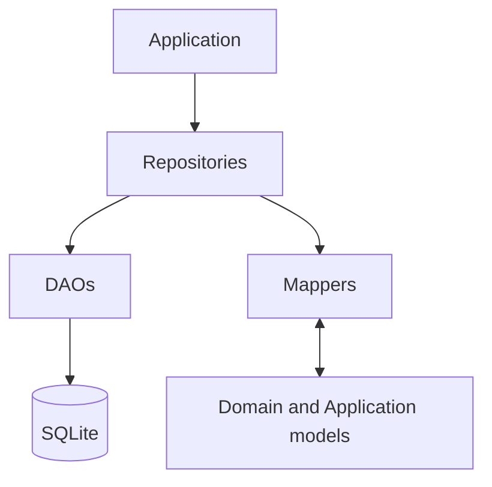

[Documentation index](../../index.md)

# Persistence layer

## Purpose

The Persistence layer stores application data, reconstructs Domain and
Application models, and isolates the rest of the project from SQLite-specific
details. It records state produced by the Domain; it does not implement
learning rules.

---

## Architecture



---

## Main components

### Repositories

Repositories expose operations aligned with application use cases. They
coordinate DAOs and mappers, rebuild complete objects, and define transaction
boundaries that span several tables.

See [Persistence repositories](repositories.md).

### DAOs

DAOs contain SQL and operate on persistence models. Simple operations open
their own `sqlite_async` transaction; aggregate writes may receive a transaction
created by a repository.

### Persistence models

Persistence models represent normalized stored data. They contain database
identifiers, scalar values, timestamps, and enum codes without business
behaviour. They never leave the Persistence layer.

### Mappers

Mappers translate persistence models into Domain objects or Application content
models and back. They handle structural conversion, not learning decisions.

### Database

The database component owns connection lifecycle, native connection
configuration, schema migrations, and access to the shared
`sqlite_async.SqliteDatabase` instance.

See [SQLite database](database.md).

---

## General flow

For a read, a repository asks one or more DAOs for normalized data, uses mappers
to reconstruct the required object, and returns only that object to the
Application layer.

For a write, the Domain has already produced the new state. The repository maps
it to persistence models and coordinates the necessary DAO operations.

The most important aggregate write occurs after an answer. One transaction
stores the exercise progression, sentence progression when applicable, answer
history, session result, and resumable exercise snapshots. This prevents the
stored exercise and active session from describing different answers.

---

## Time representation

Durations and review lookup values are stored as integer microseconds.
Date-time values are serialized as ISO-8601 UTC strings and converted back to
local `DateTime` values when reconstructed. Repository date ranges use an
inclusive start and exclusive end.

---

## Dependency rules

- Application code accesses stored data through repositories.
- SQL remains in DAOs and migrations.
- Persistence models and raw rows never cross the repository boundary.
- The Domain never imports Persistence.
- Repositories may depend on Domain types to reconstruct or store their state.
- The database is opened and migrated before any repository is constructed.

The current backend uses `sqlite_async` native connections and does not support
the Flutter web target.

---

## Directory structure

```text
infrastructure/persistence/
├── database/
├── dao/
├── mappers/
├── models/
└── repositories/
```
