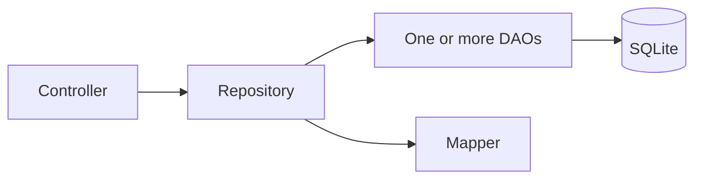

[Documentation index](../../index.md)

# Persistence repositories

## Purpose

Repositories are the application-facing API of the persistence layer. They
combine DAO operations and mappers so callers work with domain or application
objects rather than normalized SQLite rows.

## Current repositories

| Repository | Main responsibility |
|---|---|
| `ExerciseRepository` | Create, load, select, save, delete, and reset word or sentence exercise aggregates |
| `SessionRepository` | Store results and resume snapshots, rebuild unfinished sessions, and coordinate answer transactions |
| `ExerciseHistoryRepository` | Read submitted-answer history with exercise and half-open date filters |
| `ContentRepository` | Create, load, update, and delete application content and its ordered field values |
| `MediaRepository` | Resolve media metadata by SHA-256 |
| `SentenceGroupRepository` | Create groups and instances, move instances, and delete sentence structures |

## Exercise selection and persistence

`ExerciseRepository.getDueExercises` selects rows whose `next_review` is not
null and is at or before the supplied time. Results are ordered by earliest
review and may be filtered by the persisted `word` or `sentence` type.

`getNewExercises` selects exercises with no answer history, ordered by exercise
identifier. When loaded normally, history existence determines the initial
session status: `newExercise` or `toReview`.

Saving an exercise updates its SRS state, sentence states when applicable, and
all buffered history entries. `resetProgress` restores a new SRS state, removes
history, and resets per-sentence progress.

## Session aggregate

`SessionRepository` owns the persistence boundary for session lifecycle:

- `save` inserts a new `SessionResult` and all `ExerciseResume` snapshots;
- `update` replaces an unfinished result and its snapshots when pausing;
- `getActiveSession` reconstructs a session from persistent exercise state and
  resume-specific status;
- `saveAnswerProgress` atomically stores the answered exercise, history,
  session result, and new snapshot set;
- `completeSession` stores the final result and removes active snapshots;
- `getList` returns session results for statistics.

The repository receives an existing `ExerciseRepository` so answer persistence
can reuse `saveInTransaction` without nesting independent transactions.

## Content and sentence structure

`ContentRepository` maps normalized `content`, `field_value`, and
`field_definition` rows into application `Content` models. Media-valued fields
include media metadata; HTML `media://` lookup is handled separately through
`MediaRepository`.

`SentenceGroupRepository` changes sentence-group structure but is not currently
constructed by `AppDependencies`. The current composition root supports reading
content during sessions, not an application workflow for creating learning
material.

## Boundary rules

- Controllers use repositories, not DAOs.
- Repositories define multi-table and multi-aggregate transaction boundaries.
- DAOs and persistence models remain internal implementation details.
- Repositories persist state produced by the domain; they do not decide grades,
  intervals, or exercise transitions.

The controller layer currently depends on concrete repository classes. This is
an explicit MVP trade-off, not evidence that repository interfaces already
exist.
