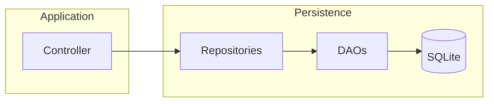
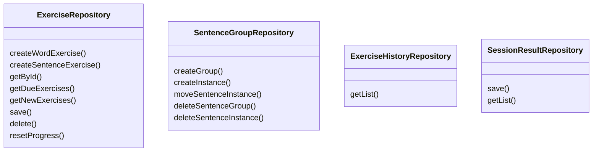
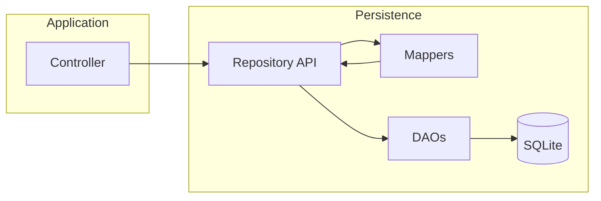

[Documentation Index](/docs/index.md)

# Persistence Repositories

## Purpose

Repositories provide the **application-facing API** of the Persistence layer.

They:

* expose operations oriented toward application use cases,
* hide DAOs and SQL queries,
* convert Persistence models into Domain objects,
* persist Domain state produced by the application and Domain layers.

The Application layer should interact with repositories rather than with DAOs directly.

---

## Architecture

Repositories are therefore the **boundary between the Application layer and the database implementation**.

---

## Repository API

### `ExerciseRepository`

Manages the persisted state associated with learning exercises.

It is responsible for:

* creating Word and Sentence exercises,
* loading exercises by ID,
* loading due or new exercises,
* saving progression after a response,
* deleting exercises,
* resetting an exercise's progression.

When saving a `SentenceExercise`, the repository also persists the associated sentence progression state and exercise history.

---

### `SentenceGroupRepository`

Manages sentence groups and their sentence instances.

It provides operations to:

* create a group,
* add a sentence instance,
* move an instance between groups,
* delete a group,
* delete an instance.

It does not create or manage `SentenceExercise` objects.

---

### `ExerciseHistoryRepository`

Provides read access to the history of exercise responses.

History can be filtered by:

* exercise,
* start date,
* end date.

History entries are returned as Domain `ExerciseHistoryEntry` objects.

---

### `SessionResultRepository`

Persists completed session results and provides historical results.

It provides:

* saving a `SessionResult`,
* retrieving results within an optional date range.

---

## Content

Content repositories are **not implemented yet**.

This is intentional: the current architecture does not define `Content` as a Domain object. Content is assembled by the **Application layer** from the `contentId` exposed by exercises.

The Persistence layer currently stores the underlying content data, but its application-facing API will be defined when the Application-level content model is implemented.

---

## Repository Boundary

The intended dependency flow is:

The important rule is:

> **Controllers use repositories; repositories use DAOs and mappers.**

DAOs and Persistence models remain implementation details of the Persistence layer.