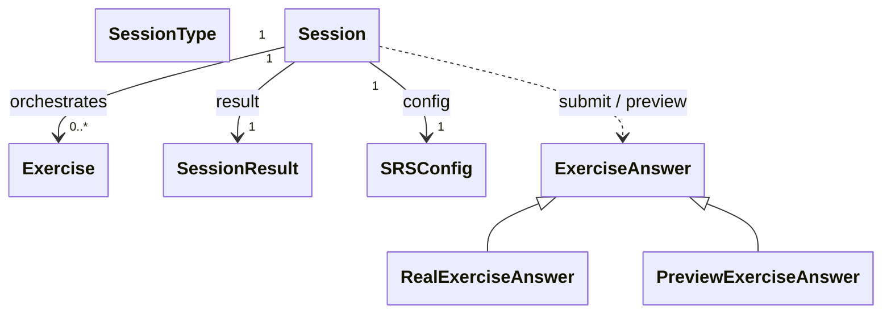

# `docs/architecture/sessions.md`

## Purpose

Describe the **role of sessions** in the learning engine and their **lifecycle**.

This document specifies:

* what a `Session` is,
* what it does and does not do,
* how it interacts with exercises,
* the invariants to respect when using it.

Internal exercise details are described in [`exercises.md`](exercises.md).

---

## Role of a Session

A `Session` is a **runtime orchestrator**.

It is responsible for:

* the temporal sequencing of exercises,
* managing the start and end of a session,
* collecting a global result.

It is **not responsible** for:

* SRS logic,
* response evaluation logic,
* exercise creation,
* display.

---

## Conceptual Diagram

---

## Session Lifecycle

A session follows a **strict lifecycle**:

1. **Creation**

   * A session is created with:

     * a list of `Exercise` objects,
     * a `SessionType`,
     * a `SRSConfig`.
   * No exercise is yet active.

2. **Start**

   * The session is explicitly started (`begin`).
   * The first exercise becomes current.

3. **Execution**

   * The session:

     * maintains a current exercise,
     * is called with user responses (`ExerciseAnswer`) by the application layer,
     * delegates processing to exercises,
     * selects the next exercise.

4. **End**

   * The session terminates:

     * either naturally (no more active exercises),
     * or early (user-triggered).
   * A final `SessionResult` is produced.

---

## Exercise Sequencing

The session:

* holds a **pre-existing list of exercises** maintained dynamically in order of presentation,
* maintains a **current exercise**,
* determines the presentation order based on:

  * exercise state (`ExerciseStatus`),
  * simple orchestration rules.

The session:

* **observes** exercise state,
* **never directly modifies** their internal logic.

---

## Interaction with Exercises

When a user response is submitted:

1. The session receives an `ExerciseAnswer`.
2. It delegates the response to the current exercise.
3. The exercise:

   * updates its state,
   * updates the progression mechanisms.
4. The session maintains exercise ordering, updates `SessionResult`, then selects the next exercise.

The session does not know:

* the meaning of a response (`Grade`, durations, timing),
* evaluation or progression rules.

---

## Preview vs Real Submission

The session distinguishes two types of user interactions:

* **Real submission** (`RealExerciseAnswer`)
  * modifies the exercise and SRS state,
  * updates `SessionResult`,
  * triggers persistence on the application side.

* **Preview** (`PreviewExerciseAnswer`)
  * simulates the theoretical interval,
  * has no side effects,
  * modifies neither the exercise nor the session.

This distinction guarantees that:
* calculation logic is unique,
* the Domain state is never modified by an exploratory action.

---

## SessionType

A `SessionType` represents the **pedagogical intent** of the session.

It is used:

* during initialisation only,
* to validate the consistency of the provided exercises,
* to qualify the session from a user and statistical perspective.

It is **not a long-lived state** of the session
and does not influence its internal behaviour after initialisation.

---

## SessionResult

A `SessionResult` is a **summary object**.
It is created during initialisation and updated after each response.

It aggregates:

* counters (exercises processed, successes, failures),
* timing information,
* global progression data.

It contains:

* no business logic,
* no evaluation rules.

---

## Core Invariants

* A session orchestrates exercises — it does not create them.
* A session contains no SRS logic and no response evaluation logic.
* A session does not know the detailed pedagogical content.
* All progression updates go through an exercise.
* A session can only be started once.
* A terminated session can no longer accept responses.
* The application layer observes session state only through explicit getters (to ensure consistency and facilitate persistence).

---

## What the Session Intentionally Ignores

The session ignores:

* UI and screens,
* persistence,
* user parameters,
* organisation of content into chapters.