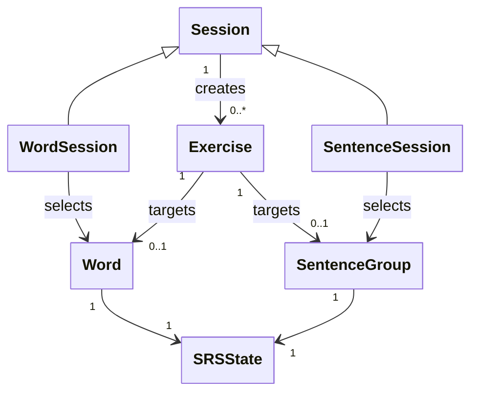

# Diagramme 3 — **Sessions**

Rappel du périmètre :
👉 **Comment on orchestre des exercices** à partir du Domain, **sans UI ni persistance**.
👉 Les sessions créent des `Exercise` temporaires à partir de `Word` / `SentenceGroup` selon des règles.

---

## `docs/architecture/sessions.md`

### Objectif

Décrire les classes responsables de l’orchestration des exercices en sessions d’apprentissage, ainsi que leurs relations avec le Domain et le modèle `Exercise`.

---

## Diagramme

---

## Lecture du diagramme

* `Session` est une classe abstraite représentant une **séquence d’apprentissage**.
* `WordSession` et `SentenceSession` sont deux spécialisations :

  * `WordSession` sélectionne des `Word` à réviser.
  * `SentenceSession` sélectionne des `SentenceGroup`.
* Une session **crée** des objets `Exercise` temporaires, qui portent le contexte d’interaction (type, template).
* Les sessions utilisent le `SRSState` **indirectement**, via les éléments sélectionnés (Word / SentenceGroup).

---

## Règles métier

* Une session ne persiste rien : elle **orchestre uniquement**.
* Le choix des éléments à réviser dépend de leur `SRSState` (éléments “dus”).
* Les `Exercise` produits sont temporaires et détruits à la fin de la session.
* La Session orchestre la réception des réponses, mais délègue la mise à jour du SRS à la logique SRS.
---

## Notes d’architecture

* Les sessions appartiennent au **Domain** (logique métier), mais sont utilisées par les Controllers.
* La génération des exercices est découplée du rendu (via `templateType`).
* Ce diagramme ne traite ni de l’UI, ni de la persistance, ni des statistiques.
