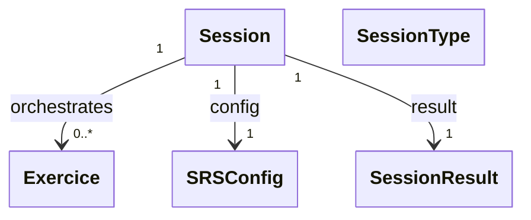

# `docs/architecture/sessions.md`

## Objectif

Décrire le **rôle des sessions** dans le moteur d’apprentissage et leur **cycle de vie**.

Ce document précise :

* ce qu’est une `Session`,
* ce qu’elle fait et ne fait pas,
* comment elle interagit avec les exercices,
* les invariants à respecter lors de son utilisation.

Les détails internes des exercices sont décrits dans [`exercises.md`](exercises.md).

---

## Rôle d’une Session

Une `Session` est un **orchestrateur runtime**.

Elle est responsable de :

* l’enchaînement temporel des exercices,
* la gestion du début et de la fin d’une session,
* la collecte d’un résultat global.

Elle n’est **pas responsable** :

* de la logique SRS,
* de la logique d’évaluation d’une réponse,
* de la création des exercices,
* de l’affichage.

---

## Diagramme conceptuel

---

## Cycle de vie d’une Session

Une session suit un **cycle de vie strict** :

1. **Création**

   * Une session est créée avec :

     * une liste d’`Exercice`,
     * un `SessionType`,
     * un `SRSConfig`.
   * Aucun exercice n’est encore actif.

2. **Démarrage**

   * La session est démarrée explicitement (`begin`).
   * Un premier exercice devient courant.

3. **Déroulement**

   * La session :

     * maintient un exercice courant,
     * est appelé avec des réponses utilisateur (classe `Grade`) par la couche applicative,
     * délègue le traitement aux exercices,
     * sélectionne l’exercice suivant.

4. **Fin**

   * La session se termine :

     * soit naturellement (plus d’exercices actifs),
     * soit de manière anticipée.
   * Un `SessionResult` final est produit.

---

## Enchaînement des exercices

La session :

* possède une **liste d’exercices préexistants** maintenue dynamiquement dans l'ordre de passage,
* maintient un **exercice courant**,
* détermine l’ordre de passage en fonction :

  * de l’état des exercices (`ExerciceStatus`),
  * de règles d’orchestration simples.

La session :

* **observe** l’état des exercices,
* **ne modifie jamais directement** leur logique interne.

---

## Interaction avec les Exercices

Lorsqu’une réponse utilisateur est soumise :

1. La session reçoit un `Grade` ainsi que la date actuelle (`DateTime now`)
2. Elle délègue la réponse à l’exercice courant.
3. L’exercice :

   * met à jour son état,
   * met à jour les mécanismes de progression.
4. La session maintient l'ordre des exercices, met à jour le `SessionResult`, puis sélectionne l’exercice suivant.

La session ne connaît pas :

* la signification d’un `Grade`,
* les règles de réussite ou d’échec.

---

## SessionType

Un `SessionType` représente l’**intention pédagogique** de la session.

Il est utilisé :

* lors de l’initialisation uniquement,
* pour valider la cohérence des exercices fournis,
* pour qualifier la session du point de vue utilisateur et statistique.

Il n’est **pas un état long-vivant** de la session
et n’influence pas son comportement interne après initialisation.

---

## SessionResult

Un `SessionResult` est un **objet de synthèse**. 
Il est créé lors de l'initialisation et est modifié à chaque réponse.

Il agrège :

* des compteurs (exercices traités, réussites, échecs),
* des informations temporelles,
* des données de progression globale.

Il ne contient :

* aucune logique métier,
* aucune règle d’évaluation.

---

## Invariants fondamentaux

* Une session orchestre des exercices, elle ne les crée pas.
* Une session ne contient aucune logique SRS ni de logique intra-session.
* Une session ne connaît pas le contenu pédagogique détaillé.
* Toute modification de progression passe par un exercice.
* Une session ne peut être démarrée qu’une seule fois.
* Une session terminée ne peut plus accepter de réponses.
* Le couche applicative ne peut utiliser uniquement des getters explicite afin de pouvoir observer la session (pour la persistance par exemple) !

---

## Ce que la Session ignore volontairement

La session ignore :

* l’UI et les écrans,
* la persistence,
* les paramètres utilisateur,
* l’organisation du contenu en chapitres.
