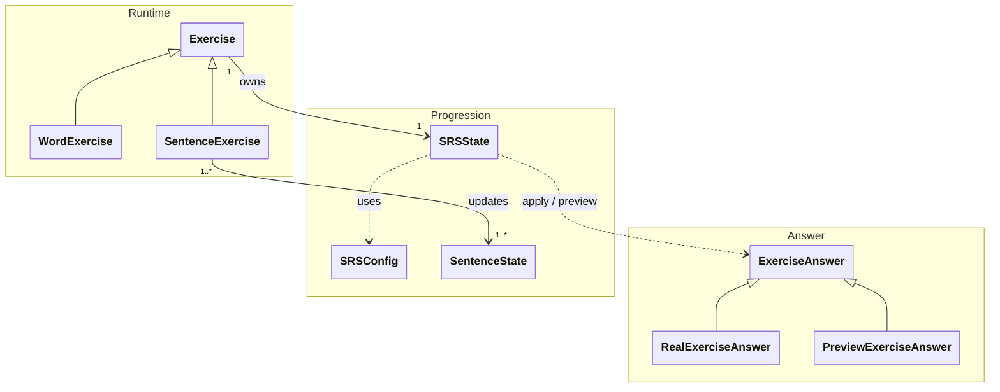

# `docs/architecture/srs.md`

## Objectif

Décrire le **fonctionnement du système de répétition espacée (SRS)** et ses règles
d’utilisation dans le moteur d’apprentissage.

Ce document précise :

* le rôle du SRS,
* la responsabilité des classes impliquées,
* la distinction intra-session / inter-session,
* les règles de persistance.

---

## Rôle du SRS

Le SRS est responsable de :

* représenter l’état de mémorisation,
* faire évoluer cet état après chaque réponse,
* calculer un **interval théorique de révision**.

Le SRS :

* ne connaît pas la notion de session,
* ne décide jamais quand une révision a lieu. Il calcule uniquement le moment où une révision serait optimisée.

---

## Diagramme SRS

---

## SRSState

`SRSState` représente l’état de mémorisation d’un exercice.

* Attaché directement à `Exercise`
* Persisté
* Modifié uniquement suite à une réponse utilisateur

Responsabilités :

* interpréter une réponse utilisateur (`ExerciseAnswer`),
* faire évoluer l’état de mémorisation,
* calculer un interval théorique de révision,
* fournir une simulation d’interval sans effet de bord (preview).

`SRSState` ne consomme jamais directement un `Grade`.
Il interprète un `ExerciseAnswer`, qui encapsule :
* la note (`Grade`),
* le moment de la réponse,
* et éventuellement des informations temporelles (durées d’étapes).

## SRSConfig

`SRSConfig` regroupe les paramètres du modèle SRS.

* Fourni à la `Session`
* Utilisé lors de la mise à jour du `SRSState`
* Ne contient aucune logique runtime

## SentenceState

`SentenceState` représente l’état d’exposition/usage d’une phrase. Il est mis à jour par les exercices de type `SentenceExercise` (typiquement un état par phrase du groupe), indépendamment du SRS : il ne calcule pas d’intervalle de révision mais sert au suivi de progression “contextuelle”.

Son Rôle est de garder les informations permettant à `SentenceExercise` de choisir la phrase à afficher. Typiquement : phrase la moins montrée / la moins réussie du groupe.

## ExerciseAnswer

Le SRS ne traite pas directement des notes brutes, mais des **réponses utilisateur modélisées**.

`ExerciseAnswer` est un type scellé représentant une interaction avec un exercice :

* `RealExerciseAnswer` correspond à une réponse effective de l’utilisateur, et entraine une mise à jour persisté du `SRSState`.

* `PreviewExerciseAnswer` représente une réponse hypothétique, permet de simuler l’évolution de l’interval  et n’a **aucun effet de bord**.

Cette distinction garantit que :
* la prévisualisation n’altère jamais l’état persisté,
* toute mise à jour réelle du SRS est explicitement intentionnelle.

## Grade

`Grade` représente la qualité d’une réponse utilisateur (ex. échec, réussite partielle, réussite). Il est fourni par la couche applicative, mais son interprétation (effet sur la progression) est entièrement gérée par l’exercice et le SRS.
Certains grades ne sont pas possible pour tous les types d'exercice.

---

## Intra-session vs inter-session

### Interval théorique

Après une réponse, le SRS calcule un interval **indépendant du contexte** :

* minutes
* heures
* jours

### Utilisation intra-session

La `Session` peut utiliser l’interval pour :

* réordonner les exercices,
* reproposer un exercice pendant la session,
* ignorer les intervalles dépassant la session.

La session :

* ne modifie jamais l’interval,
* applique uniquement une politique d’orchestration.

### Utilisation inter-session

En dehors d’une session :

* l’interval sert à planifier la prochaine révision,
* aucune logique de session n’intervient.

---

## Utilisation pratique

### Preview d’interval

La session peut exposer une **prévisualisation d’interval** :

* sans modifier le `SRSState`,
* en utilisant une `PreviewExerciseAnswer`,
* avec une logique strictement identique à celle d’une réponse réelle.
* à des fins d’information utilisateur : l'utilisateur sait quand il reverra le même exercice s’il obtient un grade précis.

### Persistance: Règle fondamentale

Les `SRSState` sont persistés **après chaque réponse utilisateur valide**.

* Le Domain met à jour le SRS
* La couche applicative déclenche la persistance
* Les sessions et exercices ne sont jamais persistés

### Cas mobile

* Une session interrompue est abandonnée
* Les exercices non terminés sont perdus
* Les `SRSState` persistés restent valides
* Les statistiques temporelles sont best-effort

---

## Invariants

* Le SRS calcule uniquement des intervalles théoriques
* Le SRS ne connaît pas la notion de session
* Toute mise à jour du SRS passe par un exercice
* La persistance est immédiate après chaque réponse
