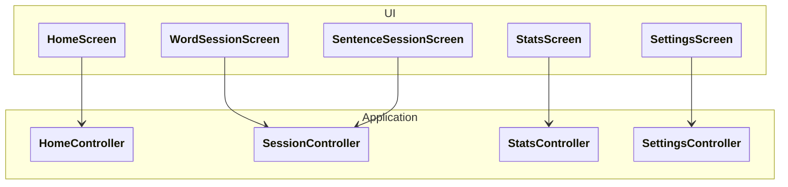

# Diagramme 6 — **UI (Screens & navigation)**

Ce diagramme décrit **la structure de l’interface utilisateur**, les écrans principaux et **leurs dépendances vers les Controllers**.
Aucune logique métier, aucun détail Flutter interne (widgets, layout).

---

## `docs/architecture/ui.md`

## Objectif

Décrire :

* les écrans principaux de l’application,
* leur rôle fonctionnel,
* quel **Controller** chaque écran utilise.

Ce diagramme fixe le **contrat UI ↔ Application**.

---

## Diagramme

---

## Lecture du diagramme

### HomeScreen

* écran d’entrée de l’application
* affiche l’état global de progression
* permet de :

  * démarrer une session (mots / phrases)
  * accéder aux statistiques
  * accéder aux paramètres

Utilise :

* `HomeController`

### WordSessionScreen

* affiche une session d’exercices sur les mots
* affiche les exercices un par un
* transmet les réponses utilisateur

Utilise :

* `SessionController`

### SentenceSessionScreen

* affiche une session d’exercices sur les phrases
* même logique que `WordSessionScreen`, mais avec des cibles grammaticales

Utilise :

* `SessionController`

### StatsScreen

* affiche les statistiques d’apprentissage
* ne déclenche aucune session
* ne manipule aucun exercice

Utilise :

* `StatsController`

### SettingsScreen

* affiche et modifie les paramètres de l’application
* inclut notamment les paramètres du SRS

Utilise :

* `SettingsController`

---

## Règles d’architecture UI

* Les écrans :

  * ne connaissent **que leur Controller**
  * ne connaissent ni le Domain ni la Persistence
* Toute action utilisateur est transmise au Controller
* Aucun calcul métier n’est fait dans l’UI
* L’UI ne persiste jamais de données directement

---

## Notes importantes pour l’implémentation ⚠️

* Chaque Screen peut être :

  * un `Widget` Flutter
  * ou un ensemble `Widget + ViewModel`
* Le Controller peut être injecté :

  * via constructeur
  * via Provider / Riverpod / autre (choix libre)
* Ce diagramme reste valide quel que soit le framework d’état choisi
