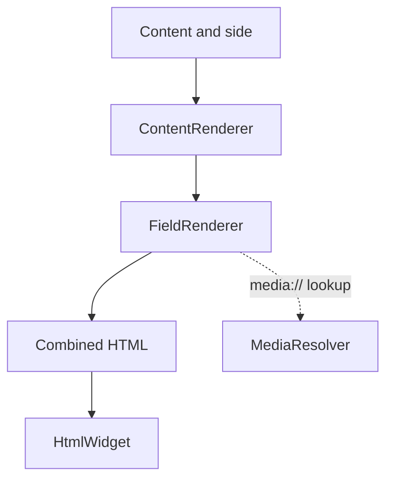

[Documentation index](../../index.md)

# UI presentation layer

## Purpose

The implemented UI code is a content-rendering pipeline. It turns application
`Content` models into one Flutter widget for the requested exercise side.

## Rendering flow

`ContentRenderer.render(content, side)` performs four operations:

1. keep fields whose side is `front`, `back`, or `both` as appropriate;
2. order them by `displayOrder`; for equal orders, null identifiers come first
   and non-null identifiers are ordered numerically;
3. ask `FieldRenderer` to produce an HTML fragment for each field;
4. concatenate the fragments and return a `flutter_widget_from_html`
   `HtmlWidget`.

## Field types

`FieldRenderer` dispatches according to `FieldValueType`:

| Type | Expected value | Rendering behaviour |
|---|---|---|
| `text` | `TextFieldValue` | Escaped text with line breaks converted to ` ` |
| `html` | `TextFieldValue` | HTML fragment with internal media references resolved |
| `image` | `MediaFieldValue` | `` using a local file URI |
| `audio` | `MediaFieldValue` | `<audio>` using a local file URI |
| `video` | `MediaFieldValue` | `<video>` using a local file URI |

A type/value mismatch is treated as invalid application data and produces a
`StateError`.

## Media resolution

HTML may refer to stored media with `media://<sha256>`. `MediaResolver` parses
the fragment, finds `src` and `poster` attributes, asks `ContentController` for
the matching media record, and replaces the internal reference with a local
file URI.

Only simple `src` and `poster` attributes are handled. URI-list attributes such
as `srcset` are intentionally unsupported, and a missing media hash is an
error.

## Current scope

The repository does not currently implement screens, navigation, exercise
input controls, or state-management bindings. Those elements remain part of the
future MVP interface.

The presentation layer may depend on application models and controllers. It
must not access DAOs, repositories, SQLite rows, or domain mutation methods
directly.
