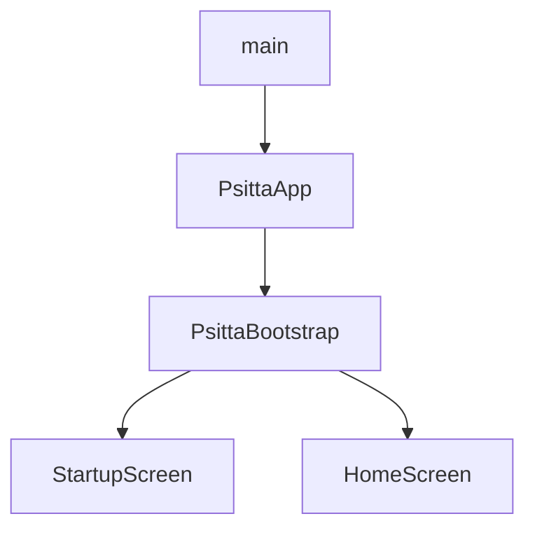
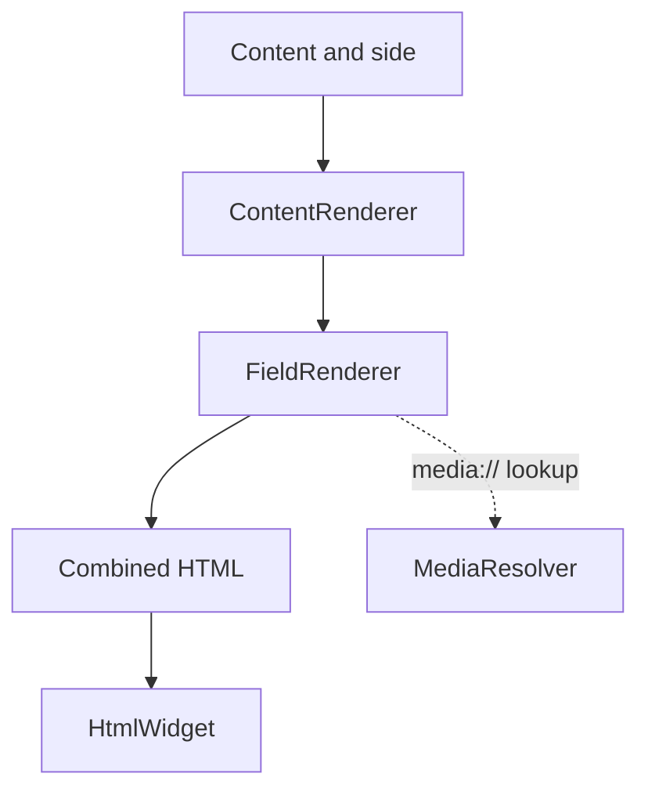

[Documentation index](../../index.md)

# UI presentation layer

## Purpose

The UI layer contains the Flutter application shell, its asynchronous startup
states, and the content-rendering pipeline. Feature screens are still at an
early stage.

## Application startup

`main` starts `PsittaApp`, which owns the root `MaterialApp` and application
theme. `PsittaBootstrap` then creates `AppDependencies` asynchronously and
represents three states:

- loading uses `StartupScreen` while dependencies are being initialized;
- failure shows the initialization error and offers a retry;
- success currently displays the placeholder `HomeScreen`.

The bootstrap state owns the dependency container and disposes it with the
widget. A retry returns to the loading state and performs a fresh
initialization. `HomeScreen` does not receive the dependencies yet; connecting
it to application controllers is part of the next UI work.

## Content rendering

The rendering pipeline turns application `Content` models into one Flutter
widget for the requested exercise side:

## Rendering flow

`ContentRenderer.render(content, side)` performs four operations:

1. keep fields whose side is `front`, `back`, or `both` as appropriate;
2. order them by `displayOrder`; for equal orders, null identifiers come first
   and non-null identifiers are ordered numerically;
3. ask `FieldRenderer` to produce an HTML fragment for each field;
4. concatenate the fragments and return a `flutter_widget_from_html`
   `HtmlWidget`.

## Field types

`FieldRenderer` dispatches according to `FieldValueType`:

| Type | Expected value | Rendering behaviour |
|---|---|---|
| `text` | `TextFieldValue` | Escaped text with line breaks converted to ` ` |
| `html` | `TextFieldValue` | HTML fragment with internal media references resolved |
| `image` | `MediaFieldValue` | `` using a local file URI |
| `audio` | `MediaFieldValue` | `<audio>` using a local file URI |
| `video` | `MediaFieldValue` | `<video>` using a local file URI |

A type/value mismatch is treated as invalid application data and produces a
`StateError`.

## Media resolution

HTML may refer to stored media with `media://<sha256>`. `MediaResolver` parses
the fragment, finds `src` and `poster` attributes, asks `ContentController` for
the matching media record, and replaces the internal reference with a local
file URI.

Only simple `src` and `poster` attributes are handled. URI-list attributes such
as `srcset` are intentionally unsupported, and a missing media hash is an
error.

## Current scope

The repository currently implements startup states and a placeholder home
screen, but no feature navigation, session controls, statistics screen, or
settings screen. The home screen is not connected to controllers, and the
content-rendering pipeline is not yet hosted by a complete learning-session
screen.

The presentation layer may depend on application models and controllers. It
must not access DAOs, repositories, SQLite rows, or domain mutation methods
directly.
