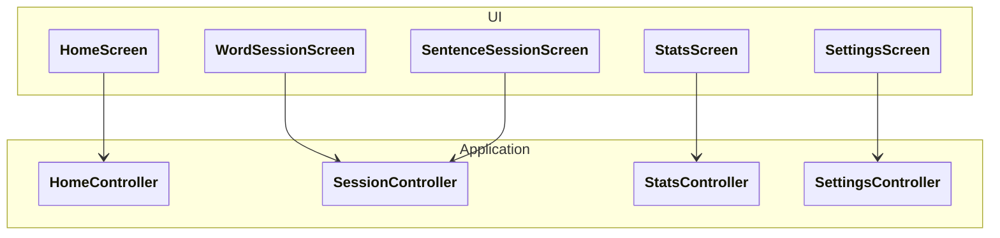

[Documentation Index](/docs/index.md)

# `docs/architecture/ui.md`

## Purpose

Describe:

* the main screens of the application,
* their functional role,
* which **Controller** each screen uses.

This diagram establishes the **UI ↔ Application contract**.

---

## Diagram

---

## Reading the Diagram

### HomeScreen

* Application entry screen.
* Displays the overall progression state.
* Allows the user to:

  * start a session (words / sentences),
  * navigate to statistics,
  * navigate to settings.

Uses: `HomeController`

### WordSessionScreen

* Displays a word exercise session.
* Renders exercises provided by the session as projections, one at a time.
* Forwards user responses to the controller.

Uses: `SessionController`

### SentenceSessionScreen

* Displays a sentence exercise session.
* Same logic as `WordSessionScreen`, but with grammatical targets.

Uses: `SessionController`

### StatsScreen

* Displays learning statistics.
* Does not trigger any session.
* Does not manipulate any exercise.

Uses: `StatsController`

### SettingsScreen

* Displays and modifies application settings.
* Includes SRS parameters in particular.

Uses: `SettingsController`

---

## UI Architecture Rules

* Screens:

  * know **only their Controller**,
  * know neither the Domain nor Persistence.
* Every user action is forwarded to the Controller.
* No business logic is computed in the UI.
* The UI never persists data directly.

---

## Implementation Notes ⚠️

* Each Screen may be implemented as:

  * a Flutter `Widget`,
  * or a `Widget + ViewModel` pair.
* The Controller may be injected:

  * via constructor,
  * via Provider / Riverpod / other (free choice).
* This diagram remains valid regardless of the chosen state management framework.