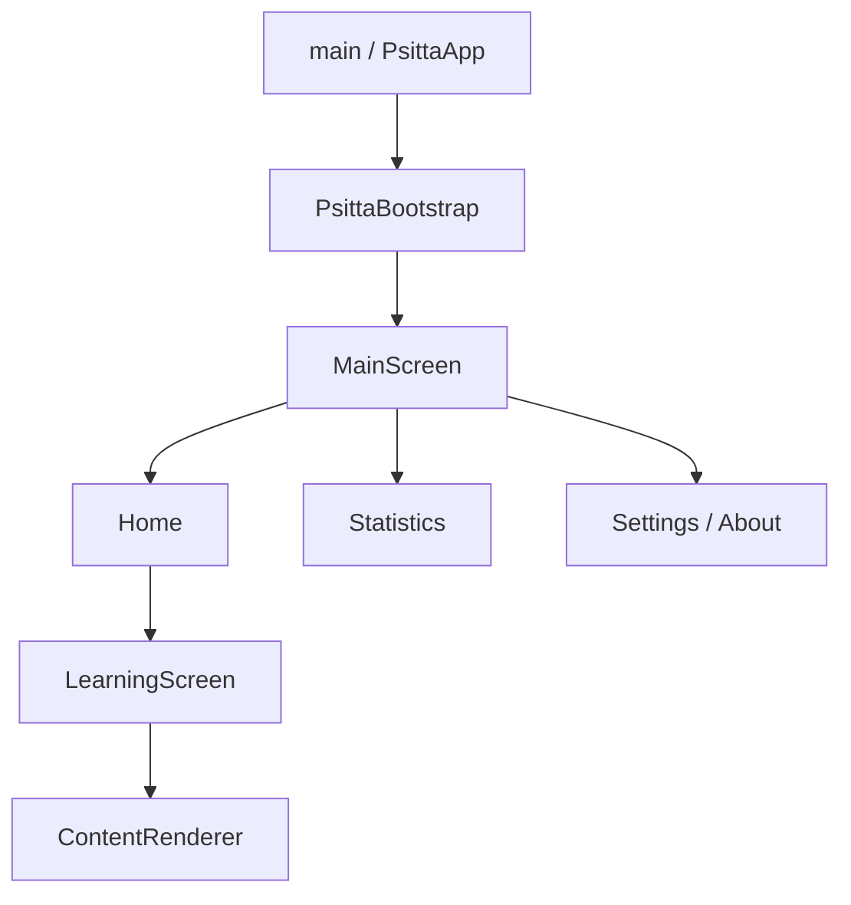

[Documentation index](../../index.md)

# UI presentation layer

## Purpose

The UI layer owns Flutter widgets and transient presentation state. It calls
Application controllers for use cases and receives Application models for
display. It does not access repositories, DAOs, SQLite rows, or Domain mutation
methods directly.

```mermaid
flowchart TD
    MAIN["main / PsittaApp"] --> BOOTSTRAP["PsittaBootstrap"]
    BOOTSTRAP --> SHELL["MainScreen"]
    SHELL --> HOME["Home"]
    SHELL --> STATS["Statistics"]
    SHELL --> SETTINGS["Settings / About"]
    HOME --> LEARNING["LearningScreen"]
    LEARNING --> RENDERER["ContentRenderer"]
```

## Application startup

`main` starts `PsittaApp`, which owns the root `MaterialApp` and monochrome
Material 3 theme. `PsittaBootstrap` creates `AppDependencies` asynchronously
and represents three startup states:

- loading displays a progress indicator;
- failure displays a retry action and includes the underlying exception only
  in debug mode;
- ready builds `MainScreen` with the shared `SessionController`,
  `StatisticController`, and `ContentRenderer`.

The bootstrap owns the dependency container and disposes it with the widget. A
retry invokes the dependency factory again, so every factory call must either
return a fresh usable container or clean up resources before throwing.

## Main navigation

`MainScreen` contains Home, Statistics, and Settings in an `IndexedStack` and
selects them with a Material `NavigationBar`. Constructing the screens once and
keeping them in the stack preserves their state while switching tabs.

The main screens constrain their content width rather than stretching cards
across large desktop windows. Home, Learning, and Statistics use a maximum
width of 720 logical pixels; Settings and About use 600.

## Home screen

`HomeScreen` requests `SessionOverview` values when it is created. It displays
one card per `SessionType`, including the new count, review count, and one
contextual action:

- `Start new session` when no resumable session exists;
- `Resume session` when an active snapshot exists.

The action is disabled only when there is neither an active session nor an
available exercise. Pull-to-refresh repeats the overview query. Returning from
`LearningScreen` also reloads the counts. A local guard prevents two learning
routes from being opened concurrently.

## Learning workflow

`LearningScreen` either starts a session or resumes its most recent persisted
snapshot for the requested type. If starting reports that a session already
exists, the screen attempts to resume it. Missing sessions and empty selections
are represented as explicit unavailable states rather than exceptions.

For each current exercise, the screen:

1. loads the selected `Content` through `SessionController`;
2. renders its front and back with `ContentRenderer`;
3. reads the allowed grades;
4. reads preview intervals only when the exercise declares that they are
   meaningful;
5. initially displays the front and a `Show answer` action.

Selecting a grade changes UI state only. The grade remains pending until the
user chooses `Next exercise`, confirms a pause, or confirms an early end. Those
three paths call `SessionController.submitAnswer` before advancing, pausing, or
ending, so a selected answer is not lost. `Cancel answer` removes the pending
grade without persistence, and the user may toggle between front and back
before confirming it.

The controller creates the submitted-answer timestamp when `submitAnswer` is
called, not when the grade button is selected. This ensures time-dependent SRS
state is based on the persistence action rather than on an unconfirmed click.

Navigation back and the close button both request a confirmed pause through
`PopScope`. The separate stop action confirms an early end, which leaves the
remaining exercises unfinished. Controls are disabled while an asynchronous
operation is running to prevent duplicate submissions.

## Statistics

`StatisticsScreen` loads all-time session and exercise aggregates in parallel.
The two controller calls use independent SQLite read transactions; they do not
form one strict shared database snapshot. This is acceptable for the MVP, but a
single repository operation would be required if cross-aggregate snapshot
consistency became necessary.

The screen displays:

- completed session count and time;
- recorded answer count;
- completed exercise count;
- completed sessions by session type;
- recorded answers by grade.

An empty history produces zero-valued metrics. Pull-to-refresh repeats both
queries.

## Settings and About

Settings is intentionally a placeholder for the MVP. It links to `AboutScreen`,
which presents application information and opens `https://psitta.net` and the
GitHub repository in an external application. Link failures are caught and
shown in a dialog whose message, URI, and caught exception are selectable.

## Content rendering

The rendering pipeline turns Application `Content` models into one Flutter
widget for a requested exercise side:

1. retain fields declared for the requested side or for both sides;
2. order by `displayOrder`, then by identifier for equal orders;
3. ask `FieldRenderer` to produce an HTML fragment for each field;
4. resolve internal media references in HTML fields;
5. concatenate the fragments and build a `flutter_widget_from_html`
   `HtmlWidget`.

`HtmlWidget` parses the resulting markup into Flutter widgets; it is not a
browser or WebView. This allows a DOM node to be replaced by a native Flutter
widget in the same layout tree.

### Field types

| Type | Expected value | Rendering behaviour |
|---|---|---|
| `text` | `TextFieldValue` | Escaped text with line breaks converted to ` ` |
| `html` | `TextFieldValue` | HTML fragment with internal media references resolved |
| `image` | `MediaFieldValue` | `` using a local file URI |
| `audio` | `MediaFieldValue` | `<audio>` replaced by `AudioControl` |
| `video` | `MediaFieldValue` | `<video>` using a local file URI |

A type/value mismatch is invalid application data and throws `StateError`.

### Media resolution

HTML may refer to stored media with `media://<sha256>`. `MediaResolver` parses
the fragment, finds `src` and `poster` attributes, asks `ContentController` for
the corresponding media record, and replaces the internal reference with a
local file URI.

Only simple `src` and `poster` attributes are supported. URI-list attributes
such as `srcset` are intentionally not resolved, and a missing media hash is an
error.

### Audio controls

`ContentRenderer.customWidgetBuilder` intercepts every `<audio>` element and
inserts `AudioControl` at that exact DOM position. Custom widgets are block
elements by default, which is appropriate for the standalone typed audio
fields currently produced by `FieldRenderer`. Embedded audio in the middle of
an arbitrary HTML sentence would also become a block.

`AudioControl` uses the singleton `SoLoud` engine. Initialization is lazy and
shared across controls, so audio failure cannot prevent application startup.
Local `file:` URIs use `loadFile`; other URIs use `loadUrl`. The control creates
a paused sound handle, supports play, pause, seek, completion, and replay, and
polls the native position every 200 ms while playing.

Disposal cancels timers and event subscriptions, stops a still-valid handle,
and releases the loaded source. Initialization or playback failures are caught
inside the control and displayed as selectable text.

`flutter_soloud` is a direct dependency in `pubspec.yaml`. On Linux, Flutter
places it in `FLUTTER_FFI_PLUGIN_LIST` inside
`linux/flutter/generated_plugins.cmake`; unlike a method-channel plugin, it has
no registration call in `generated_plugin_registrant.cc`. Both files are
Flutter-generated dependency metadata and should be regenerated by
`flutter pub get`, not edited as application logic.

## Error presentation

`LoadErrorContent` is shared by Home, Learning, and Statistics. Its user-facing
message is selectable, its underlying exception is additionally shown and
selectable in debug mode, and its retry callback belongs to the owning screen.
Audio and external-link errors have their own selectable presentation.

## Current limits

- Settings contains no configurable values in the MVP.
- Card transitions have no animation.
- The audio row has a fixed 160-pixel slider and is not yet adapted for very
  narrow layouts.
- Concatenated content fields have no automatically inserted separator; field
  markup and block widgets currently determine spacing.
- The repository contains Android, Linux, and Web platform projects, but native
  SQLite makes Web unsupported. Windows, macOS, and iOS projects and builds
  have not been added or verified.
