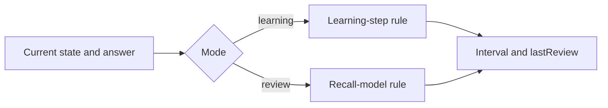

[Documentation index](../index.md)

# SRS model mathematics

## Scope

This document describes the formulas implemented by `SRSState`. It is a code
reference, not a validation that the model is an optimal representation of
human memory.

## Recall model

In review mode, the model assumes a recall probability

$$
P(t) = (1-w)e^{-kt}+w.
$$

For target recall probability $R^*$, the theoretical interval is

$$
I = -\frac{1}{k}\ln\left(\frac{R^*-w}{1-w}\right).
$$

This expression is defined under the intended conditions
$k>0$ and $0\leq w<R^*<1$. The implementation clamps the logarithm argument to
$[10^{-9},1-10^{-9}]$ as a numerical safeguard. Intervals and elapsed times are
converted to days during the calculation and rounded to integer microseconds
when converted back to `Duration`.

The main state variables are:

| Symbol | Code | Meaning |
|---:|---|---|
| $R^*$ | `rstar` | Target recall probability |
| $k$ | `kFactor` | Exponential forgetting coefficient in day$^{-1}$ |
| $w$ | `w` | Long-term recall floor |
| $\bar R$ | `rbar` | Weighted success estimate |
| $E$ | `easeFactor` | Review interval growth factor |
| $I$ | `interval` | Current theoretical interval |
| $j$ | `learningStepIndex` | Learning step; `-1` means review mode |

The derived maximum recall floor is

$$
w_{\max}=\texttt{wMaxFactor}\,R^*.
$$

## Review-mode update

Let $q$ be the numeric grade, with success indicator
$x=\mathbf{1}_{q\geq3}$. Let $\Delta$ be the elapsed time since the previous
review, or zero when no previous review exists. Lateness and tolerance are

$$
\ell=\max(0,\Delta-I),
\qquad
\tau=\min(\texttt{longPause},\texttt{minTolFactor}\cdot I).
$$

For an unsuccessful answer with $\ell\geq\tau$:

- if $\ell\geq\texttt{longPause}$, set $\bar R=0$ and $w=0$;
- otherwise, set
  $\bar R\leftarrow\bar R e^{-\mu\ell}$ and
  $w\leftarrow w_{\max}\bar R$.

For a successfull answer, there is no late penalty.

Define

$$
g(w)=-\ln\left(\frac{R^*-w}{1-w}\right).
$$

The interval branch is then:

- `again` ($q=0$): enter learning step 0 and use its duration, with a one-minute
  fallback;
- `hard` ($q=2$): enter learning step 1 and use its duration, with a ten-minute
  fallback;
- `medium` ($q=3$):
  $I\leftarrow\max(1, I\,\texttt{hardReviewFactor})$ days and
  $k\leftarrow g(w)/I$;
- `good` or `easy` ($q=4,5$):
  $k\leftarrow k/E$ and $I\leftarrow\max(1,g(w)/k)$ days;
- `easy` additionally multiplies the resulting interval by `easyBonus`.

All review intervals are capped at `iMax`. Failed reviews recompute $k$ from
the selected short interval using a denominator of at least one day.

Next, the ease factor is updated with the SM-2-derived rule

$$
\Delta E=0.1-(5-q)\left(0.08+(5-q)0.02\right),
\qquad
E\leftarrow\max(E+\Delta E,\texttt{efMin}).
$$

Finally, using the grade-specific coefficient $\lambda_q$:

$$
\bar R\leftarrow
\lambda_q\bar R+(1-\lambda_q)x,
\qquad
w\leftarrow w_{\max}\bar R.
$$

The value of $\bar R$ is clamped to $[0,1]$, and `lastReview` becomes the
answer timestamp.

The update order matters: the new interval uses the pre-answer value of $w$
after any late-failure correction. The grade's final $\bar R$ and $w$ update is
used by later reviews, not retroactively by the interval just computed.

## Learning-mode update

Let $s_0,\ldots,s_{n-1}$ be `learningSteps` and let $j\geq0$ be the current
learning index.

| Grade | Implemented transition |
|---|---|
| `again` | Set $j=0$ and $I=s_0$; fall back to one minute if no step exists |
| `hard` | Keep $j$; use $(s_j\cdot\texttt{hardLearningFactor})$ when $0<j<n$, otherwise a scaled mean of $s_0,s_1$ or a four-minute fallback |
| `medium` | Keep $j$; use $s_j$ when $0<j<n$, otherwise the mean of $s_0,s_1$ or a 5.5-minute fallback |
| `good` | Advance to the next short step while its index is strictly below $n-1$; otherwise graduate to review with the last step as interval |
| `easy` | Graduate immediately with `easyInterval` days and increase $E$ by 0.1, bounded below by `efMin` |

On graduation, $j=-1$ and $k=g(w)/I$. Every branch updates `lastReview`.
Learning-mode answers do not update $\bar R$ or $w$ in the current
implementation.

The last configured learning step therefore acts as the graduation interval;
it is not selected as another short learning repetition by the `good` branch.

## Scheduling consequences

`nextReview` is a getter:

$$
\texttt{nextReview}=\texttt{lastReview}+I,
$$

when `lastReview` exists. `SessionScheduler` uses it to prioritise learning and
relearning exercises.

Separately, `Exercise.applyAnswer` marks an exercise complete for the current
session only when `nextReview` is after the configured day boundary and the SRS
has left learning mode. This completion policy is not part of the recall
formula itself.

`previewInterval` applies the same branch calculations to a clone. It returns
only the interval and does not run persistence or change the original state.
