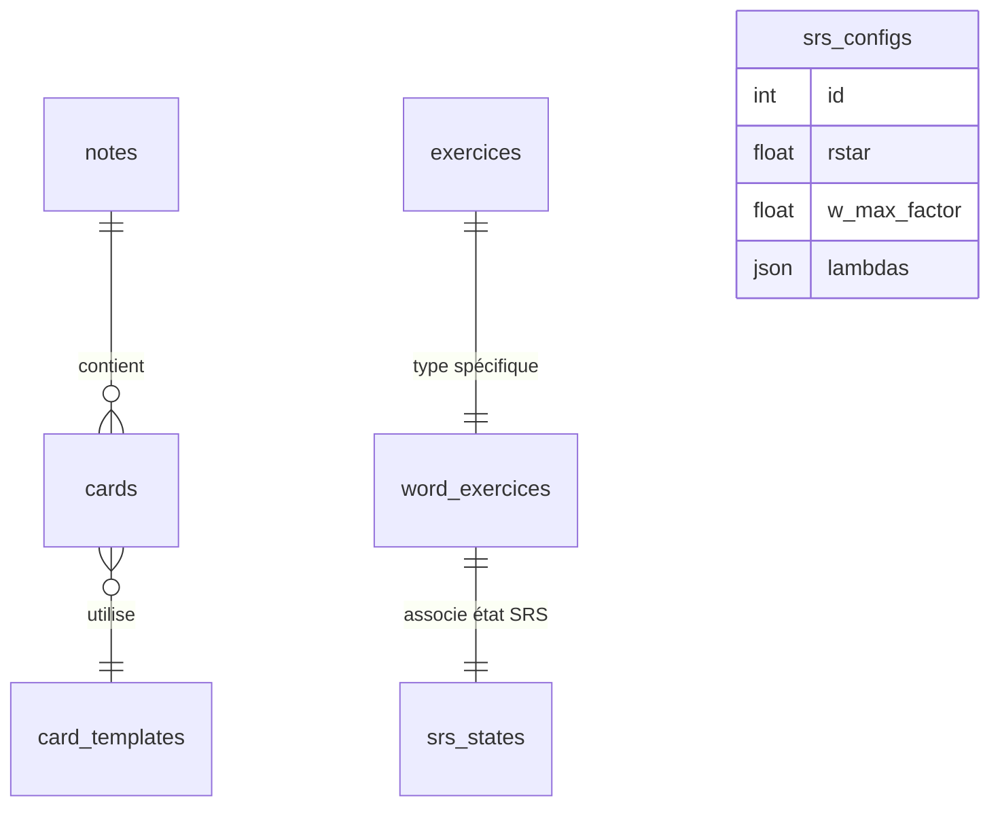

[⬅️ Retour à la documentation Services](index.md) | [💾 Voir le code source SQLite](../../lib/services/database_service.dart)

# 🗃️ Schéma de la base de données

## 🎯 Rôle du fichier
Ce document présente la **structure logique et relationnelle** de la base SQLite utilisée par l’application.  
Il complète la documentation technique de [`database_service.md`](database_service.md).

La base est entièrement gérée par le service `DatabaseService` via le package `sqflite`.  
Chaque table correspond à un **modèle Dart** du dossier `lib/models/`.

---

## 🧩 Vue d’ensemble des entités

### Vue ASCII
```

┌──────────────┐         ┌──────────────────┐
│   notes      │ 1 ——— n │     cards        │
└──────────────┘         └──────────────────┘
                            │ n             | 1
                            │               |
                            │               |
                            | 1             |
                        ┌───────────────┐   |
                        │ card_templates│   |
                        └───────────────┘   |
                                            | 1
┌──────────────────┐       ┌────────────────────┐       ┌──────────────┐
│    exercices     │ 1───1 │  word_exercices    │ 1───1 │  srs_states  │
└──────────────────┘       └────────────────────┘       └──────────────┘

┌───────────────┐
│  srs_configs  │ (globale)
└───────────────┘

```

## Vue mermaid ER Diagram


---

## 🧱 Description détaillée des tables

| Table | Clé primaire | Champs principaux | Relations |
|--------|---------------|------------------|-------------|
| **notes** | `id` | `data`, `tags`, `created_time` | utilisée par `cards.note_id` |
| **card_templates** | `id` | `recto_html`, `verso_html` | utilisée par `cards.template_id` |
| **cards** | `id` | `note_id`, `template_id` | `note_id → notes(id)` ; `template_id → card_templates(id)` |
| **exercices** | `id` | `type`, `available_at` | `id → word_exercices.id` ; `id → srs_states.exercice_id` |
| **word_exercices** | `id` | `card_id` | `card_id → cards(id)` ; `id → exercices(id)` |
| **srs_states** | `exercice_id` | `ease_factor`, `interval`, `rbar`, `k_factor`, `w` | 1:1 avec `exercices` |
| **srs_configs** | `id` | `rstar`, `w_max_factor`, `lambdas`, `learning_steps`, ... | aucune dépendance (config globale) |

---

## 🧩 Clés étrangères et contraintes d’intégrité

| Table enfant | Clé étrangère | Table parente | Effet `ON DELETE` |
|---------------|---------------|---------------|--------------------|
| `cards` | `note_id` | `notes` | `CASCADE` |
| `cards` | `template_id` | `card_templates` | `CASCADE` |
| `word_exercices` | `id` | `exercices` | `CASCADE` |
| `word_exercices` | `card_id` | `cards` | `CASCADE` |
| `srs_states` | `exercice_id` | `exercices` | `CASCADE` |

✅ **Clés étrangères activées automatiquement** via `PRAGMA foreign_keys = ON`.

---

## 🧠 Correspondance avec les modèles Dart

| Table | Modèle Dart | Fichier source |
|--------|--------------|----------------|
| `notes` | `Note` | `models/note.dart` |
| `card_templates` | `CardTemplate` | `models/note.dart` |
| `cards` | `Card` | `models/note.dart` |
| `exercices` / `word_exercices` | `WordExercice` | `models/exercice.dart` |
| `srs_states` | `SRSState` | `models/srs.dart` |
| `srs_configs` | `SRSConfig` | `models/srs.dart` |

---

## 🧩 Logique d’accès (via `DatabaseService`)

- Les opérations CRUD sont regroupées par entité.  
- Les objets composites (comme `WordExercice`) sont **reconstruits via des jointures SQL**.
- Les insertions complexes (ex: `insertWordExercice`) sont **atomiques** grâce aux transactions `txn.insert`.

Exemple de cascade :
```

Note → Card → WordExercice → SRSState

```

Une suppression d’un `Note` supprimera automatiquement ses `Card`, `WordExercice` et `SRSState` associés.

---

## 🧮 Représentation simplifiée des relations (SQL)

```sql
-- 1) notes
CREATE TABLE notes (
  id INTEGER PRIMARY KEY AUTOINCREMENT,
  data TEXT NOT NULL,
  tags TEXT,
  created_time TEXT NOT NULL
);

-- 2) card_templates
CREATE TABLE card_templates (
  id INTEGER PRIMARY KEY AUTOINCREMENT,
  recto_html TEXT NOT NULL,
  verso_html TEXT NOT NULL
);

-- 3) cards
CREATE TABLE cards (
  id INTEGER PRIMARY KEY AUTOINCREMENT,
  note_id INTEGER NOT NULL REFERENCES notes(id) ON DELETE CASCADE,
  template_id INTEGER NOT NULL REFERENCES card_templates(id) ON DELETE CASCADE
);

-- 4) exercices
CREATE TABLE exercices (
  id INTEGER PRIMARY KEY AUTOINCREMENT,
  type TEXT NOT NULL,
  available_at TEXT
);

-- 5) word_exercices
CREATE TABLE word_exercices (
  id INTEGER PRIMARY KEY REFERENCES exercices(id) ON DELETE CASCADE,
  card_id INTEGER NOT NULL REFERENCES cards(id) ON DELETE CASCADE
);

-- 6) srs_states
CREATE TABLE srs_states (
  exercice_id INTEGER PRIMARY KEY REFERENCES exercices(id) ON DELETE CASCADE,
  ease_factor REAL,
  interval INTEGER,
  w REAL,
  rbar REAL
);

-- 7) srs_configs
CREATE TABLE srs_configs (
  id INTEGER PRIMARY KEY AUTOINCREMENT,
  rstar REAL NOT NULL,
  w_max_factor REAL NOT NULL,
  lambdas TEXT NOT NULL
);
```

---

## 📘 Notes complémentaires

* Tous les **timestamps** (`created_time`, `available_at`, etc.) sont enregistrés en **UTC ISO8601**.
* Les **durées** (`interval`, `day_boundary`) sont stockées en **millisecondes**.
* Le système SRS repose sur une relation **1:1** entre `exercices` et `srs_states`.

---

*Fichier : `docs/services/schema_db.md`*
